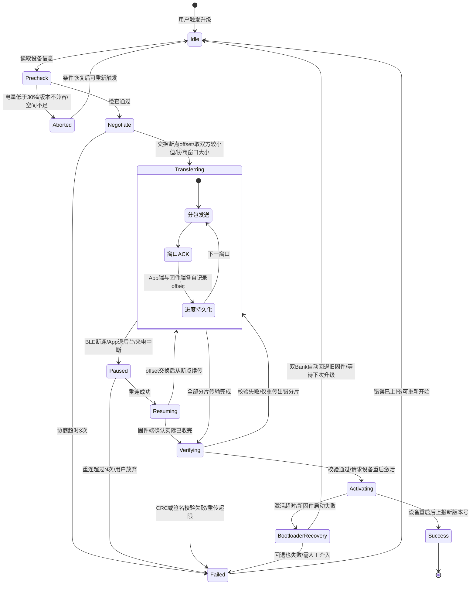
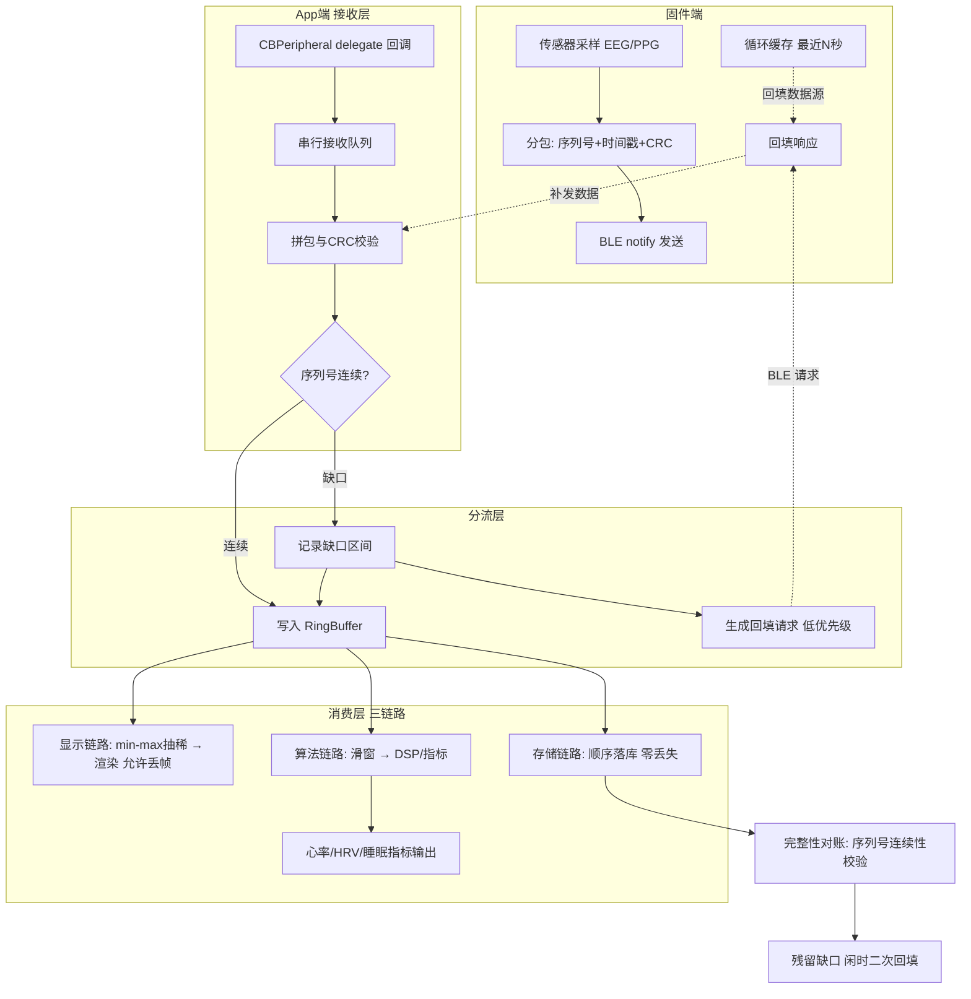

# 两张核心架构图：OTA 状态机 与 流式数据管道

> 面试白板使用说明：两张图都要能默画。讲图顺序固定为"先状态、再迁移、最后讲失败边"——这是面试官判断你有没有真做过的分水岭：没做过的人只画主路径，做过的人先画失败边。
> Mermaid 语法保守（兼容 Obsidian / Gitee 渲染），每个设计决策在图下方单独列出，不塞进图里。

---

## 图一：OTA / DFU 状态机

### 设计决策清单（讲图时逐条带出）

1. **双端 offset，取较小值**：App 端记录"已发送且被 ACK 的最大偏移"，固件端记录"已写入 flash 的最大偏移"。恢复时取小——App 以为发了不代表固件写进去了，这是断点续传正确性的根。
2. **窗口 ACK 而非逐包 ACK**：逐包安全但吞吐砍半，窗口批量（如 16 包一 ACK）是吞吐与重传成本的平衡点，窗口大小在 Negotiate 阶段协商而非写死。
3. **Paused 是独立状态而不是直接 Failed**：断连是常态不是异常。Paused 期间进度已持久化，App 被杀也能恢复。
4. **校验失败只重传出错分片**：500KB 固件一个字节错了全部重传是浪费，按分片校验、按分片重传。
5. **签名验证在 Verifying 完成**：固件签名（Ed25519/ECDSA）校验不过直接 Failed 且不上报可重试——安全失败与传输失败是两类故障，处理路径不同。
6. **激活超时走 BootloaderRecovery**：新固件启动失败时双 Bank 回退旧固件，设备永远不死。这是"变砖率归零"目标的设计承载点。
7. **Aborted 与 Failed 分离**：Aborted 是条件不满足的主动拒绝（可再触发），Failed 是执行失败（要上报埋点）。两者在 OTA 成功率漏斗里是不同分层。

### 面试话术锚点

- "这个状态机我先画失败边：断连、断电、校验失败、激活超时，每条边都有明确的恢复目标状态。"
- "所有迁移都有埋点，OTA 漏斗七个状态每个转化率都可监控——JD 要的'可靠性'在工程上就是可度量。"

---

## 图二：实时流式数据管道（波形场景）

### 设计决策清单

1. **串行接收队列是地基**：delegate 回调全进自定义串行队列，拼包、校验、写 RingBuffer 都在此队列，杜绝数据竞争；只有渲染和落库前做有界的队列切换。
2. **缺口检测在入口，不在消费者**：序列号连续性判断放在写 RingBuffer 之前，所有下游共享同一份"干净的有序视图"，缺口信息作为元数据随数据流动。
3. **三链路 QoS 分级**：显示链路允许丢帧（抽稀本身就在丢信息，跳一帧无感）；存储链路零丢失（缺口必须回填闭环）；算法链路吃 RingBuffer 滑窗，对缺口敏感则降级输出并标记数据质量。
4. **回填是低优先级旁路**：回填请求走单独的消息类型，闲时发送，绝不能饿死实时流；固件端循环缓存深度 N 决定回填能力上限——这个 N 是 App + FW 联调时共同拍板的。
5. **对账闭环**：存储链路落库后做序列号连续性校验，残留缺口触发闲时二次回填；整夜监测场景的"数据完整率"指标由此对账产生。
6. **RingBuffer 背压策略**：显示链路满了覆盖最旧（用户只看最新的），存储链路满了触发告警（设计上不该发生，发生即容量评估失误）。
7. **与 OTA 的复用关系**：序列号 + CRC + 断点 offset 的机制与 OTA 传输同构——面试时点出"传输层可靠性原语是复用的"，展示抽象能力。

### 面试话术锚点

- "这个管道的核心是入口处的缺口检测加三链路分级，同一份数据三种可靠性要求，架构上必须分流而不是一刀切。"
- "它和音频 Jitter Buffer 是同构问题：底层都是'分片到达 vs 连续消费'的矛盾，我做眼镜音频时的缓冲设计经验直接迁移。"

---

## 默画自检

- [ ] OTA 图：11 个状态、全部失败边、双端 offset 逻辑，5 分钟内默画完成
- [ ] 管道图：四段分层（固件/接收/分流/消费）、回填环路、三链路 QoS 差异，4 分钟内默画完成
- [ ] 每张图至少能讲出 5 个"为什么这样设计"而不是"是什么"
