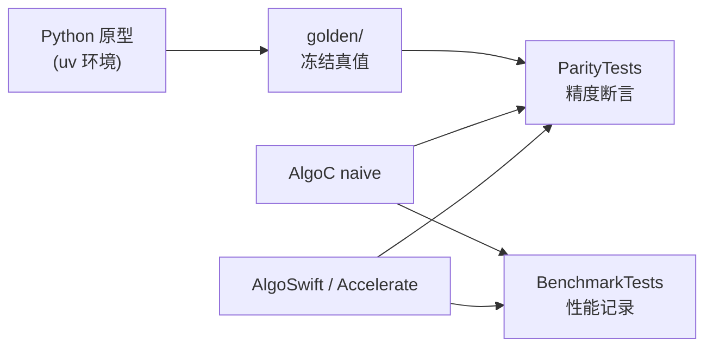

# algo-engineering-lab

> **定位：** 验证 Python 算法原型 → golden 数据集 → C 库 / Swift → iOS 侧 parity 回归的数值一致性与性能链路。  
> **对外口径：** 面试前针对目标公司技术栈的**验证性原型**，不是生产项目。

版本：0.1.0 · 日期：2026-07-28 · 作者：lab · 状态：草稿

---

## 链路架构



---

## 环境依赖

| 项 | 要求 |
| :--- | :--- |
| Python | 3.11+（由 `uv` 管理） |
| uv | [https://github.com/astral-sh/uv](https://github.com/astral-sh/uv) |
| Xcode / Swift | Xcode 15+（Swift 5.9+），用于 `swift build` 与测试 |
| 平台 | 本机 macOS 即可跑 SPM；真机数字须按 `docs/05` 记录环境 |

---

## 快速开始（≤3 条）

```bash
cd algo-engineering-lab
uv sync
uv run python -c "import numpy; print('ok', numpy.__version__)"
```

Swift 空壳（T1 起）：

```bash
swift build
```

生成 golden / 跑 Case1 parity：

```bash
uv run python -m python.generate_golden hrv_time_domain
swift test --filter ParityTests
```

---

## 结果看板（占位，T7 收口）

### 精度误差表

| Case | 指标 | 阈值 | 实测误差 | 结论 |
| :--- | :--- | :--- | :--- | :--- |
| 01 HRV 时域 | SDNN/RMSSD | ≤0.1 ms | ≤阈值（parity 全绿） | 通过 |
| 01 HRV 时域 | pNN50 | ≤0.5 pp | ≤阈值 | 通过 |

### 性能数字表

| 实现 | 耗时 (p50/p95) | 加速比 | 环境 |
| :--- | :--- | :--- | :--- |
| — | — | — | 待 T3+ |

> 裸数字无效；必须带机型 / 芯片 / OS / 编译配置 / 电量与发热状态（见 `docs/05`）。

---

## Case 导航

| Case | 对齐口径 | 复盘 | 状态 |
| :--- | :--- | :--- | :--- |
| 01 HRV 时域 | [`hrv-time-domain.md`](docs/02-算法对齐口径/hrv-time-domain.md) | [`case-01`](docs/06-实验复盘/case-01-hrv-time-domain.md) | T2 已完成 |
| 02 FIR 滤波 | 同上 | 同上 | 待 T3 |
| 03 HRV 频域 | 同上 | 同上 | 待 T4 |
| 04 CoreML 量化 | 同上 | 同上 | 待 T5 |
| 05 流式滑窗 | 同上 | 同上 | 待 T6 |

实施任务清单：[`tickets.md`](./tickets.md)  
文档要求说明书：[`../Talk with K3/algo-engineering-lab技术文档要求说明书.md`](../Talk%20with%20K3/algo-engineering-lab技术文档要求说明书.md)
