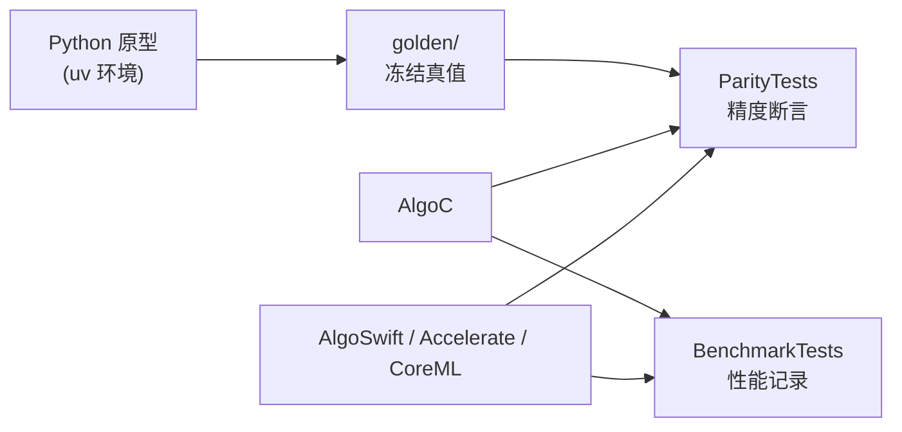

# algo-engineering-lab

> **定位：** 验证 Python 算法原型 → golden 数据集 → C 库 / Swift → iOS 侧 parity 回归的数值一致性与性能链路。  
> **对外口径：** 面试前针对目标公司技术栈的**验证性原型**，不是生产项目。

版本：0.4.0 · 日期：2026-07-29 · 作者：lab · 状态：生效

---

## 链路架构



**CoreML 零基础：** 先读 [`docs/09-CoreML入门/00-导读.md`](docs/09-CoreML入门/00-导读.md)（ML 最小必要 → Python 生成 → 运行时 → 预处理/量化）。  
**T1–T16 通俗总览（含怎么跟别人讲）：** [`docs/10-初学者导读-T1到T16.md`](docs/10-初学者导读-T1到T16.md)。

---

## 环境依赖

| 项 | 要求 |
| :--- | :--- |
| Python | 3.11+（由 `uv` 管理） |
| uv | [https://github.com/astral-sh/uv](https://github.com/astral-sh/uv) |
| Xcode / Swift | Xcode 15+（Swift 5.9+） |
| CoreML case | `uv sync --extra ml`（coremltools + scikit-learn&lt;1.6） |
| 平台 | macOS 跑 SPM；真机数字须按 `docs/05` 记环境 |

---

## 快速开始（陌生人 15 分钟）

```bash
cd algo-engineering-lab
uv sync
swift test --filter ParityTests
```

可选：重生全部 golden（含 CoreML 报告）：

```bash
uv sync --extra ml
uv run python -m python.generate_golden hrv_time_domain
uv run python -m python.generate_golden fir_ppg
uv run python -m python.generate_golden hrv_freq_domain
uv run python -m python.generate_golden coreml_quant
uv run python -m python.generate_golden streaming_fir
uv run python -m python.generate_golden hrv_artifact_correction
uv run python -m python.generate_golden ota_dfu_state_machine
uv run python -m python.generate_golden multi_channel_sync
uv run python -m python.generate_golden coreml_drift_monitoring
uv run python -m python.generate_golden sleep_staging_postprocess
uv run python -m python.generate_golden coreml_preprocess_inmodel
uv run python -m python.generate_golden coreml_streaming
swift test --filter ParityTests
```

---

## 结果看板

### 精度误差表

| Case | 指标 | 阈值 | 实测 | 结论 |
| :--- | :--- | :--- | :--- | :--- |
| 01 HRV 时域 | SDNN/RMSSD | ≤0.1 ms | parity 全绿 | 通过 |
| 01 HRV 时域 | pNN50 | ≤0.5 pp | parity 全绿 | 通过 |
| 02 FIR PPG | 滤波输出 | ≤1e-4 | naive + vDSP 全绿 | 通过 |
| 03 HRV 频域 | 时域快照 | abs ≤1e-9 | 全绿 | 通过 |
| 03 HRV 频域 | PSD / LF/HF | 见口径 | 全绿 | 通过 |
| 04 CoreML | FP16↔FP32 top-1 | ≥95% | **100%** | 通过 |
| 04 CoreML | 置信度偏移均值 | abs ≤0.05 | ~1e-5 | 通过 |
| 05 流式 FIR | 连续窗 vs 因果整段 | abs ≤1e-12 | 全绿 | 通过 |
| 05 流式 FIR | 丢包 zero_fill | abs ≤1e-12 | 全绿 | 通过 |
| 06 HRV 伪差校正 | corrected+mask | 逐点对齐 | 全绿 | 通过 |
| 07 OTA 状态机 | 终态/漏斗/进度 | 逐字段对齐 | 全绿 | 通过 |
| 08 多通道同步 | timeline/aligned/mask | 全量对齐 | 全绿 | 通过 |
| 09 CoreML 漂移监控 | stable/shifted 告警语义 | 规则断言 | 全绿 | 通过 |
| 10 睡眠后处理 | raw/smoothed/metrics | 全量对齐 | 全绿 | 通过 |
| 11 Swift CoreML 集成 | 固定输入→概率输出 | 与 Python 向量对齐 | 全绿 | 通过 |
| 12 CoreML 运行时 | 缓存 Session 下向量对齐 | 同 Case04 容差 | 全绿 | 通过 |
| 13 预处理入模 | App vs 图内 scaler | ≤1e-5；负例≥0.01 | 全绿 | 通过 |
| 14 流式 CoreML | 窗特征+概率 | 1e-9 / 5e-4 | 全绿 | 通过 |

### 性能数字表

| 实现 | p50 / p95 | 备注 | 环境 |
| :--- | :--- | :--- | :--- |
| FIR AlgoC naive | 见 [`docs/bench-log.md`](docs/bench-log.md) | 热路径基准 | Debug · Apple Silicon |
| FIR Swift vDSP_dotpr | 见 bench-log | 逐点组窗开销大 | 同上 |
| CoreML compile_every_call | 见 bench-log | **含** compile；勿当推理 | 同上 |
| CoreML infer_cached | 见 bench-log | T14 纯推理 | 同上 |

> 裸数字无效；必须带机型 / 芯片 / OS / 编译配置 / 电量与发热（`docs/05`）。

---

## 三张面试口述卡片

完整版：[`docs/07-面试口述卡片.md`](docs/07-面试口述卡片.md)

| 卡片 | 一句话 |
| :--- | :--- |
| **精度漂移** | 对不上先查口径与中间快照，不要先怪 FFT / 量化。 |
| **C 集成** | 边界规则写进规范：所有权、零拷贝、错误码、批次调用。 |
| **流式状态** | FIR 延迟线跨窗连续；和 BLE 分片同构，中间层是 iOS 价值。 |

---

## 扩展路线图（新增 case 候选）

详见：[`docs/08-扩展案例建议.md`](docs/08-扩展案例建议.md)

建议优先级：

1. HRV 伪差校正（Artifact Correction）✅
2. OTA/DFU 断点续传仿真（状态机 + 漏斗指标）✅
3. 多通道同步与时间戳漂移校正✅
4. CoreML 在线漂移监控✅
5. 睡眠分期后处理✅
6. 端上性能与能耗画像✅
7. CoreML 入门文档 + 运行时工程化（T14）✅
8. CoreML 预处理入模对照（T15）✅
9. CoreML 流式滑窗推理（T16）✅

扩展 case 仍遵循同一交付链路：

`Python 原型 → golden → C/Swift 实现 → Parity/Benchmark → 复盘`

---

## Case 导航

| Case | 对齐口径 | 复盘 | 状态 |
| :--- | :--- | :--- | :--- |
| 01 HRV 时域 | [`hrv-time-domain.md`](docs/02-算法对齐口径/hrv-time-domain.md) | [`case-01`](docs/06-实验复盘/case-01-hrv-time-domain.md) | 完成 |
| 02 FIR 滤波 | [`fir-ppg-bandpass.md`](docs/02-算法对齐口径/fir-ppg-bandpass.md) | [`case-02`](docs/06-实验复盘/case-02-fir-filter.md) | 完成 |
| 03 HRV 频域 | [`hrv-freq-domain.md`](docs/02-算法对齐口径/hrv-freq-domain.md) | [`case-03`](docs/06-实验复盘/case-03-hrv-freq-domain.md) | 完成 |
| 04 CoreML 量化 | [`coreml-quant.md`](docs/02-算法对齐口径/coreml-quant.md) | [`case-04`](docs/06-实验复盘/case-04-coreml-quant.md) | 完成 |
| 05 流式滑窗 | [`streaming-fir.md`](docs/02-算法对齐口径/streaming-fir.md) | [`case-05`](docs/06-实验复盘/case-05-streaming-fir.md) | 完成 |
| 06 HRV 伪差校正 | [`hrv-artifact-correction.md`](docs/02-算法对齐口径/hrv-artifact-correction.md) | [`case-06`](docs/06-实验复盘/case-06-hrv-artifact-correction.md) | 完成 |
| 07 OTA/DFU 状态机仿真 | [`ota-dfu-state-machine.md`](docs/02-算法对齐口径/ota-dfu-state-machine.md) | [`case-07`](docs/06-实验复盘/case-07-ota-dfu-simulation.md) | 完成 |
| 08 多通道同步 | [`multi-channel-sync.md`](docs/02-算法对齐口径/multi-channel-sync.md) | [`case-08`](docs/06-实验复盘/case-08-multi-channel-sync.md) | 完成 |
| 09 CoreML 漂移监控 | [`coreml-drift-monitoring.md`](docs/02-算法对齐口径/coreml-drift-monitoring.md) | [`case-09`](docs/06-实验复盘/case-09-coreml-drift-monitoring.md) | 完成 |
| 10 睡眠分期后处理 | [`sleep-staging-postprocess.md`](docs/02-算法对齐口径/sleep-staging-postprocess.md) | [`case-10`](docs/06-实验复盘/case-10-sleep-staging-postprocess.md) | 完成 |
| 11 统一性能与能耗画像 | [`05-性能基准规范.md`](docs/05-性能基准规范.md) | [`case-11`](docs/06-实验复盘/case-11-perf-and-power.md) | 完成 |
| 12 CoreML 运行时工程化 | [`coreml-runtime-engineering.md`](docs/02-算法对齐口径/coreml-runtime-engineering.md) | [`case-12`](docs/06-实验复盘/case-12-coreml-runtime.md) | 完成 |
| 13 CoreML 预处理入模 | [`coreml-preprocess-inmodel.md`](docs/02-算法对齐口径/coreml-preprocess-inmodel.md) | [`case-13`](docs/06-实验复盘/case-13-coreml-preprocess-inmodel.md) | 完成 |
| 14 CoreML 流式滑窗 | [`coreml-streaming.md`](docs/02-算法对齐口径/coreml-streaming.md) | [`case-14`](docs/06-实验复盘/case-14-coreml-streaming.md) | 完成 |
| — CoreML 入门 | [`09-CoreML入门/00-导读.md`](docs/09-CoreML入门/00-导读.md) | — | 生效 |
| — T1–T16 初学者导读 | [`10-初学者导读-T1到T16.md`](docs/10-初学者导读-T1到T16.md) | — | 生效 |

实施任务清单：[`tickets.md`](./tickets.md)  
文档要求说明书：[`../Talk with K3/algo-engineering-lab技术文档要求说明书.md`](../Talk%20with%20K3/algo-engineering-lab技术文档要求说明书.md)
