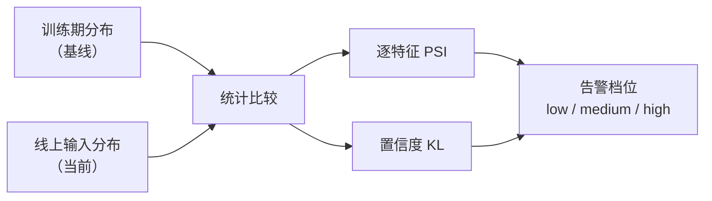

# 对齐口径：CoreML 在线漂移监控

版本：0.2.0 · 日期：2026-07-29 · 作者：lab · 状态：生效

> Case09 / T11。零基础请先读 [`docs/09-CoreML入门/04-预处理单源与量化语义.md`](../09-CoreML入门/04-预处理单源与量化语义.md) §3。  
> 复盘：[`../06-实验复盘/case-09-coreml-drift-monitoring.md`](../06-实验复盘/case-09-coreml-drift-monitoring.md)。

---

## 0. 发生了什么（读完能口述）

模型上线后，即使 `.mlpackage` 没换过，如果 **输入分布变了**（用户群体不同、固件采样率变化、佩戴方式改变），准确率会 silently 下降——没有报错，但结果越来越不靠谱。

T11 做了一组漂移检测原型，用统计距离把「分布变了」变成可量化、可告警的指标。



| 场景 | 类比 | 期望告警 |
| :--- | :--- | :--- |
| 训练用年轻人数据，上线用年轻人 | 试卷和考生匹配 | `low` |
| 训练用年轻人数据，上线用老年人 | 试卷和考生错配 | `medium` / `high` |

---

## 1. 环节分解表

| 环节 | 参数 | 取值 | Python | 说明 |
| :--- | :--- | :--- | :--- | :--- |
| 模型 | — | Case04 FP32 活动三分类 | `activity_fp32.mlpackage` | 若缺失自动重生 |
| 预处理 | scaler | Case04 同一套 mean/scale | `compare_report.json` | **单源**——不能用当前数据重新 fit |
| 基线 | N=600 | 高斯 N(0,1) 无偏移 | `_synth_features(shifted=False)` | 代表训练期分布 |
| 稳定场景 | N=600 | 同分布、另一组 | `_synth_features(shifted=False)` | 应与基线相似 |
| 漂移场景 | N=600 | 特征 0,1 偏移、特征 4 方差扩大 | `_synth_features(shifted=True)` | 应与基线显著不同 |
| 评估 | — | PSI + KL → 告警 | `coreml_drift_prototype.py` | 取 max_psi + kl_confidence |

---

## 2. 指标与阈值

### 2.1 PSI（Population Stability Index）

直觉：**两个直方图的形状差了多少**。

```
对每个特征 i：
  PSI_i = Σ (cur_bin_ratio - ref_bin_ratio) × ln(cur_bin_ratio / ref_bin_ratio)
```

| PSI 值 | 含义 | 行动 |
| :--- | :--- | :--- |
| < 0.10 | 分布稳定 | 无需干预 |
| 0.10 – 0.25 | 中度变化 | 关注；准备回滚方案 |
| > 0.25 | 显著漂移 | 告警；考虑重训或回滚 |

本 lab 取 **max_psi**（8 个特征中最大的那个）作为聚合指标。

### 2.2 KL 散度（置信度分布）

直觉：**模型的「自信程度分布」变了没**。

```
KL(current || baseline) = Σ current_bin × ln(current_bin / baseline_bin)
```

| KL 值 | 含义 |
| :--- | :--- |
| < 0.08 | 置信度分布稳定 |
| 0.08 – 0.20 | 模型"犹豫程度"变了 |
| > 0.20 | 输出分布显著偏移 |

### 2.3 告警策略

```python
def alert_level(max_psi, kl_conf):
    if max_psi >= 0.25 or kl_conf >= 0.20:
        return "high"
    if max_psi >= 0.10 or kl_conf >= 0.08:
        return "medium"
    return "low"
```

| 档位 | 条件 | 建议行动 |
| :--- | :--- | :--- |
| `low` | max_psi < 0.10 **且** kl_conf < 0.08 | 正常运营 |
| `medium` | max_psi ≥ 0.10 **或** kl_conf ≥ 0.08 | 人工 review；准备回滚 |
| `high` | max_psi ≥ 0.25 **或** kl_conf ≥ 0.20 | 触发告警；考虑立即回滚 |

---

## 3. 产物路径

| 产物 | 路径 |
| :--- | :--- |
| 原型实现 | `python/coreml_drift_prototype.py` |
| 生成器 | `python/generate_coreml_drift_monitoring.py` |
| Golden 报告 | `golden/coreml_drift_monitoring/report.json` |
| Parity 测试 | `Tests/ParityTests/CoreMLDriftMonitoringParityTests.swift` |
| 模型（依赖） | `artifacts/coreml/activity_fp32.mlpackage` |
| Scaler（依赖） | `golden/coreml_quant/compare_report.json` |

```bash
uv sync --extra ml
# 若缺 T5 模型/报告会自动重生
uv run python -m python.generate_golden coreml_drift_monitoring
swift test --filter CoreMLDriftMonitoringParityTests
```

---

## 4. 集成约定

- 若 `artifacts/coreml/activity_fp32.mlpackage` 或 `golden/coreml_quant/compare_report.json` 缺失，
  T11 脚本会先调用 T5 Python 链路重生模型与预处理参数，再执行漂移评估。
- 监控评估输入使用与 T5 同维度特征并套用同一 `StandardScaler` 参数（**单源预处理**）。

---

## 5. 排查手册（出问题怎么查）

### 5.1 稳定场景被误报（`stable_low_alert` 失败）

| 检查项 | 怎么做 |
| :--- | :--- |
| scaler 是否同源 | 必须用 Case04 报告里的 mean/scale；若重训了模型要同步重生 |
| 基线和稳定场景是否同分布 | 两者都应 `shifted=False`，区别只是随机种子不同 |
| PSI bins 是否太少 | 默认 10 bins；极端分布下可调大到 20，但不宜过大 |
| 是否有 NaN / Inf | 检查输入向量有无异常值污染 |

### 5.2 漂移场景未告警（`shifted_not_low` 失败）

| 检查项 | 怎么做 |
| :--- | :--- |
| 偏移量是否足够 | `shifted=True` 对特征 0,1 偏移 +1.8/+1.2，特征 4 方差 ×1.8 |
| 是否用了正确的基线 | 基线应是 `shifted=False` 的数据，不是其他来源 |
| epsilon 是否太大 | PSI 用 `eps=1e-8` 避免 log(0)；太大会平滑掉差异 |

### 5.3 指标数值对不上 Python

| 检查项 | 怎么做 |
| :--- | :--- |
| histogram bins 是否一致 | Python 用 `np.histogram_bin_edges` 合并后分桶；Swift 需同一算法 |
| 归一化方式 | 桶频率 = count / sum(counts)，不是 count / N |
| clip 范围 | `np.clip(p, 1e-8, 1.0)`——避免 log(0) |

### 5.4 监控链路本身有 bug

关键原则：**监控也必须用训练期的 scaler**。如果监控链路用当前数据重新 fit scaler，
你监控的是「我的预处理和训练期不一样」，不是「用户群体变了」。

---

## 6. 已知差异

| 差异点 | 量级 | 接受理由 | 确认人 |
| :--- | :--- | :--- | :--- |
| 合成数据非真实 | 大 | 练工程口径，非生产监控规则 | lab |
| 仅 Python 侧实现 | 中 | 漂移监控通常在服务端/后台；端侧可轻量化实现 | lab |
| 固定 10 bins | 小 | 足够演示 PSI/KL 语义；生产可调参 | lab |

---

## 7. 面试金句

> 模型文件不变也会退化。我用逐特征 PSI 和置信度 KL 盯分布变化，分三档告警；监控链路必须与训练预处理同口径，否则你监控的是自己的 bug。
