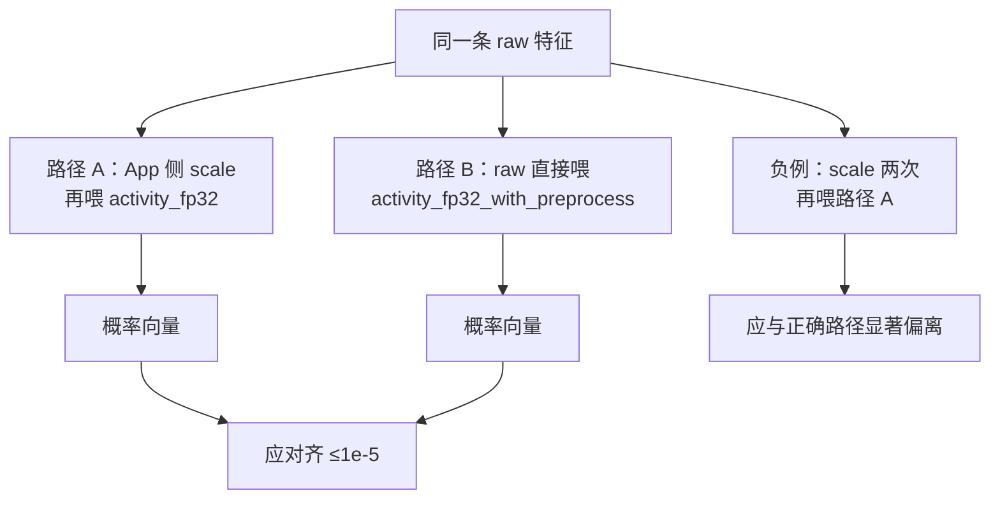

# 对齐口径：CoreML 预处理入模对照（App 侧 vs 图内 StandardScaler）

版本：0.2.0 · 日期：2026-07-29 · 作者：lab · 状态：生效

> Case13 / T15。零基础请先读 [`docs/09-CoreML入门/04-预处理单源与量化语义.md`](../09-CoreML入门/04-预处理单源与量化语义.md)。  
> 复盘：[`../06-实验复盘/case-13-coreml-preprocess-inmodel.md`](../06-实验复盘/case-13-coreml-preprocess-inmodel.md)。

---

## 0. 发生了什么（读完能口述）

线上最常见的「模型突然不准」，往往不是权重坏了，而是 **预处理做了两次或两边各做一半**。

T15 做了一组对照实验，把「单源」钉成可测事实：



| 路径 | 模型文件 | App 喂什么 | 模型内部 |
| :--- | :--- | :--- | :--- |
| A（合法） | `activity_fp32.mlpackage` | **已 scaled** | 只做 MLP |
| B（合法） | `activity_fp32_with_preprocess.mlpackage` | **raw** | 先对角 linear 实现 scaler，再 MLP |
| 负例（非法） | 仍用 A | 对 raw **套两次** scaler | MLP 吃到错误分布 |

同权（同 `seed=42` 训练）时：A 与 B 必须对齐；负例必须能被测试抓住。

---

## 1. 环节分解表

| 环节 | 参数 | 取值 | Python | iOS / CoreML |
| :--- | :--- | :--- | :--- | :--- |
| 权重 | — | 与 Case04 同 seed MLP | `generate_coreml_preprocess_inmodel.py` | 同权两包 |
| 路径 A | 输入 | **scaled** 8 维 | `activity_fp32.mlpackage` | App 显式 `(x-mean)/scale` |
| 路径 B | 输入 | **raw** 8 维 | `activity_fp32_with_preprocess.mlpackage` | 图内对角 linear：`W=diag(1/s)`, `b=-m/s` |
| 负例 | — | 对 raw **套两次** scaler 再喂路径 A | 全向量上 max abs ≥ 0.01 | 同断言（不必每条都大） |

---

## 2. 指标与阈值

| 指标 | 阈值 | 说明 |
| :--- | :--- | :--- |
| 路径 A vs B 概率 max abs | ≤ **1e-5** | 单样本逐维 |
| 双重 normalize vs 正确路径 max abs | ≥ **0.01** | 取 **全部验证向量** 上的最大偏离（有的样本偏离很小，属正常） |

---

## 3. 产物与命令

| 产物 | 路径 |
| :--- | :--- |
| App 侧模型 | `artifacts/coreml/activity_fp32.mlpackage` |
| 入模预处理模型 | `artifacts/coreml/activity_fp32_with_preprocess.mlpackage` |
| 报告 | `golden/coreml_preprocess_inmodel/compare_report.json` |
| Parity | `Tests/ParityTests/CoreMLPreprocessInModelParityTests.swift` |

```bash
uv sync --extra ml
uv run python -m python.generate_golden coreml_preprocess_inmodel
swift test --filter CoreMLPreprocessInModelParityTests
```

报告关键字段：`verification_vectors.raw_features` / `scaled_features` / `double_scaled_features`、`expected_probs_*`、`metrics`、`pass`。

---

## 4. 排查手册（出问题怎么查）

按失败现象从上到下排查：

### 4.1 `app_matches_inmodel` 失败 / Swift `app_vs_in` 超差

| 检查项 | 怎么做 |
| :--- | :--- |
| 是否喂错输入语义 | 路径 A 必须喂 **scaled**；路径 B 必须喂 **raw**。对调必挂。 |
| 输入名是否写死 | 入模包输入名是 `raw_features`。本 lab Session 读 description 首输入名；自己封装时勿写死 `features`。 |
| mean/scale 是否同源 | 与训练报告一致；对比 `compare_report.json` 的 `preprocess`。 |
| 权重是否同 seed | 重生脚本用 `SEED=42`；若只改一侧模型，先两边一起重生。 |
| Python 是否已对齐 | 先看报告 `metrics.app_vs_inmodel_max_abs_diff`；Python 已挂则别先怪 Swift。 |

### 4.2 `double_normalize_diverges` 失败（负例不够偏）

| 检查项 | 怎么做 |
| :--- | :--- |
| 是否误用「每条都必须 ≥0.01」 | 正确口径是 **所有向量上的 max** ≥ 0.01。第 0 条可能只偏 `1e-3`，后面才偏到 ~0.99。 |
| double_scaled 公式 | 应对 **raw** 连续做两次 `(x-m)/s`，不是对 scaled 再减一次 mean 用错维度。 |
| 是否拿错「正确」参考 | 应与 **单次** scaled 的路径 A 比，不要和入模路径的错误期望比。 |

### 4.3 Case04 / 其它 CoreML 测试突然挂

T15 生成脚本会 **覆写** `activity_fp32.mlpackage`。若 seed 一致应与 Case04 同权；若你改过训练超参：

```bash
uv run python -m python.generate_golden coreml_quant
uv run python -m python.generate_golden coreml_preprocess_inmodel
swift test --filter 'CoreML'
```

### 4.4 模型加载失败

- 确认 `.mlpackage` 目录完整（含 `Manifest.json` 与 `Data/com.apple.CoreML/`）。
- 使用 `CoreMLActivityModel.load`（先 `compileModel`），不要假定未编译 package 可直接 `contentsOf`。

---

## 5. 面试金句

> 预处理单源有两种合法落地：全在 App，或全烘进模型。事故形态是各做一半或双重 normalize——本 lab 用负例测试把它钉死。
