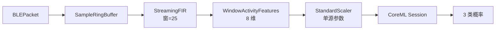

# 对齐口径：CoreML 流式滑窗推理（StreamingFIR → 窗特征 → Session）

版本：0.1.0 · 日期：2026-07-29 · 作者：lab · 状态：生效

> Case14 / T16。零基础请先读 [`docs/09-CoreML入门/03-CoreML运行时与硬件.md`](../09-CoreML入门/03-CoreML运行时与硬件.md)。  
> FIR 口径继承 Case5；模型继承 Case04 FP32。

---

## 1. 端到端链路

Actor：`CoreMLStreamingInferenceActor` 串行 `ingest`，避免 BLE 回调与推理并发碰同一 Session。

> **流式附录（T16）：** 完整链路与窗特征公式见 [`../02-算法对齐口径/coreml-streaming.md`](../02-算法对齐口径/coreml-streaming.md)。

---

## 2. 窗特征公式（固定）

对长度 25 的滤波输出 `y`：

| 下标 | 定义 |
| :--- | :--- |
| 0 | mean(y) |
| 1 | std(y, ddof=0) |
| 2 | max(y)-min(y) |
| 3 | mean(y²) |
| 4 | y[0] |
| 5 | y[24] |
| 6 | abs(y[24]-y[0]) |
| 7 | y[12] |

然后 `(f - mean) / scale`，参数来自 `golden/coreml_quant/compare_report.json`。

> 窗特征为工程演示，不是临床活动识别特征。

---

## 3. 指标与阈值

| 指标 | 阈值 |
| :--- | :--- |
| 窗特征 vs Python | abs ≤ **1e-9** |
| 概率 vs Python CoreML | abs ≤ **5e-4** |
| Actor vs 同步 Pipeline | 同概率容差 |

---

## 4. 产物

| 产物 | 路径 |
| :--- | :--- |
| Golden | `golden/coreml_streaming/stream_report.json` |
| 实现 | `Sources/AlgoSwift/CoreMLStreamingPipeline.swift` |
| 重跑 | `uv run python -m python.generate_golden coreml_streaming` |

---

## 5. 面试金句

> BLE 分片进 RingBuffer，凑满窗做 FIR，再提特征喂缓存好的 CoreML Session；推理放 Actor 串行，compile 不进热路径。
