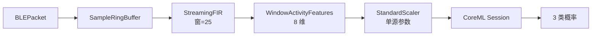
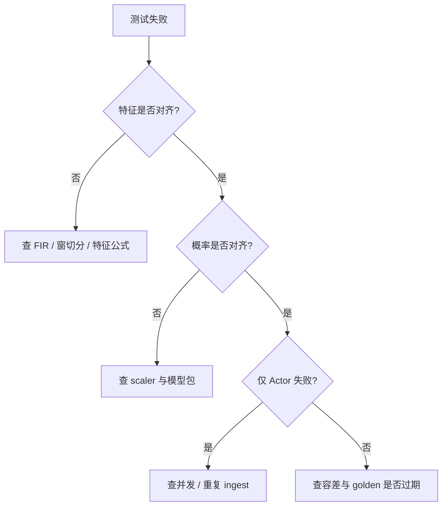

# 对齐口径：CoreML 流式滑窗推理（StreamingFIR → 窗特征 → Session）

版本：0.2.0 · 日期：2026-07-29 · 作者：lab · 状态：生效

> Case14 / T16。零基础请先读 [`docs/09-CoreML入门/03-CoreML运行时与硬件.md`](../09-CoreML入门/03-CoreML运行时与硬件.md)。  
> FIR 口径继承 Case5；模型 / scaler 继承 Case04。  
> 复盘：[`../06-实验复盘/case-14-coreml-streaming.md`](../06-实验复盘/case-14-coreml-streaming.md)。

---

## 0. 发生了什么（读完能口述）

可穿戴主场不是「一次喂一整段数组」，而是：

1. BLE 分片到达；
2. RingBuffer 凑满 1 秒窗（25 点 @25Hz）；
3. 因果 StreamingFIR 滤波（延迟线跨窗连续）；
4. 从滤波窗抽出 **固定公式** 的 8 维特征；
5. 用训练侧 **同一套** StandardScaler；
6. 喂给 **已缓存** 的 CoreML `Session`（compile 不在热路径）；
7. 可选：`CoreMLStreamingInferenceActor` 串行 `ingest`，避免回调线程并发碰模型。



本 lab 用 100 点合成 PPG → 4 个窗，把上述链路做成 golden + Swift parity。  
**窗特征是工程演示公式，不是临床活动识别特征**；验收的是链路数值，不是分类业务语义。

---

## 1. 窗特征公式（冻结，改了必须重生 golden）

对长度 25 的滤波输出 `y`：

| 下标 | 定义 | Swift / Python |
| :--- | :--- | :--- |
| 0 | mean(y) | `mean` |
| 1 | std(y, **ddof=0**) | 总体标准差 |
| 2 | max(y)-min(y) | range |
| 3 | mean(y²) | energy |
| 4 | y[0] | first |
| 5 | y[24] | last |
| 6 | abs(y[24]-y[0]) | delta |
| 7 | y[12] | mid |

然后 `(f - mean) / scale`，参数来自 `golden/coreml_quant/compare_report.json`。

---

## 2. 指标与阈值

| 指标 | 阈值 |
| :--- | :--- |
| 窗特征 vs Python | abs ≤ **1e-9** |
| 概率 vs Python CoreML | abs ≤ **5e-4** |
| Actor vs 同步 Pipeline | 同概率容差 |

---

## 3. 产物与命令

| 产物 | 路径 |
| :--- | :--- |
| Golden | `golden/coreml_streaming/stream_report.json` |
| 实现 | `Sources/AlgoSwift/CoreMLStreamingPipeline.swift` |
| Parity | `Tests/ParityTests/CoreMLStreamingParityTests.swift` |
| 模型 | `artifacts/coreml/activity_fp32.mlpackage` |

```bash
uv sync --extra ml
# 若缺 Case04 报告/模型，streaming 生成器会尝试触发重生
uv run python -m python.generate_golden coreml_streaming
swift test --filter CoreMLStreamingParityTests
```

---

## 4. 排查手册（出问题怎么查）

**原则：分层对齐。** 先特征、再概率；先同步 Pipeline、再 Actor。



### 4.1 窗特征对不上（`feat[i][j]`）

| 检查项 | 怎么做 |
| :--- | :--- |
| 窗长是否 25 | `WindowActivityFeatures.windowSize` 与 golden `input.window` |
| std 是否用了样本标准差 | 必须 **ddof=0**（除以 N，不是 N-1） |
| FIR 是否跨窗 reset | 正确路径 **不** `resetStateEachWindow`；Case5 负例才演示错误 reset |
| 包序列是否完整 | 对照 `stream_report.json` → `input.packets`；seq 缺口会 zero_fill |
| 系数是否同源 | Case2 `golden/fir_ppg/coeffs.json`；与 StreamingFIR 默认 coeffs 一致 |

中间快照：把 Swift `fir.outputs` 拼成 `flatOutput`，与 golden `expected.filtered_y` 比——若滤波已偏，特征必偏。

### 4.2 特征对齐但概率偏（`prob[i][j]`）

| 检查项 | 怎么做 |
| :--- | :--- |
| scaler 是否 Case04 那套 | `preprocess.mean/scale` 必须来自 `coreml_quant` 报告 |
| 是否喂了 raw 给 App 侧模型 | T16 用的是 **scaled → activity_fp32**，不是 with_preprocess 包 |
| Session 是否缓存 | 应用 `load` 一次；勿每窗 `compileModel`（慢且非本 case 焦点） |
| 模型是否被 T15 覆写后未重生 streaming golden | 先 `coreml_quant` / `coreml_preprocess_inmodel`，再 `coreml_streaming` |

### 4.3 同步 Pipeline 过、Actor 不过（或反过来）

| 检查项 | 怎么做 |
| :--- | :--- |
| 是否对同一 pipeline 实例双边 ingest | Actor 持有同一 class 引用；测试应只通过 Actor 喂，或只用同步路径 |
| 是否 await 漏掉 | `ingest` 在 actor 上需 `await`；漏 await 会导致未跑完就读结果 |
| 是否并发双喂 | 不要 BLE 模拟线程 + 测试线程同时 `ingest` 同一 pipeline |

### 4.4 窗数不对（期望 4 窗却更少/更多）

- `n_samples` 必须能被 25 整除（golden 用 100 → 4 窗）。
- 丢包 / zero_fill 会改变重建序列长度；本 case 默认无丢包连续流。
- 空包不会触发窗；确认 packets 总采样点数。

### 4.5 加载 / 编译失败

同 T14：`.mlpackage` 路径、`compileModel`、测试 `locate` 是否找到 repo 根下 `artifacts/`。

---

## 5. 面试金句

> BLE 分片进 RingBuffer，凑满窗做 FIR，再提特征喂缓存好的 CoreML Session；推理放 Actor 串行，compile 不进热路径。对不齐时先对窗特征，再对概率。
