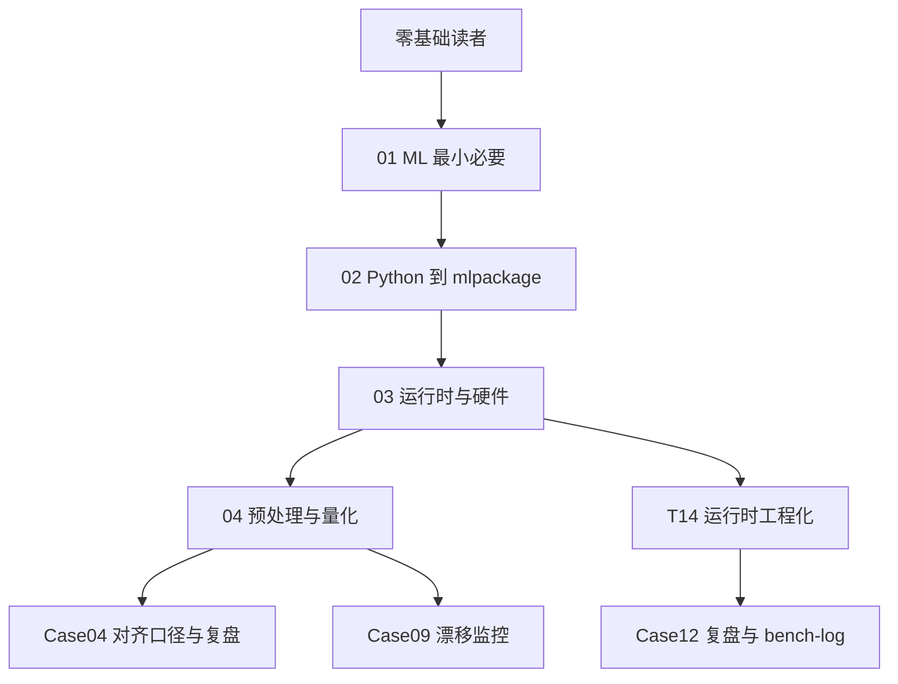

# CoreML 入门 · 00 导读

版本：0.1.0 · 日期：2026-07-29 · 作者：lab · 状态：生效

> **读者：** 无机器学习（ML）基础、无 CoreML 经验的 iOS / 联调工程师。  
> **目标：** 读完本系列，能用本仓库的真实模型与数字讲清「特征 → 训练 → `.mlpackage` → 编译 → 推理 → 量化验收」。

---

## 1. 你将学到什么

| 能力 | 对应章节 | 本仓库印证 |
| :--- | :--- | :--- |
| 说清分类、概率、top-1 | [`01-机器学习最小必要.md`](01-机器学习最小必要.md) | 合成 rest / walk / run |
| 看懂 Python 如何生成 CoreML 包 | [`02-Python到CoreML生成.md`](02-Python到CoreML生成.md) | `python/generate_coreml_quant.py` |
| 理解编译、加载、CPU/GPU/ANE | [`03-CoreML运行时与硬件.md`](03-CoreML运行时与硬件.md) | T14 Session 缓存 + bench |
| 预处理单源与量化验收语义 | [`04-预处理单源与量化语义.md`](04-预处理单源与量化语义.md) | Case04 / Case09 |

**建议顺序：** `01 → 02 → 03 → 04`，再读工程口径与复盘（数字以 `docs/bench-log.md` 为准）。

---

## 2. 学习路径总览



---

## 3. 与现有 Case / Ticket 的导航

| 主题 | 对齐口径 | 复盘 / Ticket |
| :--- | :--- | :--- |
| FP32 vs FP16 量化对比 | [`../02-算法对齐口径/coreml-quant.md`](../02-算法对齐口径/coreml-quant.md) | [`../06-实验复盘/case-04-coreml-quant.md`](../06-实验复盘/case-04-coreml-quant.md) · T5 |
| 输入分布漂移监控 | [`../02-算法对齐口径/coreml-drift-monitoring.md`](../02-算法对齐口径/coreml-drift-monitoring.md) | [`../06-实验复盘/case-09-coreml-drift-monitoring.md`](../06-实验复盘/case-09-coreml-drift-monitoring.md) · T11 |
| 预处理入模对照 | [`../02-算法对齐口径/coreml-preprocess-inmodel.md`](../02-算法对齐口径/coreml-preprocess-inmodel.md) | [`../06-实验复盘/case-13-coreml-preprocess-inmodel.md`](../06-实验复盘/case-13-coreml-preprocess-inmodel.md) · **T15** |
| 流式滑窗推理 | [`../02-算法对齐口径/coreml-streaming.md`](../02-算法对齐口径/coreml-streaming.md) | [`../06-实验复盘/case-14-coreml-streaming.md`](../06-实验复盘/case-14-coreml-streaming.md) · **T16** |
| 编译缓存与 computeUnits | [`../02-算法对齐口径/coreml-runtime-engineering.md`](../02-算法对齐口径/coreml-runtime-engineering.md) | [`../06-实验复盘/case-12-coreml-runtime.md`](../06-实验复盘/case-12-coreml-runtime.md) · **T14** |

**后续：** CoreML 深挖主线 T14–T16 已落地；扩展见 `docs/08`。

---

## 4. 术语表（先扫一眼）

| 术语 | 一句话 |
| :--- | :--- |
| **model** | 学到的参数 + 计算图；本 lab 是小 MLP 三分类器 |
| **inference（推理）** | 用已训练模型对新输入算出输出（这里是 3 类概率） |
| **feature（特征）** | 模型输入向量；本 lab 固定 **8** 维 float |
| **label（标签）** | 训练时的正确答案；`rest` / `walk` / `run` |
| **preprocess（预处理）** | 推理前对特征的变换（如 StandardScaler）；必须与训练一致 |
| **quantization（量化）** | 用更低精度（如 FP16）存算；本 lab 比 top-1 一致率，不比逐 logit |
| **`.mlpackage`** | Core ML 模型包（coremltools 导出） |
| **`compileModel`** | 把 package 编译成设备可执行的 `.mlmodelc`；应 **一次**，非每次推理 |
| **top-1** | 概率最大的那一类；产品语义上的「预测结果」 |
| **confidence** | 通常指 top-1 对应的 softmax 概率 |

---

## 5. 本仓库关键路径（动手时打开）

| 路径 | 作用 |
| :--- | :--- |
| `python/generate_coreml_quant.py` | 训练 + 导出 FP32/FP16 |
| `artifacts/coreml/activity_fp32.mlpackage` | Swift / Python 共用的 FP32 模型 |
| `artifacts/coreml/activity_fp16.mlpackage` | FP16 对照模型 |
| `golden/coreml_quant/compare_report.json` | 指标、scaler、`verification_vectors` |
| `Sources/AlgoSwift/CoreMLActivityModel.swift` | Swift 加载与推理 |

重跑生成：

```bash
cd algo-engineering-lab
uv sync --extra ml
uv run python -m python.generate_golden coreml_quant
```
