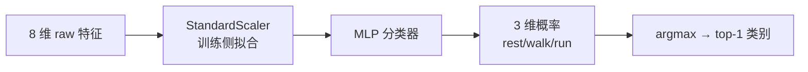
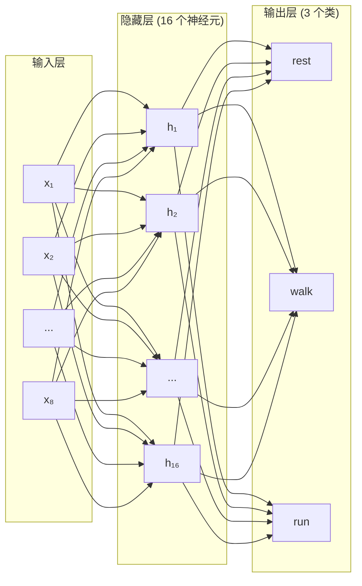
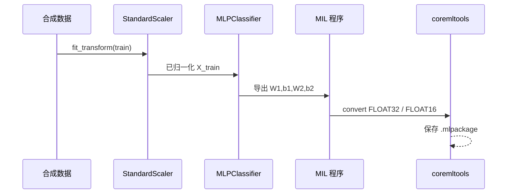
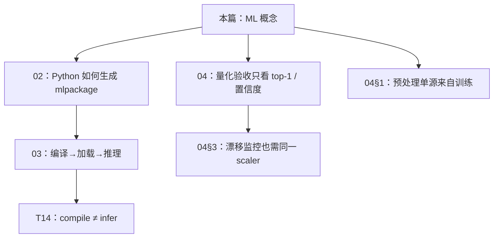

# CoreML 入门 · 01 机器学习最小必要

版本：0.2.0 · 日期：2026-07-29 · 作者：lab · 状态：生效

> 只讲本 lab 用到的概念。目标不是成为算法专家，而是能和算法同学对齐 I/O 与验收指标。

---

## 1. 本 lab 在解决什么问题

把一段 **8 维运动相关特征** 判成三类活动之一：

| 类别索引 | 名称 | 直觉 |
| :--- | :--- | :--- |
| 0 | `rest` | 低运动能量 |
| 1 | `walk` | 中等 |
| 2 | `run` | 高 |

数据是 **合成的**（`seed=42`），用于练工程链路，不是临床/生产模型。见 `python/generate_coreml_quant.py` 中 `_synth_dataset`。



---

## 2. 特征、标签、样本

| 概念 | 本 lab 取值 |
| :--- | :--- |
| **样本** | 一行 8 个数 + 一个类别标签 |
| **特征 X** | `shape = (N, 8)` |
| **标签 y** | `0 / 1 / 2` |
| **训练集** | 前 600 条：拟合 scaler + 训练 MLP |
| **验证集** | 后 200 条：只评估，不再改模型参数 |

### 2.1 为什么要分训练集和验证集？

- 训练集用来 **学**（调整参数）。
- 验证集用来 **考**（检验学到的东西有没有泛化能力）。
- 如果只看训练集成绩，模型可能只是"死记答案"（过拟合），一换题就不行。

**过拟合一句话：** 训练准但验证不准 = 背题不等于理解。本 lab 训练 600 条、验证 200 条，验证准确率 ~94.5%，没有明显过拟合。

### 2.2 合成数据是怎么造的？

脚本里用三个 **中心向量**（每个代表一类活动的"典型姿态"），再叠加高斯噪声：

```python
centers = [
    [0.0, 0.0, 0.2, ...],  # rest：值都很小
    [1.5, 1.2, 0.8, ...],  # walk：中等
    [2.5, 2.0, 1.5, ...],  # run：值较大
]
X = centers[y] + noise(scale=0.45)
```

这样三类之间有重叠（现实中也不可能完美可分），但大体可分——足够练工程口径。

**分类 vs 回归（一句话）：**  
分类输出离散类别（或各类概率）；回归输出连续数值（如心率 bpm）。本 lab 是 **分类**。

---

## 3. MLP 网络结构

MLP（Multi-Layer Perceptron，多层感知机）是最简单的神经网络。本 lab 的结构：



| 层 | 维度 | 参数量 | 作用 |
| :--- | :--- | :--- | :--- |
| 输入 → 隐藏 | `(8, 16)` + 16 bias | 8×16+16 = **144** | 学习特征组合 |
| ReLU 激活 | — | 0 | 引入非线性 |
| 隐藏 → 输出 | `(16, 3)` + 3 bias | 16×3+3 = **51** | 映射到类别 |
| Softmax | — | 0 | 概率化 |
| **总计** | — | **195** | 极小模型 |

### 3.1 每一层在做什么？

1. **线性变换** `h = x × W + b`：把输入 8 个数混合加权，变成 16 个数。
2. **ReLU**：把负数变成 0，正数不变。一句话——"负面信号清零，正面信号通过"。
3. **再来一次线性变换**：16 → 3。
4. **Softmax**：把 3 个裸分数变成和为 1 的概率。

### 3.2 为什么用 ReLU 而不是 Sigmoid？

- ReLU 计算简单（一次 `max(0, x)`），**不会梯度消失**。
- Sigmoid 在大值/小值处梯度接近 0，深一点的网络就训不动。
- 现代几乎所有神经网络的默认激活都是 ReLU 或其变体（LeakyReLU、GELU）。

---

## 4. Softmax、概率与 top-1

模型最后一层先得到 **logits**（未归一化分数），再经 **softmax** 变成和为 1 的概率：

$$
p_i = \frac{e^{z_i}}{\sum_j e^{z_j}}
$$

- **top-1**：$\arg\max_i p_i$，产品上「判成了哪一类」。
- **confidence**：常取 $\max_i p_i$，表示「有多确信」。

### 为何本 lab 不盯单点 logits？

量化（FP16）会让每个 logit 有微小数值差；若要求 `1e-12` 对齐，几乎必挂。  
产品上真正会翻车的是：**类别翻转**（top-1 变了）或 **置信度虚高/虚低**（阈值展示误导）。

因此 Case04 验收：

| 指标 | 阈值 | 含义 |
| :--- | :--- | :--- |
| top-1 一致率 FP16↔FP32 | ≥ 95% | 决策是否一致 |
| 置信度偏移均值 abs | ≤ 0.05 | 展示用概率是否整体漂移 |

数字见 `golden/coreml_quant/compare_report.json` 的 `metrics`。

---

## 5. 「训练」在本仓库里发生了什么



要点：

1. **Scaler 只在训练流水线拟合一次**（均值/方差写入报告）。
2. 权重从 sklearn 拷到 MIL 手写小网络（`linear → relu → linear → softmax`）。
3. 导出两份模型：FP32 与 FP16，用同一验证集比决策一致性。

### 5.1 训练循环的直觉

即使你不写训练代码（sklearn 帮你封装了），背后在循环做：

```
repeat 很多轮:
    1. 模型猜一批答案（前向传播）
    2. 算"猜错了多少"（loss / 损失）
    3. 算"每个参数该往哪个方向调"（梯度 / 反向传播）
    4. 微调参数（优化器更新）
```

**梯度下降一句话：** 站在山上，每步往最陡的方向下坡，直到走到谷底（loss 最小）。  
本 lab 用 `adam` 优化器（自适应学习率版梯度下降），训 800 轮（`max_iter=800`）。

---

## 6. 这些概念怎么串到后面的工程环节



**理解了本篇，你就能回答：**

- 「8 维特征是什么？」→ 合成运动相关向量（见 §2.2）
- 「为什么不看 logits 精度？」→ 看决策一致性（见 §4）
- 「MLP 有多少参数？」→ 195 个（见 §3）
- 「训练循环怎么工作？」→ 前向→loss→梯度→更新（见 §5.1）

下一篇：[02-Python到CoreML生成.md](02-Python到CoreML生成.md) 对着脚本逐步走。
