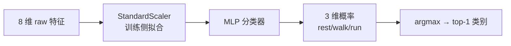
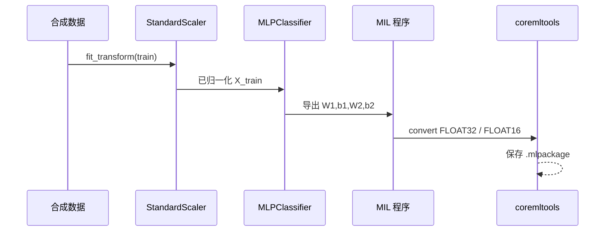

# CoreML 入门 · 01 机器学习最小必要

版本：0.1.0 · 日期：2026-07-29 · 作者：lab · 状态：生效

> 只讲本 lab 用到的概念。目标不是成为算法专家，而是能和算法同学对齐 I/O 与验收指标。

---

## 1. 本 lab 在解决什么问题

把一段 **8 维运动相关特征** 判成三类活动之一：

| 类别索引 | 名称 | 直觉 |
| :--- | :--- | :--- |
| 0 | `rest` | 低运动能量 |
| 1 | `walk` | 中等 |
| 2 | `run` | 高 |

数据是 **合成的**（`seed=42`），用于练工程链路，不是临床/生产模型。见 `python/generate_coreml_quant.py` 中 `_synth_dataset`。

---

## 2. 特征、标签、样本

| 概念 | 本 lab 取值 |
| :--- | :--- |
| **样本** | 一行 8 个数 + 一个类别标签 |
| **特征 X** | `shape = (N, 8)` |
| **标签 y** | `0 / 1 / 2` |
| **训练集** | 前 600 条：拟合 scaler + 训练 MLP |
| **验证集** | 后 200 条：只评估，不再改模型参数 |

**分类 vs 回归（一句话）：**  
分类输出离散类别（或各类概率）；回归输出连续数值（如心率 bpm）。本 lab 是 **分类**。

---

## 3. Softmax、概率与 top-1

模型最后一层先得到 **logits**（未归一化分数），再经 **softmax** 变成和为 1 的概率：

\[
p_i = \frac{e^{z_i}}{\sum_j e^{z_j}}
\]

- **top-1**：\( \arg\max_i p_i \)，产品上「判成了哪一类」。
- **confidence**：常取 \( \max_i p_i \)，表示「有多确信」。

### 为何本 lab 不盯单点 logits？

量化（FP16）会让每个 logit 有微小数值差；若要求 `1e-12` 对齐，几乎必挂。  
产品上真正会翻车的是：**类别翻转**（top-1 变了）或 **置信度虚高/虚低**（阈值展示误导）。

因此 Case04 验收：

| 指标 | 阈值 | 含义 |
| :--- | :--- | :--- |
| top-1 一致率 FP16↔FP32 | ≥ 95% | 决策是否一致 |
| 置信度偏移均值 abs | ≤ 0.05 | 展示用概率是否整体漂移 |

数字见 `golden/coreml_quant/compare_report.json` 的 `metrics`。

---

## 4. 「训练」在本仓库里发生了什么

要点：

1. **Scaler 只在训练流水线拟合一次**（均值/方差写入报告）。
2. 权重从 sklearn 拷到 MIL 手写小网络（`linear → relu → linear → softmax`）。
3. 导出两份模型：FP32 与 FP16，用同一验证集比决策一致性。

下一篇：[02-Python到CoreML生成.md](02-Python到CoreML生成.md) 对着脚本逐步走。
