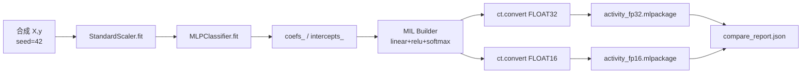
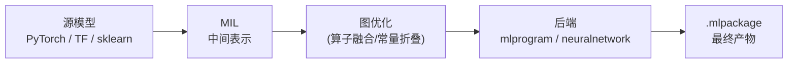

# CoreML 入门 · 02 从 Python 到 CoreML 生成

版本：0.2.0 · 日期：2026-07-29 · 作者：lab · 状态：生效

> 对照脚本：[`python/generate_coreml_quant.py`](../../python/generate_coreml_quant.py)。  
> 环境：`uv sync --extra ml`（锁定 `scikit-learn<1.6`，否则 coremltools 会禁用转换 API）。

---

## 1. 端到端生成链



产物路径：

| 产物 | 路径 |
| :--- | :--- |
| FP32 | `artifacts/coreml/activity_fp32.mlpackage` |
| FP16 | `artifacts/coreml/activity_fp16.mlpackage` |
| 报告 | `golden/coreml_quant/compare_report.json` |

---

## 2. MIL 是什么？

**MIL（Model Intermediate Language）** 是 coremltools 内部的中间表示，类似编译器里的 **LLVM IR**：



| 你可能听过的 | 类比 |
| :--- | :--- |
| Python 源码 → 字节码 → 执行 | 源模型 → MIL → CoreML 运行时 |
| C 源码 → LLVM IR → 机器码 | PyTorch → MIL → mlprogram |

**为什么要知道 MIL？**  
本 lab 直接用 `MIL Builder` 手写小网络（不走 PyTorch/TF 转换器），所以你会在代码里看到 `mb.linear`、`mb.relu`、`mb.softmax` 这些 MIL 算子。

---

## 3. 为什么手写 MIL，而不是直接转 sklearn？

本 lab 早期尝试过树模型（GBM）走 `compute_precision=FLOAT16`，在 coremltools 9 下会停在 `pipelineClassifier`，**无法演示 FP16 compute precision**。

因此改为：

1. 用 `MLPClassifier` 训出权重；
2. 用 `coremltools.converters.mil.Builder` 搭同结构小网络；
3. `ct.convert(..., convert_to="mlprogram", compute_precision=...)`。

这是工程取舍，记在对齐口径「已知差异」里，不是「MLP 一定优于树模型」。

---

## 4. `ct.convert` 参数详解

```python
model = ct.convert(
    prog,                                    # MIL 程序对象
    convert_to="mlprogram",                  # 目标格式
    compute_precision=ct.precision.FLOAT32,   # 精度策略
    inputs=[ct.TensorType(name="features", shape=(1, 8))],  # 输入签名
)
```

### 4.1 `convert_to`：neuralnetwork vs mlprogram

| | `neuralnetwork` | `mlprogram` |
| :--- | :--- | :--- |
| 产物 | `.mlmodel`（旧格式） | `.mlpackage`（新格式） |
| 精度控制 | 无 `compute_precision` | ✅ 支持 FP16/FP32 |
| 新算子支持 | 不再更新 | 持续新增 |
| 最低系统要求 | iOS 11 | iOS 15 |
| **本 lab 选择** | ❌ | ✅ |

**一句话：** 2024+ 年新项目都应该用 `mlprogram`。`neuralnetwork` 是遗留格式。

### 4.2 `compute_precision`

| 值 | 含义 | 本 lab 用途 |
| :--- | :--- | :--- |
| `ct.precision.FLOAT32` | 权重和计算全用 32 位 | 参考基准 |
| `ct.precision.FLOAT16` | 半精度；体积更小、带宽更友好 | 对照实验 |

> **注意**：`compute_precision` 只影响 **mlprogram**。如果 `convert_to="neuralnetwork"`，这个参数会被静默忽略——这就是树模型踩坑的原因。

### 4.3 `inputs`

```python
ct.TensorType(name="features", shape=(1, 8))
```

- `name="features"`：Swift 侧通过这个名字喂数据（`MLDictionaryFeatureProvider`）。
- `shape=(1, 8)`：batch=1，8 维特征。CoreML 不原生支持 dynamic batch；固定 1 即可。

---

## 5. 脚本关键片段怎么读

### 5.1 权重布局

sklearn：`coefs_[0]` 形状 `(n_in, n_hid)`；MIL `linear` 的 weight 期望 `(n_out, n_in)`，故脚本里 `W1 = mlp.coefs_[0].T`。

```python
# sklearn 权重布局：(8, 16) — 输入在行、输出在列
# MIL 权重布局：(16, 8) — 输出在行、输入在列
# 所以需要转置
W1 = mlp.coefs_[0].T.copy()   # (8,16) → (16,8)
b1 = mlp.intercepts_[0].copy()  # (16,)
W2 = mlp.coefs_[1].T.copy()   # (16,3) → (3,16)
b2 = mlp.intercepts_[1].copy()  # (3,)
```

### 5.2 MIL 网络构建

```python
@mb.program(input_specs=[mb.TensorSpec(shape=(1, 8), dtype=fp32)])
def prog(features):
    h = mb.linear(x=features, weight=W1, bias=b1)   # 8→16
    h = mb.relu(x=h)                                  # 非线性
    logits = mb.linear(x=h, weight=W2, bias=b2)       # 16→3
    probs = mb.softmax(x=logits, axis=-1)              # 概率化
    return probs
```

每个 `mb.*` 就是一个 MIL 算子，最终会被 `ct.convert` 翻译成 CoreML 可执行的图。

### 5.3 验证向量（给 Swift 用）

报告里的 `verification_vectors`：

- `scaled_features`：已用训练集 scaler 变换；
- `expected_probs_fp32` / `expected_probs_fp16`：Python CoreML runtime 的期望输出；
- 容差：FP32 `1e-6`，FP16 `5e-4`。

Swift 侧 `CoreMLModelUsageParityTests` 加载同一 `.mlpackage`，断言概率对齐——这是「生成物真的在 iOS 栈可用」的证据，不只是 Python 自嗨。

---

## 6. `.mlpackage` 里面有什么？

打开一个 `.mlpackage` 目录，结构如下：

```
activity_fp32.mlpackage/
├── Manifest.json            ← 模型元数据索引
└── Data/
    └── com.apple.CoreML/
        ├── model.mlmodel     ← 模型定义（protobuf 序列化）
        └── weights/
            └── weight.bin    ← 权重二进制文件
```

| 文件 | 内容 | 你需要知道的 |
| :--- | :--- | :--- |
| `Manifest.json` | 版本、作者、创建时间 | 调试时确认"是不是最新生成的" |
| `model.mlmodel` | 计算图 + 输入输出签名 | `model.get_spec()` 可在 Python 中读 |
| `weight.bin` | 所有权重的连续字节 | FP32 = 195×4 = 780 bytes；FP16 = 195×2 = 390 bytes |

> 更详细的格式解析见 [05-CoreML模型格式深度解析.md](05-CoreML模型格式深度解析.md)。

**用 Python 快速查看模型签名：**

```python
import coremltools as ct
model = ct.models.MLModel("activity_fp32.mlpackage")
spec = model.get_spec()
print(spec.description)  # 输入名、输出名、shape
```

---

## 7. 你自己重跑

```bash
cd algo-engineering-lab
uv sync --extra ml
uv run python -m python.generate_golden coreml_quant
```

成功时 stdout 打印 `metrics`，且 `pass.top1` 与 `pass.conf_shift` 为真；否则脚本返回非 0。

---

## 8. 和 Swift 的契约（先记住）

| 项 | 约定 |
| :--- | :--- |
| 输入名 | 模型 description 中的第一个输入（脚本侧名 `features`） |
| 输入 shape | `(1, 8)`，float32 `MLMultiArray` |
| 输入语义 | **已 scaled**；App 禁止再套一套 normalize |
| 输出 | 长度为 3 的概率向量（softmax） |
| 输出名 | `softmax_0`（自动生成，Swift 侧读 description 首输出） |

---

## 9. 读完本篇，你能回答

- 「MIL 是什么？」→ CoreML 的中间表示，类似 LLVM IR（§2）
- 「为什么不直接转 sklearn？」→ 树模型无法走 `compute_precision`（§3）
- 「mlpackage 里面有什么？」→ Manifest + model 定义 + 权重二进制（§6）
- 「怎么在 Python 里看模型签名？」→ `model.get_spec().description`（§6）
- 「neuralnetwork 和 mlprogram 有啥区别？」→ 新格式支持 FP16、新算子（§4.1）

下一篇：[03-CoreML运行时与硬件.md](03-CoreML运行时与硬件.md)（编译为何贵、computeUnits 是什么）。
