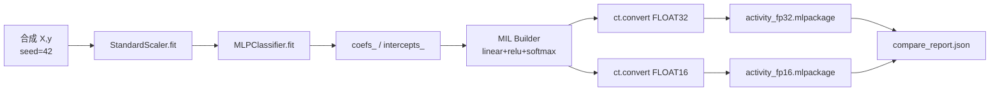

# CoreML 入门 · 02 从 Python 到 CoreML 生成

版本：0.1.0 · 日期：2026-07-29 · 作者：lab · 状态：生效

> 对照脚本：[`python/generate_coreml_quant.py`](../../python/generate_coreml_quant.py)。  
> 环境：`uv sync --extra ml`（锁定 `scikit-learn<1.6`，否则 coremltools 会禁用转换 API）。

---

## 1. 端到端生成链



产物路径：

| 产物 | 路径 |
| :--- | :--- |
| FP32 | `artifacts/coreml/activity_fp32.mlpackage` |
| FP16 | `artifacts/coreml/activity_fp16.mlpackage` |
| 报告 | `golden/coreml_quant/compare_report.json` |

---

## 2. 为什么手写 MIL，而不是直接转 sklearn？

本 lab 早期尝试过树模型（GBM）走 `compute_precision=FLOAT16`，在 coremltools 9 下会停在 `pipelineClassifier`，**无法演示 FP16 compute precision**。

因此改为：

1. 用 `MLPClassifier` 训出权重；
2. 用 `coremltools.converters.mil.Builder` 搭同结构小网络；
3. `ct.convert(..., convert_to="mlprogram", compute_precision=...)`。

这是工程取舍，记在对齐口径「已知差异」里，不是「MLP 一定优于树模型」。

---

## 3. 脚本关键片段怎么读

### 3.1 权重布局

sklearn：`coefs_[0]` 形状 `(n_in, n_hid)`；MIL `linear` 的 weight 期望 `(n_out, n_in)`，故脚本里 `W1 = mlp.coefs_[0].T`。

### 3.2 转换

```text
ct.convert(prog, convert_to="mlprogram",
           compute_precision=ct.precision.FLOAT32 | FLOAT16,
           inputs=[ct.TensorType(name="features", shape=(1, 8))])
```

- **FLOAT32**：权重与计算用 32 位浮点（参考）。
- **FLOAT16**：半精度；体积与带宽更友好，数值有 ULP 级差，用 top-1 / 置信度验收。

### 3.3 验证向量（给 Swift 用）

报告里的 `verification_vectors`：

- `scaled_features`：已用训练集 scaler 变换；
- `expected_probs_fp32` / `expected_probs_fp16`：Python CoreML runtime 的期望输出；
- 容差：FP32 `1e-6`，FP16 `5e-4`。

Swift 侧 `CoreMLModelUsageParityTests` 加载同一 `.mlpackage`，断言概率对齐——这是「生成物真的在 iOS 栈可用」的证据，不只是 Python 自嗨。

---

## 4. 你自己重跑

```bash
cd algo-engineering-lab
uv sync --extra ml
uv run python -m python.generate_golden coreml_quant
```

成功时 stdout 打印 `metrics`，且 `pass.top1` 与 `pass.conf_shift` 为真；否则脚本返回非 0。

---

## 5. 和 Swift 的契约（先记住）

| 项 | 约定 |
| :--- | :--- |
| 输入名 | 模型 description 中的第一个输入（脚本侧名 `features`） |
| 输入 shape | `(1, 8)`，float32 `MLMultiArray` |
| 输入语义 | **已 scaled**；App 禁止再套一套 normalize |
| 输出 | 长度为 3 的概率向量（softmax） |

下一篇：[03-CoreML运行时与硬件.md](03-CoreML运行时与硬件.md)（编译为何贵、computeUnits 是什么）。
