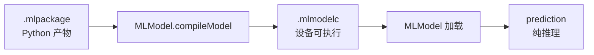
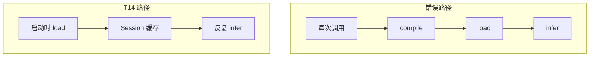
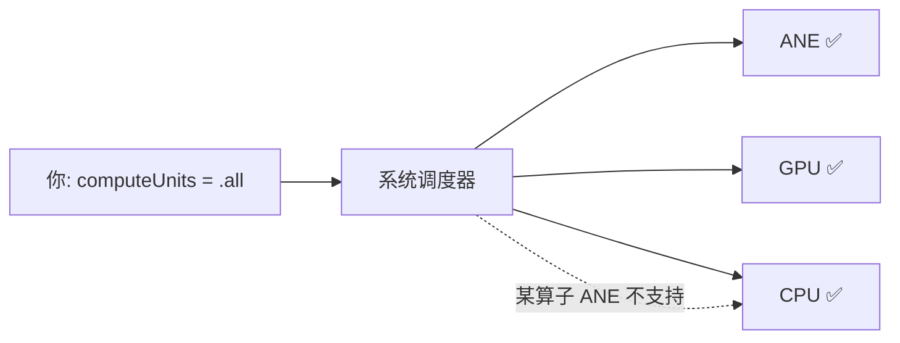
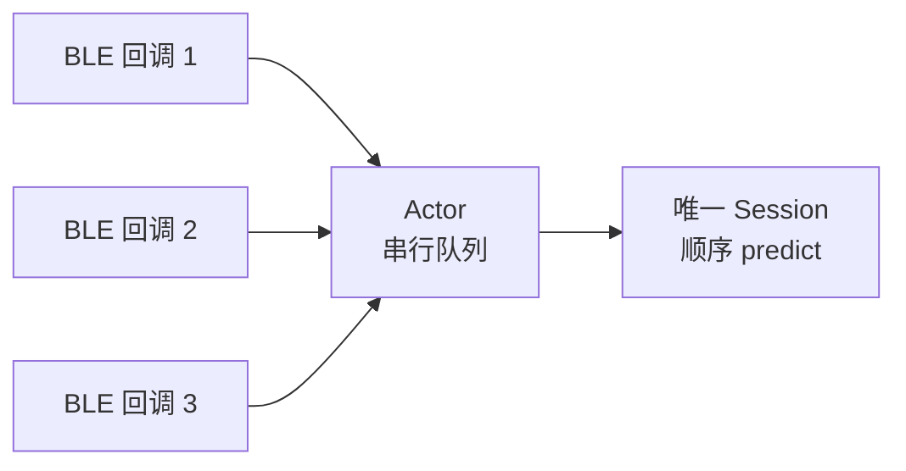

# CoreML 入门 · 03 运行时与硬件

版本：0.2.0 · 日期：2026-07-29 · 作者：lab · 状态：生效

> 工程口径全文：[`../02-算法对齐口径/coreml-runtime-engineering.md`](../02-算法对齐口径/coreml-runtime-engineering.md)（T14）。  
> 实现：[`Sources/AlgoSwift/CoreMLActivityModel.swift`](../../Sources/AlgoSwift/CoreMLActivityModel.swift)。

---

## 1. `.mlpackage` 还不能直接「飞」

Python / coremltools 写出的是 **模型包**。设备上要跑，通常还要：

1. **编译** `MLModel.compileModel(at:)` → 得到 `.mlmodelc`（或 Xcode 构建时预编译）；
2. **加载** `MLModel(contentsOf:configuration:)`；
3. **推理** `prediction(from:)`。



| 阶段 | 贵在哪 | 应该多久做一次 |
| :--- | :--- | :--- |
| compile | 图优化、选后端、写磁盘 | **冷启动 / 换模型版本时一次** |
| load | 读编译产物进内存 | 会话级缓存 |
| infer | 真正算一次前向 | 每个窗口 / 每个样本 |

### 1.1 `compileModel` 返回了什么？

```swift
let compiledURL = try MLModel.compileModel(at: packageURL)
// compiledURL 指向一个临时目录下的 .mlmodelc 文件夹
```

返回的 URL 指向系统 **临时目录**（`/var/folders/...`）。结构：

```
Compiled.mlmodelc/
├── model.mil               ← MIL 编译产物
├── coremldata.bin           ← 权重（可能被量化/重排）
├── metadata.json            ← 元数据
└── neural_network.espresso.* ← 后端特定文件（可能多个）
```

> ⚠️ 每次 `compileModel` 都会在临时目录新建一份。如果你每次推理前都 compile，不仅慢，还会堆积临时文件。正确做法是 **compile 一次、缓存 URL（或直接缓存 MLModel 对象）**。

### 1.2 Xcode 拖入 vs 运行时编译

| 方式 | 何时编译 | 适用场景 |
| :--- | :--- | :--- |
| Xcode Build Phases 拖入 `.mlpackage` | App 构建时 | 模型随 App 分发、不频繁更新 |
| 运行时 `compileModel` | App 运行时 | 从服务器下载新模型、A/B 测试 |

本 lab 用运行时编译（`CoreMLActivityModel.load`），因为模型在 `artifacts/` 而非 Xcode project。

---

## 2. 为什么「每次 predict 都 compile」是错的

T13 统一 bench 曾把 CoreML 测到 **p50 ≈ 42 ms**（见 `docs/bench-log.md`）。  
那条路径是：`predictProbabilities` **内部每次** `compileModel` + 加载 + 推理。

对 8 维小 MLP，纯推理应远低于「几十毫秒」。  
**若不拆开计量，你会把编译成本当成推理成本，面试数字与优化方向都会错。**

T14 的做法：

- `Session = load 一次`（compile + 持有 `MLModel`）；
- `Session.predict` 只做 `MLMultiArray` + `prediction`；
- bench 分别报 `compile_every_call` 与 `infer_after_cached_load`。



### 2.1 数字说话

| 路径 | p50 (ms) | 说明 |
| :--- | ---: | :--- |
| `compile_every_call` | 42.052 | 每次含 compile，慢 1100× |
| `infer_cached .all` | 0.038 | 纯推理 |
| `infer_cached .cpuOnly` | 0.038 | 本机与 .all 接近 |

> 42ms → 0.038ms，不是「模型变快了 1100 倍」，是「你终于不在每次推理前装修房子了」。

---

## 3. `MLComputeUnits`：算力落在哪

通过 `MLModelConfiguration.computeUnits` 指定偏好：

| 取值 | 含义（直觉） | 何时用 |
| :--- | :--- | :--- |
| `.cpuOnly` | 只用 CPU（BNNS 等） | 对照基准、需要确定性结果 |
| `.cpuAndGPU` | 允许 GPU（Metal） | 大矩阵运算、CNN |
| `.cpuAndNeuralEngine` | 允许 ANE，不用 GPU | 低功耗场景 |
| `.all` | 允许所有可用单元（默认） | 一般生产部署 |

### 3.1 理解 ANE 调度的黑盒本质



注意：

- 即使你指定了 `.all`，系统仍可能按算子支持情况 **fallback**。小模型可能全跑在 CPU 上。
- `.all` 是 **偏好**，不是 **保证**——你不能假定模型一定跑在 ANE。
- 同一模型在 A17 和 M2 上的 ANE 占用率可能不同。
- **唯一可靠的方法是实测**：用 Instruments CoreML 模板看实际后端分配。

### 3.2 小模型 vs 大模型在 computeUnits 上的表现

| 模型 | `.cpuOnly` vs `.all` | 原因 |
| :--- | :--- | :--- |
| 195 参数 MLP（本 lab） | 几乎无差 | 模型太小，ANE 启动开销抵消收益 |
| 百万参数 CNN（如 MobileNet） | `.all` 明显快 | ANE 并行度被利用 |
| 大型 Transformer | `.all` 显著快 | 大矩阵乘法是 ANE 强项 |

---

## 4. `MLModelConfiguration` 更多配置

除 `computeUnits` 外，还有一些值得了解的配置项：

| 属性 | 作用 | 默认 |
| :--- | :--- | :--- |
| `computeUnits` | 硬件后端偏好 | `.all` |
| `allowLowPrecisionAccumulationOnGPU` | GPU 上允许 FP16 累加 | `false` |

> 本 lab 只用 `computeUnits`，其他保持默认。但面试被追问时知道这些存在即可。

---

## 5. 内存与模型大小估算

### 5.1 模型文件大小

```
权重参数量 × 每个参数字节数 ≈ 最小权重文件大小

本 lab：195 × 4 bytes (FP32) = 780 bytes
         195 × 2 bytes (FP16) = 390 bytes
```

实际 `.mlpackage` 会大于此（包含元数据、图定义、对齐填充），但数量级对。

### 5.2 运行时内存

加载模型后内存占用 ≈ **权重大小 + 中间 tensor + 框架开销**。  
本 lab 小 MLP 几乎可忽略（<1 MB）。但要注意：

- **多模型并发**：每个 `MLModel` 实例独占一份内存。5 个模型 = 5 份权重。
- **编译产物**：`compileModel` 产生的临时文件也占磁盘。

---

## 6. 多模型并发注意事项

| 场景 | 建议 |
| :--- | :--- |
| 同一模型多线程推理 | `MLModel.prediction` 本身是线程安全的，但并发推理可能导致 ANE 争抢 |
| 多模型交替推理 | 各自持有独立 Session，注意内存总量 |
| BLE 回调触发推理 | 用 Actor 或串行队列隔离（本 lab 的 `CoreMLStreamingInferenceActor`） |



> 避免「10 个 BLE 回调同时触碰同一个 Session」——虽然理论上线程安全，但 ANE 调度不保证这种场景的确定性延迟。

---

## 7. 和本 lab API 的对应

```text
CoreMLActivityModel.load(modelURL:computeUnits:) -> Session
Session.predict(features:) -> [Double]   // 长度 3 的概率

// 兼容旧调用（内部每次 load，仅适合偶发 / 对照 bench）
CoreMLActivityModel.predictProbabilities(modelURL:features:)
```

Parity：对 `verification_vectors` 使用 **同一 Session 多次 predict**，仍须与 Python 期望对齐。

---

## 8. 读完本篇，你能回答

- 「compileModel 做了什么？」→ 图优化 + 选后端 + 写临时 .mlmodelc（§1.1）
- 「为什么有人说 CoreML 推理要 40ms？」→ 因为每次都在 compile（§2）
- 「computeUnits 怎么选？」→ 一般用 .all，但不保证 ANE；小模型差距不大（§3）
- 「多模型怎么管？」→ 各自 Session 独立持有，用 Actor 管并发（§6）
- 「Xcode 拖入 vs 运行时编译选哪个？」→ 模型随 App 发布选拖入，动态更新选运行时（§1.2）

下一篇：[04-预处理单源与量化语义.md](04-预处理单源与量化语义.md)。  
复盘数字：[`../06-实验复盘/case-12-coreml-runtime.md`](../06-实验复盘/case-12-coreml-runtime.md)。

---

## 9. 流式附录（T16）

BLE 分片 → RingBuffer → StreamingFIR 窗 → 8 维窗特征 → StandardScaler → 缓存 Session。  
Actor 串行 `ingest`。对不齐时：**先对窗特征，再对概率**（见流式口径排查手册）。

详见：[`../02-算法对齐口径/coreml-streaming.md`](../02-算法对齐口径/coreml-streaming.md)、[`../06-实验复盘/case-14-coreml-streaming.md`](../06-实验复盘/case-14-coreml-streaming.md)。
