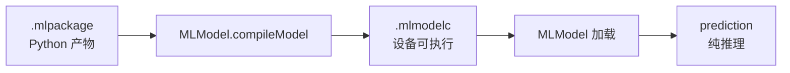
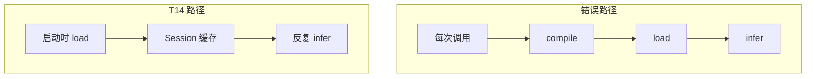

# CoreML 入门 · 03 运行时与硬件

版本：0.1.0 · 日期：2026-07-29 · 作者：lab · 状态：生效

> 工程口径全文：[`../02-算法对齐口径/coreml-runtime-engineering.md`](../02-算法对齐口径/coreml-runtime-engineering.md)（T14）。  
> 实现：[`Sources/AlgoSwift/CoreMLActivityModel.swift`](../../Sources/AlgoSwift/CoreMLActivityModel.swift)。

---

## 1. `.mlpackage` 还不能直接「飞」

Python / coremltools 写出的是 **模型包**。设备上要跑，通常还要：

1. **编译** `MLModel.compileModel(at:)` → 得到 `.mlmodelc`（或 Xcode 构建时预编译）；
2. **加载** `MLModel(contentsOf:configuration:)`；
3. **推理** `prediction(from:)`。



| 阶段 | 贵在哪 | 应该多久做一次 |
| :--- | :--- | :--- |
| compile | 图优化、选后端、写磁盘 | **冷启动 / 换模型版本时一次** |
| load | 读编译产物进内存 | 会话级缓存 |
| infer | 真正算一次前向 | 每个窗口 / 每个样本 |

---

## 2. 为什么「每次 predict 都 compile」是错的

T13 统一 bench 曾把 CoreML 测到 **p50 ≈ 42 ms**（见 `docs/bench-log.md`）。  
那条路径是：`predictProbabilities` **内部每次** `compileModel` + 加载 + 推理。

对 8 维小 MLP，纯推理应远低于「几十毫秒」。  
**若不拆开计量，你会把编译成本当成推理成本，面试数字与优化方向都会错。**

T14 的做法：

- `Session = load 一次`（compile + 持有 `MLModel`）；
- `Session.predict` 只做 `MLMultiArray` + `prediction`；
- bench 分别报 `compile_every_call` 与 `infer_after_cached_load`。



---

## 3. `MLComputeUnits`：算力落在哪

通过 `MLModelConfiguration.computeUnits` 指定偏好：

| 取值 | 含义（直觉） |
| :--- | :--- |
| `.cpuOnly` | 只用 CPU（BNNS 等）；可复现、便于对照 |
| `.cpuAndGPU` | 允许 GPU（Metal） |
| `.all` | 允许 Neural Engine（ANE）等全部可用单元 |

注意：

- 系统仍可能按算子支持情况 **fallback**；小模型在 Mac 上 `.all` 与 `.cpuOnly` 差距可能很小。
- 对比必须 **同一模型、同一输入、缓存已完成**，只改 configuration 后重新 `load`。
- 真机 / 可穿戴上的 ANE 收益要以 Release + 目标芯片重测，不能直接抄 Mac Debug 数字。

---

## 4. 和本 lab API 的对应

```text
CoreMLActivityModel.load(modelURL:computeUnits:) -> Session
Session.predict(features:) -> [Double]   // 长度 3 的概率

// 兼容旧调用（内部每次 load，仅适合偶发 / 对照 bench）
CoreMLActivityModel.predictProbabilities(modelURL:features:)
```

Parity：对 `verification_vectors` 使用 **同一 Session 多次 predict**，仍须与 Python 期望对齐。

下一篇：[04-预处理单源与量化语义.md](04-预处理单源与量化语义.md)。  
复盘数字：[`../06-实验复盘/case-12-coreml-runtime.md`](../06-实验复盘/case-12-coreml-runtime.md)。

---

## 5. 流式附录（T16）

BLE 分片 → RingBuffer → StreamingFIR 窗 → 8 维窗特征 → StandardScaler → 缓存 Session。  
Actor 串行 `ingest`。详见 [`../02-算法对齐口径/coreml-streaming.md`](../02-算法对齐口径/coreml-streaming.md)、[`../06-实验复盘/case-14-coreml-streaming.md`](../06-实验复盘/case-14-coreml-streaming.md)。
