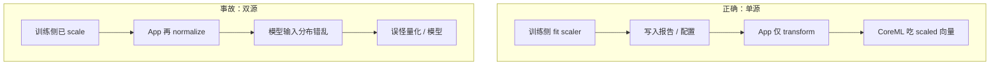
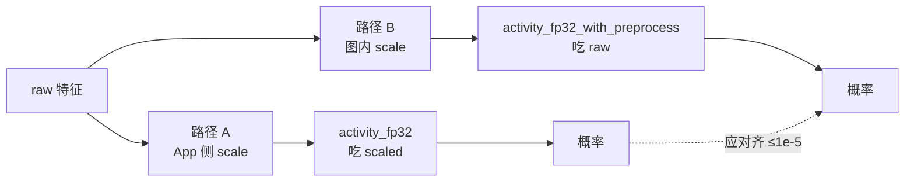
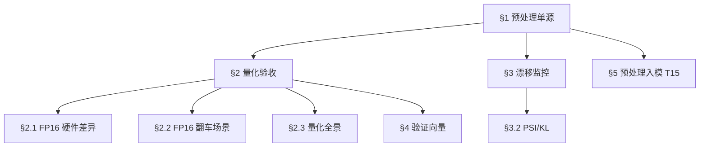

# CoreML 入门 · 04 预处理单源与量化语义

版本：0.2.0 · 日期：2026-07-29 · 作者：lab · 状态：生效

> 对齐口径：[`../02-算法对齐口径/coreml-quant.md`](../02-算法对齐口径/coreml-quant.md)、[`../02-算法对齐口径/coreml-drift-monitoring.md`](../02-算法对齐口径/coreml-drift-monitoring.md)。

---

## 1. 预处理「单源」是什么意思

训练时用 `StandardScaler`：对每个特征减均值、除标准差。  
均值 / 方差写在 `golden/coreml_quant/compare_report.json` → `preprocess.mean` / `preprocess.scale`。

**单源规则：**

| 允许 | 禁止 |
| :--- | :--- |
| 训练流水线拟合 scaler，推理只使用同一组参数 | App 再 `normalize` 一次，模型内又做一次 |
| 要么参数全在 App 侧显式应用，要么全烘进模型（见 T15） | 「训练一套、线上拍脑袋另一套」 |



面试金句：  
「预处理均值方差要么全烘进模型，要么全在 App，禁止各做一半。」

### 1.1 StandardScaler 的数学

```
scaled_x = (x - mean) / scale
```

- `mean`：训练集每个特征的均值（8 个数）
- `scale`：训练集每个特征的标准差（8 个数）

**只在训练集上 fit**——验证集和线上数据只能用训练集的参数 transform，不能重新 fit。

### 1.2 T15 的两条合法路径



图内 scale 的实现：一层对角 linear `W=diag(1/s), b=-m/s`，数学上等价。

---

## 2. 量化验收看什么

FP16 不是「精度减半」的同义词。本 lab：

| 看 | 不看（默认） |
| :--- | :--- |
| 验证集 top-1 一致率 FP16 vs FP32 | 逐样本 logits `1e-12` |
| top-1 置信度偏移均值 / 分布 | 单条「感觉差一点」 |

阈值（Case04）：top-1 ≥ 95%；置信度偏移均值 abs ≤ 0.05。  
实测见 `compare_report.json`（本仓库曾为 **100%** 一致、偏移 ~1e-5）。

### 2.1 FP16 在不同硬件上的表现

| 硬件 | FP16 支持 | 说明 |
| :--- | :--- | :--- |
| **Neural Engine (ANE)** | ✅ 原生 FP16 | ANE 天然用 FP16 计算；FP32 模型也可能被 ANE 内部降精度 |
| **GPU (Metal)** | ✅ FP16 运算 | Metal Performance Shaders 支持 half；带宽减半是主要收益 |
| **CPU** | ⚠️ 需转换 | ARM NEON 有 FP16 指令，但 CoreML 在 CPU 上可能仍用 FP32 累加 |

**一句话：** FP16 在 ANE/GPU 上几乎"免费"（甚至更快），在 CPU 上可能没收益。

### 2.2 FP16 什么时候会翻车？

虽然本 lab 100% 一致，但在更复杂的真实场景中 FP16 可能出问题：

| 场景 | 原因 | 后果 |
| :--- | :--- | :--- |
| **边界决策点** | 两类概率非常接近时，FP16 舍入可能改变 argmax | top-1 翻转 |
| **超大 logits** | FP16 最大值 ~65504，超出则 inf | 推理直接 NaN |
| **极小权重** | FP16 最小正数 ~6e-8，更小的权重变成 0 | 特征被"吞掉" |
| **累积误差** | 深层网络逐层累积舍入误差 | 最终概率偏离 |

**本 lab 为什么没问题：** 模型极小（195 参数、2 层），logits 范围正常，不会碰到上述极端。

### 2.3 CoreML 量化全景（展望）

本 lab 只做了 FP16，但 CoreML 支持更多量化维度：

| 量化方式 | 说明 | CoreML 支持 | 本 lab |
| :--- | :--- | :--- | :--- |
| **FP16** | 权重和计算半精度 | ✅ `compute_precision` | ✅ |
| **Weight-Only INT8** | 权重 INT8，计算仍 FP16/32 | ✅ `ct.optimize.coreml.linear_quantize_weights` | ❌ |
| **Palettization** | 权重聚类到 k 个值（k-means） | ✅ `ct.optimize.coreml.palettize_weights` | ❌ |
| **INT8 Activation** | 权重和激活都 INT8 | ⚠️ 需要校准数据集 | ❌ |
| **Mixed Precision** | 不同层用不同精度 | ✅ 可按层指定 | ❌ |

**为什么本 lab 只做 FP16？**  
- 195 参数太小，INT8/palettization 几乎无体积收益。
- FP16 足以演示"量化验收看决策一致性"的工程思维。
- 更复杂的量化需要校准数据和更大的模型才有意义。

---

## 3. 漂移监控（Case09 / T11）

上线后即使模型文件不变，**输入分布变了**也会让准确率 silently 掉。

### 3.1 什么是「漂移」？


| 漂移类型 | 例子 |
| :--- | :--- |
| **协变量漂移** | 用户从年轻人变成老年人，运动模式不同 |
| **采样漂移** | 新固件采样率从 25Hz 变成 50Hz |
| **标签漂移** | 「步行」的定义变了（含/不含拄拐） |

### 3.2 本 lab 用什么检测漂移？

#### PSI（Population Stability Index）

直觉：**两个直方图有多不一样**。

```
对每个特征：
  1. 把训练集和当前数据各分成 10 个桶
  2. 比较每个桶的占比差
  3. 差越大 → PSI 越高 → 分布变化越大
```

| PSI 值 | 解读 |
| :--- | :--- |
| < 0.10 | 分布稳定 |
| 0.10 – 0.25 | 有些变化，需关注 |
| > 0.25 | 显著漂移，应告警 |

#### KL 散度（置信度分布）

直觉：**模型的"自信程度分布"变了没**。

- 训练时模型对大多数样本置信度 > 0.9
- 如果线上突然有很多 0.5 的置信度 → 说明模型在"犹豫" → 可能输入变了

### 3.3 告警档位

本 lab 实现：

- `low`：`max_psi < 0.10` 且 `kl_confidence < 0.08`
- `medium`：`max_psi >= 0.10` 或 `kl_confidence >= 0.08`
- `high`：`max_psi >= 0.25` 或 `kl_confidence >= 0.20`

脚本：`python/coreml_drift_prototype.py`（缺模型时会先跑 T5 生成链）。  
要点：漂移评估也必须套用 **同一 StandardScaler**——否则你监控的是「预处理 bug」，不是「人群分布变了」。

---

## 4. 和验证向量的关系

Swift 对齐流程：

1. 读报告里的 `mean` / `scale`（或直接用已写好的 `scaled_features`）；
2. `Session.predict`；
3. 与 `expected_probs_fp32` / `fp16` 比容差。

这保证：**生成脚本、Python CoreML、Swift CoreML** 三条链对同一输入同口径。

---

## 5. 后续扩展（T15 已落地）

对照实验（同权两份包）：

1. App 侧显式 scaler（`activity_fp32.mlpackage`，喂 scaled）；
2. scaler 烘进 mlpackage（`activity_fp32_with_preprocess.mlpackage`，喂 raw）。

负例：对 raw **双重** StandardScaler 再喂路径 1，概率须显著偏离正确路径（按 **全集最大偏离** ≥0.01，不是每条都大）。  
排查：喂错 raw/scaled、输入名写死、`activity_fp32` 被覆写后未同步重生 Case04。  
详见：[`../02-算法对齐口径/coreml-preprocess-inmodel.md`](../02-算法对齐口径/coreml-preprocess-inmodel.md)（含排查手册）、[`../06-实验复盘/case-13-coreml-preprocess-inmodel.md`](../06-实验复盘/case-13-coreml-preprocess-inmodel.md)。

---

## 6. 本篇串联图



读完本篇，你能回答：

- 「单源是什么意思？」→ 预处理参数只能来自训练流水线（§1）
- 「量化后怎么验收？」→ 看 top-1 一致率和置信度分布（§2）
- 「模型上线后怎么监控？」→ PSI 盯特征、KL 盯置信度（§3）
- 「FP16 会不会翻车？」→ 边界决策点可能，本 lab 不会（§2.2）
