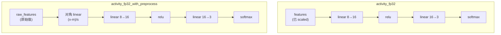

# CoreML 入门 · 05 模型格式深度解析

版本：0.1.0 · 日期：2026-07-29 · 作者：lab · 状态：生效

> 对照脚本：[`python/explore_mlpackage_structure.py`](../../python/explore_mlpackage_structure.py)——运行后可自己看到本文描述的全部结构。  
> 前置阅读：[02-Python到CoreML生成.md](02-Python到CoreML生成.md) §6。

---

## 1. 为什么要了解模型格式

面试场景：面试官打开一个 `.mlpackage`，问你「这里面是什么」。  
日常场景：模型加载失败，你需要知道去哪检查——是权重文件损坏，还是 Manifest 缺失？

本篇目标：**打开 mlpackage 和 mlmodelc，每个文件能一句话说清用途。**

---

## 2. `.mlpackage`：Python 导出的原始包

`.mlpackage` 本质是一个 **目录**（macOS Finder 会显示为"包"，右键「显示包内容」）。

```
activity_fp32.mlpackage/
├── Manifest.json                ← ① 元数据索引
└── Data/
    └── com.apple.CoreML/
        ├── model.mlmodel        ← ② 模型定义（protobuf）
        └── weights/
            └── weight.bin       ← ③ 权重二进制
```

### 2.1 Manifest.json — 包的"身份证"

```json
{
  "fileFormatVersion": "1.0.0",
  "itemInfoEntries": {
    "<hash>": {
      "path": "Data/com.apple.CoreML/model.mlmodel",
      "author": "com.apple.coremltools"
    }
  }
}
```

| 字段 | 用途 |
| :--- | :--- |
| `fileFormatVersion` | 包格式版本；1.0.0 是 mlprogram 标准 |
| `itemInfoEntries` | 包内文件的索引和作者 |

**排查价值：** 若加载失败，先确认 `Manifest.json` 存在且格式正确。

### 2.2 model.mlmodel — 计算图定义

这是一个 **protobuf 序列化** 的文件，包含：

- 输入输出签名（名称、shape、类型）
- 计算图定义（MIL 算子序列）
- 模型元数据（作者、描述、版本）

**用 Python 读取：**

```python
import coremltools as ct
model = ct.models.MLModel("activity_fp32.mlpackage")
spec = model.get_spec()

# 输入签名
for inp in spec.description.input:
    print(f"输入: {inp.name}, shape={list(inp.type.multiArrayType.shape)}")

# 输出签名
for out in spec.description.output:
    print(f"输出: {out.name}, shape={list(out.type.multiArrayType.shape)}")

# 模型类型
print(f"类型: {spec.WhichOneof('Type')}")  # → "mlProgram"
```

### 2.3 weight.bin — 权重的"数据仓库"

所有权重（W1、b1、W2、b2）按顺序紧凑排列。

| 模型 | 参数量 | 精度 | weight.bin 大小 |
| :--- | :--- | :--- | :--- |
| `activity_fp32` | 195 | FP32 (4 bytes) | ~780 bytes |
| `activity_fp16` | 195 | FP16 (2 bytes) | ~390 bytes |
| `activity_fp32_with_preprocess` | 195 + 8×8 + 8 = 267 | FP32 | ~1068 bytes |

> 第三个多出来的是对角 scaler 层的权重（8×8 对角矩阵 + 8 bias）。

---

## 3. `.mlmodelc`：编译后的设备可执行产物

`MLModel.compileModel(at:)` 的输出，生成在系统临时目录。

```
Compiled.mlmodelc/
├── model.mil                    ← MIL 编译优化后的中间表示
├── coremldata.bin               ← 权重（可能被重排/量化）
├── metadata.json                ← 编译元数据
└── neural_network.espresso.*    ← 后端特定执行计划
```

| 文件 | 说明 |
| :--- | :--- |
| `model.mil` | 经过图优化（算子融合、常量折叠）后的 MIL |
| `coremldata.bin` | 权重可能被重排以适配目标硬件（ANE 对齐等） |
| `*.espresso.*` | Apple Neural Engine / GPU 的执行计划；格式不公开 |

### 3.1 mlpackage vs mlmodelc

| 对比项 | `.mlpackage` | `.mlmodelc` |
| :--- | :--- | :--- |
| 谁产生 | coremltools（Python） | `MLModel.compileModel`（Swift/macOS） |
| 内容 | 原始图 + 权重 | 优化图 + 重排权重 + 执行计划 |
| 可移植 | ✅ 跨平台传输 | ❌ 编译产物绑定目标硬件 |
| 可检查 | ✅ 人类可读 Manifest | ⚠️ 二进制为主 |
| 体积 | 较小 | 可能更大（含多后端计划） |

**一句话：** `.mlpackage` 是源码，`.mlmodelc` 是二进制可执行文件。

---

## 4. 旧格式 `.mlmodel`（了解即可）

coremltools 5 之前（`convert_to="neuralnetwork"`）导出的是单个 `.mlmodel` 文件：

- 也是 protobuf，但权重和图定义都在一个文件里
- 不支持 `compute_precision`（FP16 控制）
- 不支持 mlprogram 新算子

**本 lab 不用旧格式**，但可能在面试或旧代码中遇到。

---

## 5. 本 lab 三个模型包对比

| 模型包 | 输入名 | 输入语义 | 特殊说明 |
| :--- | :--- | :--- | :--- |
| `activity_fp32.mlpackage` | `features` | 已 scaled | 标准路径 |
| `activity_fp16.mlpackage` | `features` | 已 scaled | FP16 量化对照 |
| `activity_fp32_with_preprocess.mlpackage` | `raw_features` | raw 原始值 | 图内含 scaler 层 |



---

## 6. 动手探索

运行探索脚本：

```bash
cd algo-engineering-lab
uv sync --extra ml
uv run python -m python.explore_mlpackage_structure
```

输出会显示每个模型包的目录结构、输入输出签名、权重统计和快速推理结果。

---

## 7. 读完本篇，你能回答

- 「mlpackage 里面有什么文件？」→ Manifest + model 定义 + 权重（§2）
- 「mlpackage 和 mlmodelc 有什么区别？」→ 源码 vs 编译产物（§3.1）
- 「旧格式 .mlmodel 还能用吗？」→ 能用但不推荐，无 FP16 控制（§4）
- 「模型加载失败先查什么？」→ Manifest 完整性、目录结构、是否先 compile（§2.1）
- 「with_preprocess 包多了什么？」→ 一层对角 linear 做 scaler（§5）
