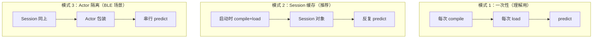
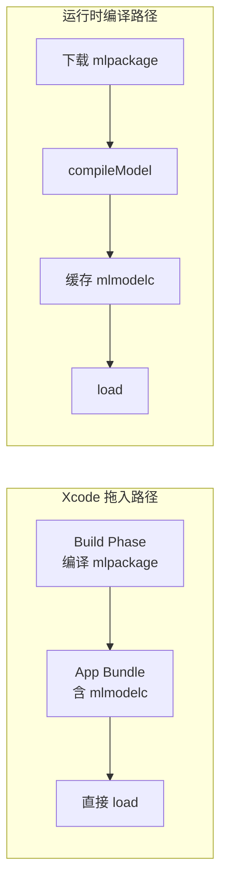

# CoreML 入门 · 06 CoreML 与 Swift 的集成模式

版本：0.1.0 · 日期：2026-07-29 · 作者：lab · 状态：生效

> 对照代码：[`Sources/AlgoSwift/CoreMLIntegrationPatterns.swift`](../../Sources/AlgoSwift/CoreMLIntegrationPatterns.swift)。  
> 前置阅读：[03-CoreML运行时与硬件.md](03-CoreML运行时与硬件.md)。

---

## 1. 三种集成模式一览

在 iOS/macOS 上使用 CoreML，本质上就三件事：**获取模型 → 构造输入 → 读取输出**。  
但「获取模型」和「管理生命周期」的方式不同，形成了三种常见模式：



| 模式 | 类比 | 推理延迟 | 适用场景 |
| :--- | :--- | :--- | :--- |
| **一次性** | 每次做饭都搭灶台 | ~42ms（含 compile） | 一次性脚本 / playground |
| **Session 缓存** | 灶台搭好不拆 | ~0.04ms | **通用生产路径** |
| **Actor 隔离** | 厨师按序接单 | ~0.04ms + 队列等待 | BLE 多回调并发 |

---

## 2. 模式 1：每次都 compile（理解用，不推荐）

```swift
// ⚠️ 每次调用约 40ms+，热路径禁用
let compiledURL = try MLModel.compileModel(at: packageURL)  // 慢！
let model = try MLModel(contentsOf: compiledURL)
let output = try model.prediction(from: inputProvider)
```

**为什么要知道这个？** 因为很多教程/stackoverflow 代码就是这样写的。初学者不知道 compile 贵，就会觉得「CoreML 好慢」。

本 lab 的 `CoreMLActivityModel.predictProbabilities` 就是这个模式——只用于对照 bench。

---

## 3. 模式 2：Session 缓存（本 lab 推荐）

```swift
// 启动时执行一次
let session = try CoreMLActivityModel.load(
    modelURL: packageURL,
    computeUnits: .all
)

// 热路径反复调用（亚毫秒级）
let probs = try session.predict(features: scaledFeatures)
```

### 3.1 构造输入的几种方式

| 方式 | 代码 | 适用 |
| :--- | :--- | :--- |
| `MLDictionaryFeatureProvider` | `[inputName: MLMultiArray]` | **本 lab 用这个**——通用、灵活 |
| Xcode 自动生成的类 | `MyModelInput(features: array)` | 模型在 Xcode project 中时最方便 |
| 自定义 `MLFeatureProvider` | 实现 `featureNames` + `featureValue(for:)` | 复杂输入 / 需要自定义逻辑 |

### 3.2 本 lab 为什么用 `MLDictionaryFeatureProvider`

- 模型不在 Xcode project（在 `artifacts/`），没有自动生成类
- 输入很简单（一个 `MLMultiArray`），不需要复杂封装
- 代码可读性好，一行搞定

### 3.3 读取输出

```swift
let output = try model.prediction(from: provider)

// 方式 1：按名称取
let outArray = output.featureValue(for: "softmax_0")?.multiArrayValue

// 方式 2：读 description 首输出名（更健壮）
let outName = model.modelDescription.outputDescriptionsByName.keys.first!
let outArray = output.featureValue(for: outName)?.multiArrayValue

// 转成 Swift 数组
let probs = (0..<outArray.count).map { outArray[$0].doubleValue }
```

---

## 4. 模式 3：Actor 隔离（BLE 回调场景）

BLE 回调可能从不同线程到来。虽然 `MLModel.prediction` 本身线程安全，
但在可穿戴场景下我们希望推理严格按序——用 Swift Actor：

```swift
public actor CoreMLStreamingInferenceActor {
    private let pipeline: CoreMLStreamingPipeline

    public func ingest(_ packet: BLEPacket) throws {
        // Actor 保证一次只有一个调用在执行
        try pipeline.ingest(packet)
    }
}

// 多个 BLE 回调线程
Task { try await actor.ingest(packet1) }  // 先到先执行
Task { try await actor.ingest(packet2) }  // 排队等待
```

### 4.1 为什么用 Actor 而不是 DispatchQueue？

| 对比项 | DispatchQueue | Swift Actor |
| :--- | :--- | :--- |
| 编译期检查 | ❌ 运行时才报错 | ✅ 编译器强制 `await` |
| 与 async/await 协作 | 需要手动桥接 | ✅ 原生支持 |
| 引用安全 | 需要手动管理 | ✅ Actor isolation |

**一句话：** Actor 是 Swift 并发的现代方式；DispatchQueue 能用但更容易出并发 bug。

---

## 5. Xcode 拖入 vs 运行时编译

| 方式 | 做法 | 编译时机 | 优点 | 缺点 |
| :--- | :--- | :--- | :--- | :--- |
| **Xcode 拖入** | 把 `.mlpackage` 拖进 Xcode | App 构建时 | 自动生成 Swift 类、启动零延迟 | 模型更新需发版 |
| **运行时编译** | `MLModel.compileModel(at:)` | App 运行时 | 模型可动态下载 | 首次有编译延迟 |

本 lab 用运行时编译（模型在 `artifacts/`）。生产 App 中两种都常见：



---

## 6. Vision 框架集成（扩展了解）

如果你的模型是图像分类/检测类型，可以不直接用 `MLModel.prediction`，
而是通过 **Vision** 框架：

```swift
let vnModel = try VNCoreMLModel(for: imageClassifier)
let request = VNCoreMLRequest(model: vnModel) { request, error in
    let results = request.results as? [VNClassificationObservation]
    // ...
}
```

本 lab **不用 Vision**——因为输入是 8 维数值特征，不是图像。  
但面试被问到时知道 Vision 是 CoreML 的上层封装即可。

---

## 7. 读完本篇，你能回答

- 「三种集成模式分别什么时候用？」→ 一次性理解用、Session 通用生产、Actor BLE 并发（§1）
- 「为什么不每次都 compile？」→ compile 约 40ms，是推理的 1000 倍（§2）
- 「输入怎么构造？」→ MLDictionaryFeatureProvider + MLMultiArray（§3.1）
- 「BLE 多线程怎么管推理？」→ Actor 串行隔离（§4）
- 「Xcode 拖入 vs 运行时编译选哪个？」→ 看模型是否需要动态更新（§5）
