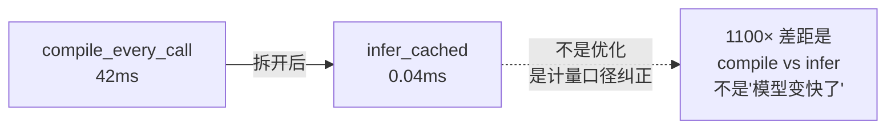

# CoreML 入门 · 07 性能分析实战

版本：0.1.0 · 日期：2026-07-29 · 作者：lab · 状态：生效

> 数字来源：[`../bench-log.md`](../bench-log.md)。  
> 规范：[`../05-性能基准规范.md`](../05-性能基准规范.md)。  
> 前置阅读：[03-CoreML运行时与硬件.md](03-CoreML运行时与硬件.md)（compile vs infer 拆分）。

---

## 1. 为什么性能分析这么重要

一句话不对的场景：

| 你说的 | 面试官听到的 | 实际情况 |
| :--- | :--- | :--- |
| "CoreML 推理 42ms" | 模型太慢 | 你把 compile 算进去了 |
| "我优化了 1100 倍" | 神仙优化 | 你只是把 compile 移出了热路径 |
| "ANE 比 CPU 快 10 倍" | 上 ANE 就行 | 小模型 ANE 启动开销比计算还大 |

**核心原则：没有环境信息的性能数字无效。**

---

## 2. 本 lab 怎么测性能

### 2.1 必须记录的环境五元

| 字段 | 本 lab 值 | 为什么必须记 |
| :--- | :--- | :--- |
| 机型 / 芯片 | Mac / Apple M2 | 不同芯片 ANE 差异极大 |
| OS 版本 | macOS 26.3.1 | CoreML 底层可能跨版本优化 |
| 编译配置 | **Debug** | Debug vs Release 差距可达 10× |
| 电源与发热 | 接电、常温 | 低电量/发热会降频 |
| Xcode 版本 | 26.6 | 编译器优化影响 Swift 代码性能 |

> ⚠️ 缺任何一项，数字就不能对外引用。本 lab bench-log 每行都带环境摘要。

### 2.2 测量方法

```swift
// 预热
for _ in 0..<5 {
    _ = try session.predict(features: testFeatures)
}

// 正式测量
var times: [Double] = []
for _ in 0..<50 {
    let start = CFAbsoluteTimeGetCurrent()
    _ = try session.predict(features: testFeatures)
    let elapsed = (CFAbsoluteTimeGetCurrent() - start) * 1000 // ms
    times.append(elapsed)
}

// 报告 p50 / p95
times.sort()
let p50 = times[times.count / 2]
let p95 = times[Int(Double(times.count) * 0.95)]
```

### 2.3 为什么报 p50/p95 而不是平均值？

| 指标 | 含义 | 用途 |
| :--- | :--- | :--- |
| p50 | 一半调用比这快 | 典型体验 |
| p95 | 95% 调用比这快 | 尾部延迟（最差 5% 用户的体验） |
| 平均值 | 所有调用的均值 | ❌ 容易被极值拉偏；不推荐 |

---

## 3. 本 lab 的实测数字

| 实现 | p50 (ms) | p95 (ms) | 说明 |
| :--- | ---: | ---: | :--- |
| `compile_every_call` | 42.052 | 43.975 | 每次含 compile；旧路径 |
| `infer_cached .all` | 0.038 | 0.048 | 纯推理；Session 缓存 |
| `infer_cached .cpuOnly` | 0.038 | 0.056 | 与 .all 接近（小模型） |



### 3.1 怎么读这些数字

1. **42ms 是假象**——compile 主导，不是推理慢。
2. **0.04ms 是本机 Debug 小 MLP**——不能直接说"CoreML 推理 0.04ms"对所有模型成立。
3. **`.all` 和 `.cpuOnly` 接近**——因为 195 参数太小，ANE 没有施展空间。
4. **这是 Debug**——Release 会更快，但本 lab 先证计量口径。

---

## 4. Instruments CoreML 模板（扩展了解）

Apple 提供了 Instruments 的 CoreML 性能分析模板：

### 4.1 怎么打开

1. Xcode → Product → Profile (⌘I)
2. 选择「Core ML」模板
3. 运行你的 App / 测试

### 4.2 能看到什么

| 面板 | 信息 |
| :--- | :--- |
| **Model Load** | 编译和加载耗时 |
| **Predictions** | 每次推理耗时 |
| **Compute Unit** | 实际运行在 CPU / GPU / ANE 哪个 |
| **Memory** | 模型内存占用 |

### 4.3 本 lab 的限制

本 lab 是 SPM + `swift test`，不是完整 App，所以无法直接用 Instruments Profile。  
但原理和操作是相同的——面试时知道「怎么用 Instruments 看 CoreML 后端」即可。

---

## 5. 模型大小 vs 推理速度的经验关系

| 模型规模 | 参数量 | 推理延迟（量级） | ANE 收益 |
| :--- | :--- | :--- | :--- |
| 本 lab MLP | ~200 | <0.1ms | 几乎无 |
| MobileNetV2 | ~3.5M | 1-5ms | 明显 |
| ResNet50 | ~25M | 5-20ms | 显著 |
| Stable Diffusion UNet | ~860M | 数百 ms | 极大 |

**经验法则：**

- 参数量 < 10K 时，**不要追求 ANE**——启动开销 > 计算节省。
- 参数量 > 1M 时，`.all` 通常明显快于 `.cpuOnly`。
- 参数量 > 100M 时，FP16 的带宽优势才真正显著。

---

## 6. 常见性能坑

| 坑 | 表现 | 原因 | 修复 |
| :--- | :--- | :--- | :--- |
| "CoreML 很慢" | 每次 40ms+ | 没缓存 Session | `load` 一次、`predict` 多次 |
| 推理偶发卡顿 | p99 异常高 | GC / 系统调度 | 多次测量取 p50/p95 |
| ANE 没用上 | `.all` 和 `.cpuOnly` 一样快 | 模型太小或算子不支持 | 正常；不必强求 ANE |
| Release 差距很大 | Debug 比 Release 慢 5-10× | 编译优化级别不同 | 对外数字必须 Release |
| 首次推理慢 | 第一次 predict 比后续慢 | JIT 编译 / 缓存预热 | 预热几次后测量 |

---

## 7. 读完本篇，你能回答

- 「你怎么测 CoreML 性能？」→ 拆 compile/infer、报 p50/p95、带环境五元（§2）
- 「42ms 是推理延迟吗？」→ 不是，是 compile 主导（§3.1）
- 「ANE 一定比 CPU 快吗？」→ 小模型不一定（§5）
- 「怎么看模型实际跑在哪个硬件？」→ Instruments CoreML 模板（§4）
- 「Debug 数字能用吗？」→ 能看趋势，但对外必须 Release（§6）
