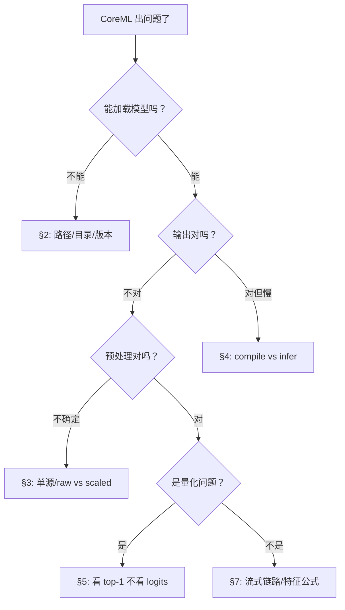

# CoreML 入门 · 08 常见踩坑与排查大全

版本：0.1.0 · 日期：2026-07-29 · 作者：lab · 状态：生效

> 汇总自本 lab Case04 / 09 / 12 / 13 / 14 所有「坑」。  
> 每个坑都标注对应的 Ticket 和口径文档，方便深挖。

---

## 1. 使用指南

出了问题？按下表 **找到你的症状**，然后看对应章节。

| 你看到的症状 | 优先看 |
| :--- | :--- |
| 模型加载失败 / crash | [§2 环境与依赖坑](#2-环境与依赖坑) |
| 推理结果不对 / 概率奇怪 | [§3 预处理坑](#3-预处理坑) |
| 性能很慢 / 数字离谱 | [§4 性能计量坑](#4-性能计量坑) |
| 量化后精度掉了 | [§5 量化坑](#5-量化坑) |
| 模型文件没换但效果变差 | [§6 漂移与监控坑](#6-漂移与监控坑) |
| 流式推理对不上 | [§7 流式链路坑](#7-流式链路坑) |
| 测试突然全挂 | [§8 交叉依赖坑](#8-交叉依赖坑) |

---

## 2. 环境与依赖坑

### 2.1 scikit-learn 版本不兼容 🔥

**症状：** `uv run python -m python.generate_golden coreml_quant` 报错 "coremltools 不支持当前 sklearn 版本"。

**原因：** coremltools 9 对 `scikit-learn >= 1.6` 禁用了部分转换 API。

**修复：** 锁定 `scikit-learn < 1.6`（已在 `pyproject.toml` 中配置）。

```bash
uv sync --extra ml  # 会自动安装锁定版本
```

**来源：** Case04 · [coreml-quant.md](../02-算法对齐口径/coreml-quant.md) §4

### 2.2 树模型无法走 FP16

**症状：** GBM / RandomForest 转出的模型无法设置 `compute_precision=FLOAT16`。

**原因：** coremltools 9 对树模型走 `pipelineClassifier` 路径，不支持 `mlprogram` 的 `compute_precision`。

**教训：** 改用 MLP 权重直接进 MIL Builder。这是工程取舍，不是"MLP 一定优于树模型"。

**来源：** Case04 · [01-机器学习最小必要.md](01-机器学习最小必要.md) §5

### 2.3 .mlpackage 目录不完整

**症状：** `MLModel.compileModel` 或 `MLModel(contentsOf:)` crash。

**排查：**

```bash
# 检查目录结构
ls -R artifacts/coreml/activity_fp32.mlpackage/
# 应该有：Manifest.json, Data/com.apple.CoreML/model.mlmodel, weights/
```

**来源：** T14 · [coreml-runtime-engineering.md](../02-算法对齐口径/coreml-runtime-engineering.md) §5

---

## 3. 预处理坑

### 3.1 双重 normalize——最常见的线上事故 🔥🔥

**症状：** 量化后"模型废了"——但其实量化是无辜的。

**原因：** App 侧对 raw 做了 scale，模型内部又做了一次（或反过来）。

**诊断：**

```
正确：raw → App scale → 模型 → 概率  ✅
正确：raw → 模型内 scale + 推理 → 概率  ✅
错误：raw → App scale → 模型内再 scale → 概率  ❌ （双重 normalize）
```

**验证方法：** 用 T15 的负例测试——双重 normalize 的概率应与正确路径偏离 ≥ 0.01。

**来源：** T5 / T15 · [coreml-preprocess-inmodel.md](../02-算法对齐口径/coreml-preprocess-inmodel.md) §4

### 3.2 喂错了 raw / scaled

**症状：** 模型输出概率接近均匀分布（各约 0.33），或 top-1 随机。

**排查：**

| 模型包 | 应该喂 | 喂错了会怎样 |
| :--- | :--- | :--- |
| `activity_fp32` | **已 scaled** 特征 | 喂 raw → 分布错乱 |
| `activity_fp32_with_preprocess` | **raw** 特征 | 喂 scaled → 等于做了两次 scale |

**来源：** T15 · [coreml-preprocess-inmodel.md](../02-算法对齐口径/coreml-preprocess-inmodel.md) §4.1

### 3.3 输入名写死

**症状：** 加载 `with_preprocess` 模型时 crash 或输出全零。

**原因：** `activity_fp32` 输入名是 `features`，`with_preprocess` 输入名是 `raw_features`。写死了会找不到输入。

**修复：** 用 `model.modelDescription.inputDescriptionsByName.keys.first` 动态读取。

**来源：** T15 · [coreml-preprocess-inmodel.md](../02-算法对齐口径/coreml-preprocess-inmodel.md) §4.1

---

## 4. 性能计量坑

### 4.1 把 compile 当成推理 🔥🔥

**症状：** "CoreML 推理 42ms"。

**原因：** 每次 predict 前都 `compileModel`。compile 约 42ms，推理只有 0.04ms。

**修复：** `load` 一次拿到 Session，热路径只 `predict`。

**来源：** T14 · [coreml-runtime-engineering.md](../02-算法对齐口径/coreml-runtime-engineering.md) §2

### 4.2 Debug 数字当结论

**症状：** 优化后仍觉得"不够快"。

**原因：** Debug 构建 Swift 性能可差 5-10×。

**来源：** T13 · [07-CoreML性能分析实战.md](07-CoreML性能分析实战.md) §6

### 4.3 不报环境信息

**症状：** "CoreML 在我机器上 0.04ms" — 别人无法复现。

**修复：** 带机型/芯片/OS/编译配置/电量发热（环境五元）。

**来源：** T13 · [../05-性能基准规范.md](../05-性能基准规范.md)

---

## 5. 量化坑

### 5.1 逐点 logits 对齐（不必要的洁癖）

**症状：** 测试要求 FP16 和 FP32 每个 logit 差 < 1e-12，全挂。

**正确做法：** 看 top-1 一致率和置信度分布偏移，不是逐点误差。

**来源：** T5 · [coreml-quant.md](../02-算法对齐口径/coreml-quant.md) §2

### 5.2 FP16 超大 logits 溢出

**症状：** 输出 inf / NaN。

**原因：** FP16 最大值 ~65504。如果模型 logits 超过此值，exp() 溢出。

**本 lab 为什么没碰到：** 195 参数小 MLP，logits 范围正常。

**来源：** [04-预处理单源与量化语义.md](04-预处理单源与量化语义.md) §2.2

---

## 6. 漂移与监控坑

### 6.1 监控用了不同的 scaler

**症状：** 稳定数据被误报为漂移。

**原因：** 监控链路用当前数据重新 fit scaler，而不是训练期的参数。

**修复：** 监控必须用 Case04 报告里的 mean/scale——与训练期 **同源**。

**来源：** T11 · [coreml-drift-monitoring.md](../02-算法对齐口径/coreml-drift-monitoring.md) §5.4

### 6.2 PSI bins 太少 / 太多

**症状：** 漂移检测不稳定。

**直觉：** bins 太少 → 丢失分布细节；bins 太多 → 每个桶样本太少、噪声大。

**推荐：** 默认 10 bins，样本量 > 1000 时可用 20。

**来源：** T11 · [coreml-drift-monitoring.md](../02-算法对齐口径/coreml-drift-monitoring.md) §5.1

---

## 7. 流式链路坑

### 7.1 FIR 状态被 reset

**症状：** 滤波窗边界有跳变。

**原因：** 流式 FIR 延迟线应跨窗连续；如果每个窗 reset 状态，边界不连续。

**来源：** T6 / T16 · [coreml-streaming.md](../02-算法对齐口径/coreml-streaming.md) §4.1

### 7.2 std 用了样本标准差

**症状：** 窗特征对不上 Python。

**原因：** 窗特征公式要求 `ddof=0`（总体标准差，除以 N）。Swift 默认或手写可能误用 `ddof=1`（样本标准差，除以 N-1）。

**来源：** T16 · [coreml-streaming.md](../02-算法对齐口径/coreml-streaming.md) §4.1

### 7.3 Actor 漏了 await

**症状：** 同步 Pipeline 过、Actor 不过。

**原因：** `ingest` 在 Actor 上需要 `await`；漏了会导致"未跑完就读结果"。

**来源：** T16 · [coreml-streaming.md](../02-算法对齐口径/coreml-streaming.md) §4.3

---

## 8. 交叉依赖坑

### 8.1 T15 覆写了 `activity_fp32.mlpackage`

**症状：** Case04 / T14 / T16 测试突然全挂。

**原因：** `generate_coreml_preprocess_inmodel.py` 会重写 `activity_fp32.mlpackage`。如果改了训练超参但没同步重生其他 golden。

**修复：**

```bash
uv run python -m python.generate_golden coreml_quant
uv run python -m python.generate_golden coreml_preprocess_inmodel
uv run python -m python.generate_golden coreml_streaming
swift test --filter 'CoreML'
```

**来源：** T15 · [coreml-preprocess-inmodel.md](../02-算法对齐口径/coreml-preprocess-inmodel.md) §4.3

---

## 9. 快速排查流程图



---

## 10. 读完本篇，你能回答

- 「量化后模型废了怎么查？」→ 先查预处理是否双源（§3.1），再看 top-1（§5.1）
- 「CoreML 很慢怎么优化？」→ 先查是否每次 compile（§4.1）
- 「模型文件没换但效果变差？」→ 查输入分布漂移（§6.1）
- 「所有 CoreML 测试突然挂了？」→ T15 覆写了模型文件（§8.1）
- 「FP16 什么时候会出问题？」→ 超大 logits 溢出（§5.2）
