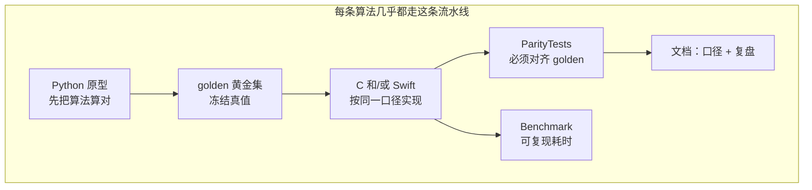

# 给 iOS 初学者：T1–T16 在干什么、原理是什么、怎么跟别人讲

版本：0.1.0 · 日期：2026-07-29 · 作者：lab · 状态：生效

> **读者：** 刚接触 iOS、不一定有 DSP / ML 背景的同学。  
> **目标：** 读完后你能用自己的话讲清「这个仓库在证明什么」；面试或带新人时，有一套分层叙事。  
> **定位：** 本仓库是**验证性原型**（练工程口径），不是上线 App，也不是临床级医疗软件。

更细的技术口径在 `docs/02-算法对齐口径/`；CoreML 零基础另见 [`09-CoreML入门/00-导读.md`](09-CoreML入门/00-导读.md)。

---

## 0. 先建立一张「大地图」

想象你在做一款**可穿戴 / BLE 手环类**产品：手机要收传感器数据，算心率变异、滤波形、偶尔跑个小模型，还要固件升级、多路信号对齐。  
难点往往不在「会不会调某个 API」，而在：

1. **算法同学用 Python 算出来的数，和 iOS/C 算出来的数是否一致？**
2. **手机上能不能稳定、省心地跑？**
3. **出了问题，你能不能分层排查，而不是瞎猜？**

本 lab 用 **Ticket T1–T16** 把这件事练成一条证据链。

**一句话总述（可直接背）：**  
「我们不是只写 App 界面，而是把算法从 Python 落到 C/Swift/CoreML，用黄金数据集证明数值一致，再用基准和文档证明能讲清楚、能排查。」

---

## 1. 几个你会反复听到的词（先混个脸熟）

| 词 | 通俗意思 | 类比 |
| :--- | :--- | :--- |
| **parity（对齐）** | 两边算出来几乎一样 | 两台计算器算同一道题，答案要对上 |
| **golden（黄金集）** | 约定好的「标准答案」数据 | 考试的标准答案卷，只能由 Python 出题老师生成 |
| **对齐口径** | 算法每一步用什么参数、谁对谁 | 菜谱：火候、盐量写死，两边各炒一盘必须同味 |
| **FIR** | 一种数字滤波器，把波形里不想要的频率滤掉 | 噪声耳机：去掉哼声，留下心跳相关成分 |
| **HRV** | 心跳间隔的变化规律 | 不是「跳得快不快」，而是「跳得稳不稳、变化模式」 |
| **CoreML** | 苹果端上跑机器学习模型的框架 | 把训练好的「小计算器」打包进 App，离线推理 |
| **MIL** | CoreML 的中间表示语言 | 类比 LLVM IR：源码 → 中间表示 → 机器码 |
| **ANE** | Apple Neural Engine，苹果的专用加速芯片 | 专人干专活：神经网络计算有专用硬件 |
| **BLE** | 蓝牙低功耗，手环常靠它传数据 | 快递分批发货：数据是一包包到的，不是一次倒完 |
| **RingBuffer** | 固定大小的环形队列 | 传送带：新的进来，太旧的被挤掉 |
| **compile（模型编译）** | 把 `.mlpackage` 变成设备能高效执行的形式 | 安装 App 时的「优化安装」，不该每次打开都重装 |
| **Session** | 编译+加载后可反复推理的模型对象 | 灶台搭好不拆，每次只管炒菜 |
| **PSI / KL** | 检测分布变化的统计指标 | 两张照片放一起比差异：差太多就告警 |
| **Actor** | Swift 并发隔离，保证串行访问 | 餐厅厨师按序接单，不同时炒两道菜 |

---

## 2. 按 Ticket 讲：发生了什么、用了什么原理、你可以怎么说

下面每个 Ticket 都按同一模板：

- **在解决什么问题**（生活语言）  
- **做了什么**（仓库里留下了什么）  
- **原理 / 关键思想**（为什么值得学）  
- **你可以怎么跟别人讲**（30 秒版）  
- **想深挖时去哪**（链接）

---

### T1 · 把 C 和 Swift 放进同一个可编译的「盒子」

**在解决什么问题**  
算法热路径常常用 C（快、好移植），App 逻辑用 Swift。两边怎么安全交接？缓冲区谁释放？错误怎么返回？

**做了什么**  
- Swift Package：`AlgoC` + `AlgoSwift` + `ParityTests` / `BenchmarkTests`  
- 写了 C 集成规范：所有权、零拷贝、批次调用、错误码、线程约定  

**原理**  
跨语言边界是事故高发区。规范先于代码：先约定「谁拥有这块内存」，再写调用。

**你可以怎么讲**  
「我先定 C/Swift 边界规则，再让 SPM 能编能测。热路径可以进 C，但所有权、错误码和批次调用写进规范，避免 Swift 侧随手 malloc。」

**深挖：** [`04-C库集成规范.md`](04-C库集成规范.md)

---

### T2 · 心率变异时域指标：先算对「稳不稳」

**在解决什么问题**  
输入一串心跳间隔（RR，单位毫秒），输出几个常用指标：SDNN、RMSSD、pNN50。  
这些数要在 Python 和 C/Swift 上对得上。

**做了什么**  
- Python 生成大量 golden（含正常 / 边界 / 病态输入）  
- C + Swift 实现同一套公式  
- Parity 全绿  

**原理**  
- **时域**：直接在时间轴上的间隔序列上算统计量（标准差、相邻差等）。  
- **病态输入也要有约定**（空数组、极值）：产品里「算不出」比「 silently 算出离谱数」更安全。

**你可以怎么讲**  
「HRV 时域就是对 RR 间隔做统计。我用黄金集锁住公式和单位，C/Swift 都必须对齐；病态输入的行为也写进规范，避免线上 NaN 乱飘。」

**深挖：** [`02-算法对齐口径/hrv-time-domain.md`](02-算法对齐口径/hrv-time-domain.md)

---

### T3 · FIR 滤波：给 PPG 波形「洗澡」

**在解决什么问题**  
光电心率（PPG）波形又脏又抖，要滤掉不需要的频率成分，再往后算。  
同一套滤波系数，C 朴素卷积和 Accelerate（vDSP）结果要一致。

**做了什么**  
- 用 scipy 设计带通系数并导出  
- naive C 与 vDSP 都过同一 golden  
- 记下耗时（发现：Swift 逐点组窗可能反而慢，热路径应留在 C）  

**原理**  
- **FIR**：输出是输入的加权滑动和，权重就是系数。  
- **系数精度**：Python 双精度系数拷到 float 时可能丢位，对齐口径里要写清。  
- **正确优先于炫技加速**：先 parity，再 benchmark。

**你可以怎么讲**  
「滤波就是按系数做卷积。我先保证 C 和 vDSP 对齐黄金集，再比速度；系数有效位和实现细节写在口径里，避免『加速了但算歪了』。」

**深挖：** [`02-算法对齐口径/fir-ppg-bandpass.md`](02-算法对齐口径/fir-ppg-bandpass.md)

---

### T4 · HRV 频域：不只看结果，还要对「中间步骤」

**在解决什么问题**  
频域 HRV（如 LF/HF）步骤多：插值、去趋势、加窗、FFT、积分……  
任何一步口径不同，最终数就会漂，还很难定位。

**做了什么**  
- 把链路拆成有序环节  
- 每环输出 **中间快照**，Python vs Swift 逐环比  
- 记录已知可接受差异  

**原理**  
**中间快照**是调试神器：最终结果不对时，不要先骂 FFT，先看是哪一环开始分叉。

**你可以怎么讲**  
「频域链路长，我对齐的是每一环的快照，不是只盯最终 LF/HF。对不上先查口径和中间量，这是精度漂移排查的基本功。」

**深挖：** [`02-算法对齐口径/hrv-freq-domain.md`](02-算法对齐口径/hrv-freq-domain.md)

---

### T5 · CoreML 量化：FP16 不是「精度减半」那么简单

**在解决什么问题**  
模型从 FP32 收到 FP16，数值会变。产品上真正怕的是：**类别判反了**、**置信度虚高/虚低**，而不是 logits 差了 `1e-12`。

**做了什么**  
- 合成活动三分类小 MLP → 导出 `.mlpackage`（FP32 / FP16）  
- 比 top-1 一致率、置信度偏移  
- 约定预处理 **单源**（训练侧 fit scaler，推理别再乱 normalize）  

**原理**  
- **量化**：用更少比特存算，换体积和带宽。  
- **验收看决策一致性**，不是逐点浮点洁癖。  
- **预处理事故**常被误判成「量化坏了」。

**你可以怎么讲**  
「上端侧模型我先看验证集 top-1 一致率和置信度分布。预处理均值方差要么全在 App，要么全进模型，绝不能两边各做一半。」

**深挖：** [`02-算法对齐口径/coreml-quant.md`](02-算法对齐口径/coreml-quant.md) · [`09-CoreML入门/`](09-CoreML入门/00-导读.md) · [`08-踩坑大全 §5`](09-CoreML入门/08-CoreML常见踩坑大全.md)

---

### T6 · 流式 FIR：数据是「一包包」来的

**在解决什么问题**  
真实设备不会一次给你 8 秒完整数组，而是 BLE **分片**到达。  
滤波器内部有「记忆」（延迟线），窗口之间如果乱 reset，波形边界会跳。

**做了什么**  
- `SampleRingBuffer` + `StreamingFIRPipeline`  
- 模拟丢包与 zero_fill  
- 证明连续流与整段因果滤波可对齐  

**原理**  
- **状态连续**：流式处理要跨窗保持内部状态。  
- **缺口策略**要显式（填 0？丢弃？），不能靠感觉。

**你可以怎么讲**  
「BLE 分片和 DSP 连续流之间，我用 RingBuffer 组窗；FIR 状态跨窗连续，丢包策略写进口径。中间层吸收分片，是 iOS 侧的价值。」

**深挖：** [`02-算法对齐口径/streaming-fir.md`](02-算法对齐口径/streaming-fir.md)

---

### T7 · 把结果收成「能给人看的看板」

**在解决什么问题**  
代码绿了，陌生人仍可能看不懂你做了什么。

**做了什么**  
- README 精度表 / 性能表  
- 三张面试口述卡片：精度漂移、C 集成、流式状态  

**原理**  
工程能力要**可展示**：表格 + 卡片 = 面试官 10 分钟能抓住重点。

**你可以怎么讲**  
「仓库 README 就是结果看板；我还有三张口述卡片，分别讲精度排查、C 边界和流式状态。」

**深挖：** [`07-面试口述卡片.md`](07-面试口述卡片.md) · 仓库 [`README.md`](../README.md)

---

### T8 · HRV 伪差校正：脏数据先洗再算

**在解决什么问题**  
RR 序列里常有异位搏动、漏搏，直接算 SDNN 会被带偏。  
要先检测异常点并合理回填，再算指标。

**做了什么**  
- 检测 + 插值校正链路  
- 输出校正后序列与 mask  
- Python / C / Swift parity  

**原理**  
**指标不稳时，先怀疑输入质量，再怀疑公式实现。**

**你可以怎么讲**  
「HRV 不稳我先做伪差校正。校正前后指标对比写进黄金集，避免把脏 RR 的锅甩给算法。」

**深挖：** [`02-算法对齐口径/hrv-artifact-correction.md`](02-算法对齐口径/hrv-artifact-correction.md)

---

### T9 · OTA/DFU：升级失败常常是「状态机」问题

**在解决什么问题**  
固件升级不是简单传文件：会断连、App 被杀、CRC 错。  
要能续传或安全失败，不能停在未知态。

**做了什么**  
- 仿真 chunk / ack / resume  
- 注入中断场景  
- 漏斗指标：开始 / 续传 / 完成 / 激活  

**原理**  
协议侧核心是 **可恢复状态机** + 明确终态，不是「把字节发完」。

**你可以怎么讲**  
「OTA 我按状态机和漏斗指标做仿真：断连、重启、CRC 错误都要能恢复或安全失败，避免砖机式未知态。」

**深挖：** [`02-算法对齐口径/ota-dfu-state-machine.md`](02-算法对齐口径/ota-dfu-state-machine.md)

---

### T10 · 多通道同步：几路信号的「表」要走在一起

**在解决什么问题**  
EEG / PPG / ACC 多路经 BLE 上来，时钟会漂、包会丢、顺序会乱。  
后续算法若默认「已经对齐」，会算出科学幻觉。

**做了什么**  
- 统一时间轴重建  
- 漂移 / 丢包 / 乱序 golden  
- Swift 与 Python 对齐  

**原理**  
**时间是一等公民**：没有可靠时间轴，跨通道特征没有意义。

**你可以怎么讲**  
「多通道我先重建时间轴和 mask，再谈特征。漂移和乱序是注入场景，对齐误差可量化。」

**深挖：** [`02-算法对齐口径/multi-channel-sync.md`](02-算法对齐口径/multi-channel-sync.md)

---

### T11 · CoreML 漂移监控：模型没改，数据变了也会挂

**在解决什么问题**  
上线后用户群体、佩戴方式、固件采样变了，输入分布漂移，准确率 silently 掉。

**做了什么**  
- 用 PSI（特征分布）、KL（置信度分布）对比基线  
- 告警档位 low / medium / high  
- 稳定场景 vs 合成漂移场景可区分  

**原理**  
**监控的是输入/输出分布，不是只盯 loss。** 且监控也必须用同一套预处理，否则监控的是自己的 bug。

**你可以怎么讲**  
「模型文件不变也会退化。我用 PSI/KL 盯输入和置信度分布，阈值分档告警，并保证监控链路与训练预处理同口径。」

**深挖：** [`02-算法对齐口径/coreml-drift-monitoring.md`](02-算法对齐口径/coreml-drift-monitoring.md) · [`04-预处理单源与量化语义 §3`](09-CoreML入门/04-预处理单源与量化语义.md)

---

### T12 · 睡眠分期后处理：模型输出还要「修边」

**在解决什么问题**  
逐段（epoch）分类会抖：这一分钟深睡、下一分钟突然清醒又跳回来，产品难看也难解释。

**做了什么**  
- 对概率序列做平滑 / 约束（如多数表决、消除过短片段）  
- 输出更稳的分期序列与统计指标  

**原理**  
**后处理是产品层**：用领域规则约束不可能的跳变，提升可解释性与稳定性。

**你可以怎么讲**  
「睡眠分期我不直接展示裸模型输出，会加平滑和最短时长约束，减少抖动，指标也更稳。」

**深挖：** [`02-算法对齐口径/sleep-staging-postprocess.md`](02-算法对齐口径/sleep-staging-postprocess.md)

---

### T13 · 性能与能耗：能跑 ≠ 能上线

**在解决什么问题**  
算法对了，但 40ms 一次、发热、耗电，可穿戴上不可接受。

**做了什么**  
- 统一基准入口：FIR / CoreML / 睡眠后处理等  
- `bench-log` 追加 p50/p95，带环境五元信息  
- 能耗记录模板  

**原理**  
**没有环境信息的性能数字无效**；精度与性能分离：优化不得偷偷改 golden 行为。

**你可以怎么讲**  
「我报的是带机型、芯片、OS、编译配置、电量发热的 p50/p95，并且精度回归和性能基准分开。」

**深挖：** [`05-性能基准规范.md`](05-性能基准规范.md) · [`bench-log.md`](bench-log.md)

---

### T14 · CoreML 运行时：别把「编译」当成「推理」

**在解决什么问题**  
有人一测 CoreML「要 40ms」，其实每次都在 `compileModel`。  
优化方向会完全走错。

**做了什么**  
- `load` 一次得到 `Session`，热路径只 `predict`  
- bench 拆开：`compile_every_call` vs `infer_cached`  
- 对照 `cpuOnly` / `.all`  
- 写了 CoreML 入门系列文档  

**原理**  
`.mlpackage` → 编译 → 加载 → 推理。  
**compile 应冷启动一次；infer 才是热路径。**

**你可以怎么讲**  
「我把 compile 和 infer 拆开计量。缓存 Session 后纯推理是亚毫秒量级（本机小模型 Debug），以前那 40ms 是编译主导。computeUnits 也会对照记录。」

**深挖：** [`02-算法对齐口径/coreml-runtime-engineering.md`](02-算法对齐口径/coreml-runtime-engineering.md) · [`03-运行时与硬件`](09-CoreML入门/03-CoreML运行时与硬件.md) · [`06-集成模式`](09-CoreML入门/06-CoreML与Swift集成模式.md) · [`07-性能分析`](09-CoreML入门/07-CoreML性能分析实战.md)

---

### T15 · 预处理入模：两种合法，一种事故

**在解决什么问题**  
「单源」可以：  
- 全在 App 做 scaler；或  
- 把 scaler 烘进模型。  

事故是：做两次，或两边各做一半。

**做了什么**  
- 同权两包：`activity_fp32`（吃 scaled）与 `activity_fp32_with_preprocess`（吃 raw）  
- 证明 A≈B  
- 负例：双重 normalize 必须显著偏离（按**全集最大偏离**验收）  

**原理**  
数学上 `(x-m)/s` 可写成一层对角线性变换，因此能进 CoreML 图。  
负例测试把「事故」变成可回归断言。

**你可以怎么讲**  
「预处理我做了 App 侧与入模两条合法路径的同权对照，并用双重 normalize 负例证明事故可被测试抓住。」

**深挖：** [`02-算法对齐口径/coreml-preprocess-inmodel.md`](02-算法对齐口径/coreml-preprocess-inmodel.md)（含排查手册） · [`08-踩坑大全 §3`](09-CoreML入门/08-CoreML常见踩坑大全.md)

---

### T16 · 滑窗接 CoreML：把 BLE 叙事和模型接到一起

**在解决什么问题**  
前面 FIR 流式和 CoreML 是分开的。产品里应是：分片来 → 滤波窗满 → 提特征 → 推理。

**做了什么**  
- `CoreMLStreamingPipeline`：复用 StreamingFIR + 固定窗特征 + scaler + Session  
- `CoreMLStreamingInferenceActor`：串行 ingest，避免回调并发碰模型  
- golden：4 个窗的特征与概率  

**原理**  
端到端链路要 **分层对齐**：先特征、再概率；Actor 管并发，不改数值。  
窗特征公式冻结在黄金集，防止随口改特征导致静默漂移。

**你可以怎么讲**  
「BLE 分片进 RingBuffer，FIR 成窗后提特征，喂缓存好的 CoreML Session；Actor 串行推理。对不齐时我先对窗特征，再对概率。」

**深挖：** [`02-算法对齐口径/coreml-streaming.md`](02-算法对齐口径/coreml-streaming.md)（含排查手册） · [`08-踩坑大全 §7`](09-CoreML入门/08-CoreML常见踩坑大全.md)

---

## 3. 一张表：T1–T16 速查（背诵用）

| Ticket | 一句话 | 关键词 |
| :--- | :--- | :--- |
| T1 | C/Swift 边界与可编译空壳 | 所有权、错误码、SPM |
| T2 | HRV 时域指标对齐 | RR、SDNN、golden |
| T3 | PPG FIR 滤波对齐与基准 | 卷积、vDSP、系数精度 |
| T4 | HRV 频域中间快照 | 逐环对齐、FFT |
| T5 | CoreML FP32/FP16 | top-1、置信度、预处理单源 |
| T6 | 流式 FIR + 丢包 | RingBuffer、状态连续 |
| T7 | README 看板 + 口述卡片 | 可展示 |
| T8 | RR 伪差校正 | 脏数据先洗 |
| T9 | OTA 状态机仿真 | 续传、安全失败 |
| T10 | 多通道时间轴 | 漂移、乱序 |
| T11 | 模型漂移监控 | PSI、KL、告警 |
| T12 | 睡眠后处理 | 平滑、约束 |
| T13 | 性能能耗画像 | p50/p95、环境五元 |
| T14 | CoreML Session 缓存 | compile≠infer |
| T15 | 预处理入模对照 | 双路径 + 负例 |
| T16 | 流式接 CoreML | 分片→窗→推理 |

---

## 4. 怎么对别人讲：三种时长

### 4.1 电梯 30 秒（面试开场）

> 我做了一个算法工程 lab：把 Python 原型通过黄金集落到 C/Swift/CoreML，用 parity 证明数值一致。覆盖了 HRV、FIR 流式、OTA、多通道同步，以及 CoreML 的量化、运行时缓存、预处理单源和流式推理。重点不是调 UI，而是可复现的对齐与排查方法。

### 4.2 3 分钟（项目深挖）

按这条故事线讲：

1. **流水线**：Python → golden → 实现 → parity → 文档  
2. **信号主线**：时域 HRV → FIR → 频域快照 → 流式 BLE → 伪差 / 多通道  
3. **模型主线**：量化验收 → 漂移监控 → compile/infer 拆分 → 预处理双路径 → 滑窗接推理  
4. **工程纪律**：病态输入、中间快照、bench 带环境、负例测试  

### 4.3 10 分钟（带白板）

画两张图：

1. 交付流水线（§0）  
2. 可穿戴数据面：`BLE → RingBuffer → FIR → 特征 → CoreML Session`（T6+T14+T16）  

然后任选一个「对不齐」案例讲排查：

- 频域：查中间快照（T4）  
- CoreML：先查预处理是否双源（T5/T15），再查是否把 compile 算进推理（T14）  
- 流式：先对窗特征，再对概率（T16）

---

## 5. 出问题了，初学者按这张「总排查表」走

| 你看到的现象 | 先怀疑 | 对应 Ticket 习惯 |
| :--- | :--- | :--- |
| 最终指标不对，但公式「看起来对」 | 口径 / 单位 / 中间步骤 | T4 中间快照 |
| 滤波边界一跳一跳 | 流式状态被 reset、组窗错误 | T6 |
| CoreML「很慢」 | 是否每次 compile | T14 |
| 量化后「模型废了」 | 是否预处理做了两次 | T5 / T15 |
| 模型文件没换但准度掉了 | 输入分布漂移 | T11 |
| 多路特征莫名其妙 | 时间轴没对齐 | T10 |
| 升级偶发变砖 / 卡死 | 状态机终态与续传 | T9 |
| 数字说不出口 | 缺环境五元 / 未写 bench-log | T13 |

---

## 6. 建议阅读顺序（初学者）

1. 本文（建立叙事）  
2. [`README.md`](../README.md) 快速跑通 `swift test --filter ParityTests`  
3. [`09-CoreML入门/00-导读.md`](09-CoreML入门/00-导读.md)（若要碰模型；含 01–08 共 9 篇）  
4. 按兴趣深入单个 `docs/02` 口径 + `docs/06` 复盘  
5. [`07-面试口述卡片.md`](07-面试口述卡片.md) 练开口  

---

## 7. 你以后带新人时，可以扔给他的三句话

1. **先对齐，再加速。**  
2. **对不齐就分层：输入 → 中间量 → 输出；别一上来怪框架。**  
3. **能写进黄金集和测试的约定，才算真正的工程约定。**

---

## 8. 附录：Ticket 与文档 / 代码导航

| Ticket | 对齐口径 / 规范 | 复盘或入门 | 关键代码（示意） |
| :--- | :--- | :--- | :--- |
| T1 | `04-C库集成规范.md` | — | `Package.swift`, `Sources/AlgoC` |
| T2 | `hrv-time-domain.md` | `case-01` | HRV 时域实现 |
| T3 | `fir-ppg-bandpass.md` | `case-02` | `FIRFilter.swift`, `algo_fir.c` |
| T4 | `hrv-freq-domain.md` | `case-03` | 频域 + snapshots |
| T5 | `coreml-quant.md` | `case-04`, `09-CoreML入门` | `generate_coreml_quant.py` |
| T6 | `streaming-fir.md` | `case-05` | `StreamingFIR.swift` |
| T7 | README, `07-面试口述卡片.md` | — | — |
| T8 | `hrv-artifact-correction.md` | `case-06` | 伪差校正 |
| T9 | `ota-dfu-state-machine.md` | `case-07` | OTA 仿真 |
| T10 | `multi-channel-sync.md` | `case-08` | 多通道同步 |
| T11 | `coreml-drift-monitoring.md` | `case-09` | drift 原型 |
| T12 | `sleep-staging-postprocess.md` | `case-10` | 睡眠后处理 |
| T13 | `05-性能基准规范.md` | `case-11`, `bench-log.md` | `UnifiedPerfPowerBenchmarkTests` |
| T14 | `coreml-runtime-engineering.md` | `case-12`, 入门 `03` | `CoreMLActivityModel.swift` |
| T15 | `coreml-preprocess-inmodel.md` | `case-13`, 入门 `04` | `generate_coreml_preprocess_inmodel.py` |
| T16 | `coreml-streaming.md` | `case-14`, 入门 `03` 附录 | `CoreMLStreamingPipeline.swift` |

任务清单总表：[`../tickets.md`](../tickets.md)。
