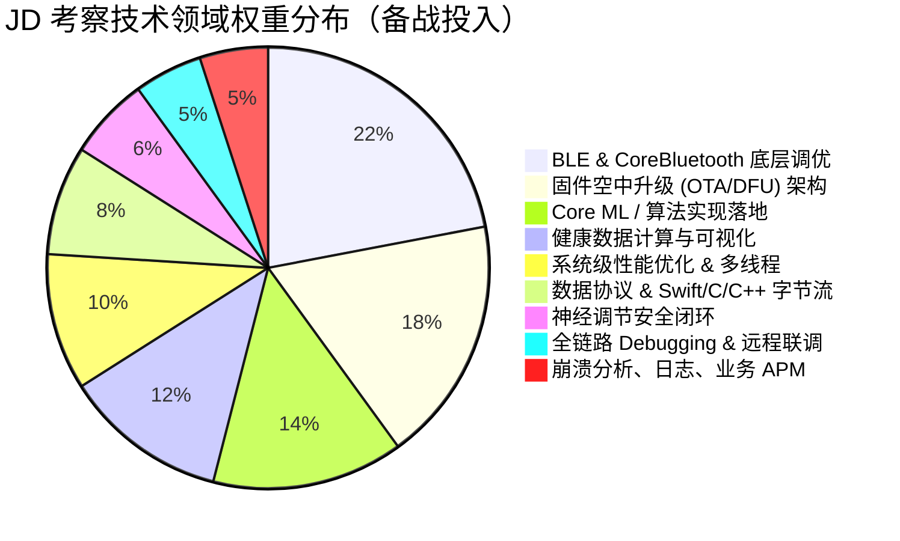

# 资深 iOS 开发专家备战指南：智能硬件 / BLE / OTA / Core ML / 性能优化

> **更新说明（对照 JD.md）**  
> - **Core ML / 算法实现**：权重**不降**，模块 03 已加强为「可落地管线 + 无深经验可练习路径」。  
> - 其余按审核建议：纠 OTA/L2CAP/Signal 误导表述；补神经调节安全、Brownfield、协议兼容、远程联调、存储分层、OTA 漏斗 APM。

---

## 📌 一、 岗位画像与四维剖析体系 (重点 / 难点 / 坑点 / 最佳实践)

本备战指南针对每一个技术模块，统一按照 **【🔥 重点】**、**【🧠 难点】**、**【⚠️ 坑点与避坑指南】** 和 **【💡 资深最佳实践】** 4 个维度进行了深度提炼与架构拆解：

> JD 职位名含「算法实现」：Core ML / Accelerate / C++ 互操是**必须能讲清的主线之一**，不是可略过的彩蛋。

---

## 📂 二、 模块化复习指南文件索引

| 模块 | 文件 | 重点 | 链接 |
| :---: | :--- | :--- | :---: |
| **01** | BLE & CoreBluetooth | MTU/流控/重连；**L2CAP 非默认 DFU** | [01](file:///Users/apple/Developments/艾犀人工智能/iOS_Interview_Prep/01_BLE_CoreBluetooth_Deep_Dive.md) |
| **02** | OTA / DFU | FSM、验签；**杀 App→Bootloader 续传为主，勿迷信 BGTask** | [02](file:///Users/apple/Developments/艾犀人工智能/iOS_Interview_Prep/02_OTA_DFU_Architecture.md) |
| **03** | Core ML 算法落地 ⭐加强 | 契约、转换量化、零拷贝管线、黄金集、TFLite/Accelerate | [03](file:///Users/apple/Developments/艾犀人工智能/iOS_Interview_Prep/03_CoreML_OnDevice_AI.md) |
| **04** | 系统性能 / 多线程 / 渲染 | Dirty 内存、LTTB、背压 | [04](file:///Users/apple/Developments/艾犀人工智能/iOS_Interview_Prep/04_System_Performance_Memory_Concurrency.md) |
| **05** | 协议 / 字节流 / C++ | Protobuf + **在野版本握手** | [05](file:///Users/apple/Developments/艾犀人工智能/iOS_Interview_Prep/05_Data_Protocol_Bytes_Interop.md) |
| **06** | 联调 / Mock / 远程 | 定责树 + **远程联调包** + 波形回放 | [06](file:///Users/apple/Developments/艾犀人工智能/iOS_Interview_Prep/06_FullStack_Debugging_Hardware_Mock.md) |
| **07** | STAR & 追问 | 含 Core ML / 神经调节追问 | [07](file:///Users/apple/Developments/艾犀人工智能/iOS_Interview_Prep/07_Senior_Interview_STAR_Pitch_QA.md) |
| **08** | 健康数据 / 可视化 | HR/HRV/睡眠 + **存储分层 TTL** | [08](file:///Users/apple/Developments/艾犀人工智能/iOS_Interview_Prep/08_Health_Data_Computation_Visualization.md) |
| **09** | 崩溃 / 日志 / APM | Signal 安全写 + **OTA 漏斗** | [09](file:///Users/apple/Developments/艾犀人工智能/iOS_Interview_Prep/09_Crash_Logging_Monitoring.md) |
| **10** | 神经调节安全 ⭐NEW | 限幅、确认、Fail-Safe、与 DFU 互斥 | [10](file:///Users/apple/Developments/艾犀人工智能/iOS_Interview_Prep/10_Neurostimulation_Safety.md) |
| **11** | Brownfield 架构 ⭐NEW | Protocol + Flag + 硬件回归矩阵 | [11](file:///Users/apple/Developments/艾犀人工智能/iOS_Interview_Prep/11_Brownfield_Architecture.md) |

根目录总览稿：[iOS_Senior_IoT_BLE_Review_Guide.md](file:///Users/apple/Developments/艾犀人工智能/iOS_Senior_IoT_BLE_Review_Guide.md)（细节以 `iOS_Interview_Prep/` 分册为准）。

---

## 🎯 三、 快速复习路线建议

1. **第一阶段（核心）**：01 BLE → 02 OTA → 08 健康数据。死磕避坑与流控；OTA 恢复路径以 Bootloader 续传为准。  
2. **第二阶段（算法实现，投入不减）**：精读 **03 Core ML 加强版**，按文末「本周练习」做最小作品（转换 + 黄金集 + Profile 截图）。同步 04 性能与 09 监控漏斗。  
3. **第三阶段（产品语境）**：10 神经调节安全 + 05 协议兼容 + 06 远程联调 + 11 Brownfield。  
4. **第四阶段（表达）**：07 STAR；主叙事：**OTA 可靠 → BLE 波形 → 算法落地（Core ML）→ 协议定责 → 安全/监控 → 旧代码演进**。

## ✅ 四、 入职前必问清单（面试也可反问）

- Flash Dual-Bank 还是 Single-Bank？DFU 协议栈？Bootloader 是否改 MAC/UUID？  
- 刺激控制是否存在？限幅在 App 还是 FW？  
- 远程如何拿板 / PacketLogger？  
- 波形采样率与算力归属（MCU vs 手机）？  
- 在野 `protocol_ver` 兼容窗口？
