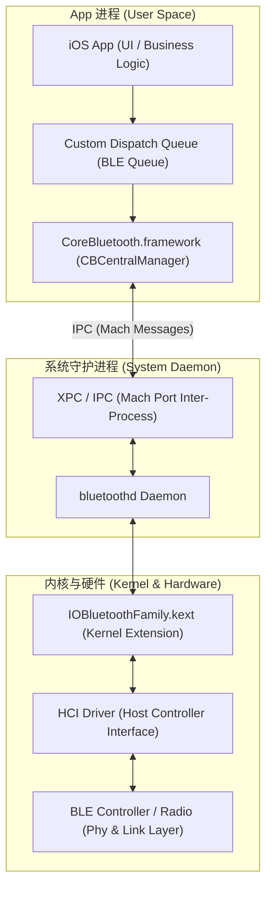
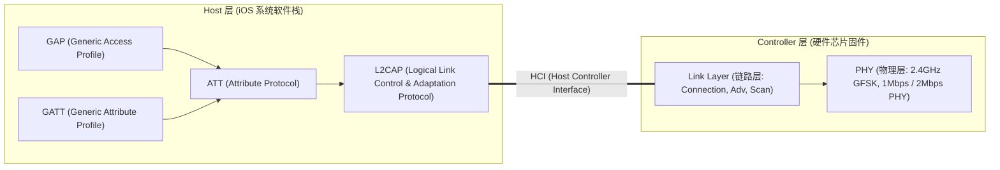
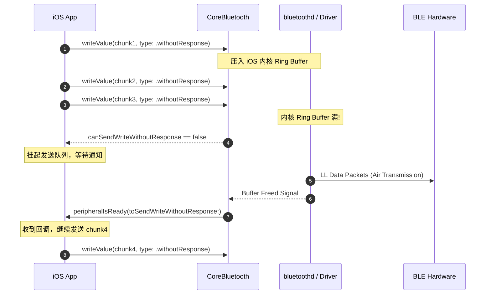
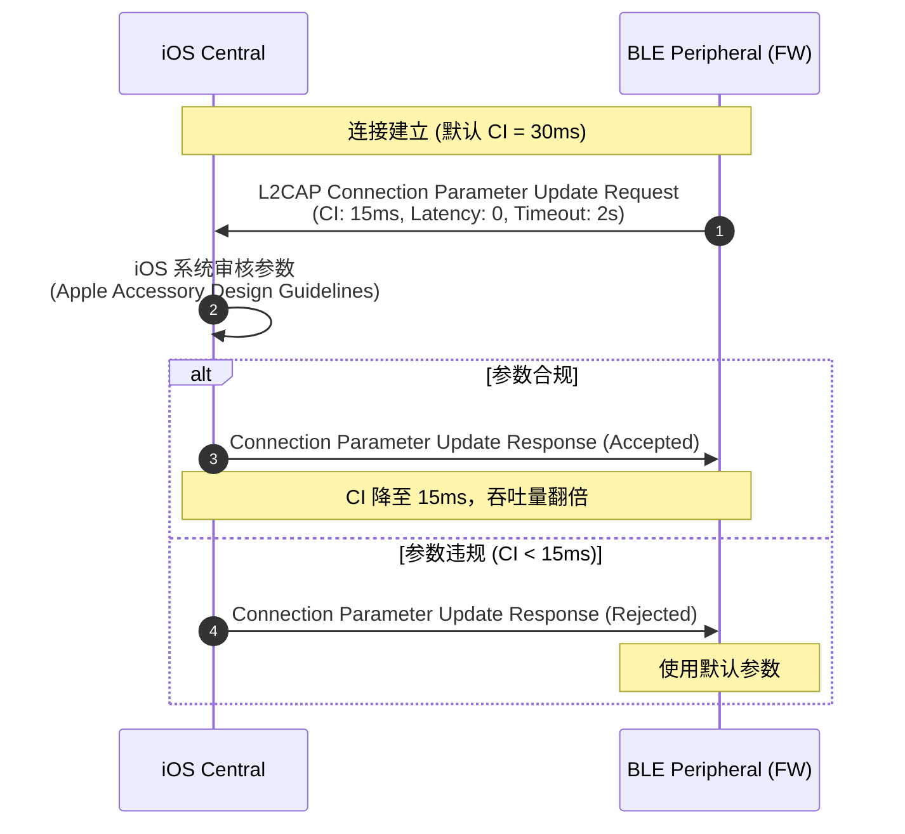
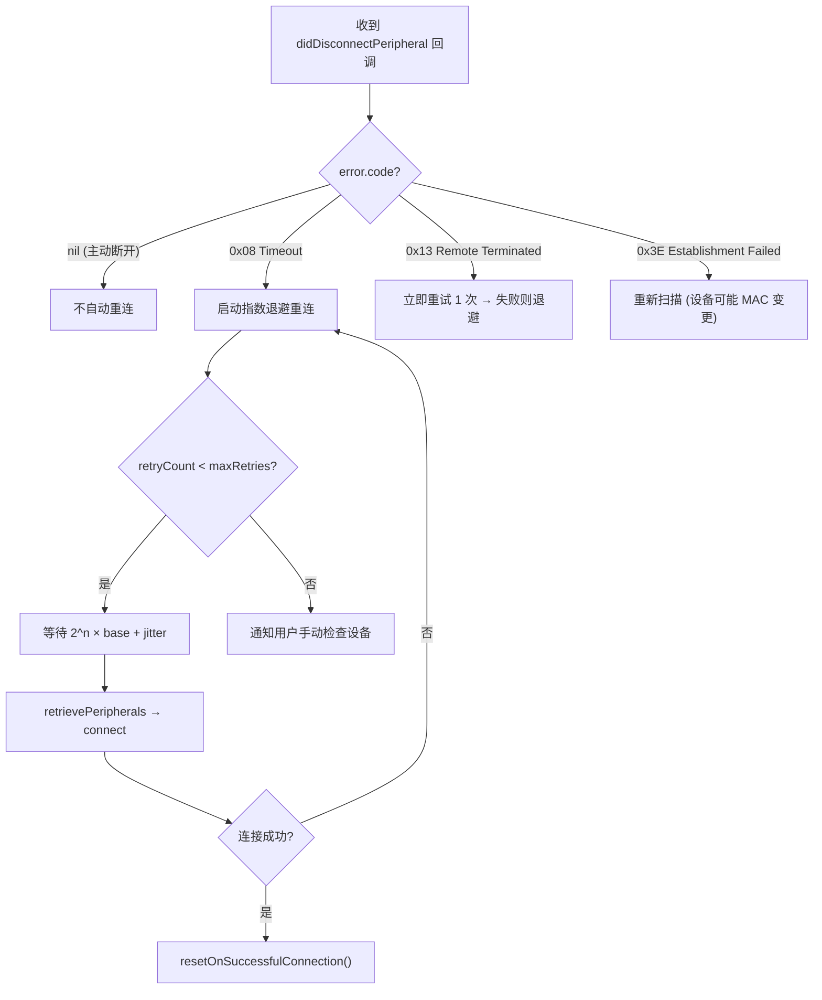

# 模块一：BLE 通信与 CoreBluetooth 底层原理与极限调优

---

## 🧭 模块知识拓扑与四维剖析

| 维度 | 核心内容 |
| :--- | :--- |
| **🔥 重点 (Key Focus)** | ATT MTU 协商与 Payload 最大化、GATT Service/Characteristic 通知订阅 (`0x2902` CCCD)、发送队列流控 |
| **🧠 难点 (Difficult Points)** | L2CAP CoC (Connection-Oriented Channels) 无属性层 Socket 通信、iOS 内核 Ring Buffer 流控原理与极限吞吐推导 |
| **⚠️ 坑点 (Pitfalls)** | 1. iOS 系统蓝牙 GATT Database 缓存机制导致的 UUID 不刷新；<br>2. 后台扫描时 `scanForPeripherals(withServices: nil)` 失效与 LocalName 丢包；<br>3. `CBCentralManager` 未强引用被 ARC 提前释放导致回调静默消失。 |
| **💡 最佳实践 (Best Practices)** | 独立后台 DispatchQueue、指数退避 (Exponential Backoff) 重连策略、`RestoreIdentifier` 状态恢复完整处理 |

---

## 1.1 iOS 蓝牙系统架构与 CoreBluetooth 线程模型

深入本质来看，`CoreBluetooth.framework` 并不是直接与蓝牙芯片通信，而是作为 Client 端通过 **Mach Port / XPC 通信** 与 iOS 蓝牙守护进程 `bluetoothd` 进行跨进程交互。



---

## 1.2 GATT / ATT / L2CAP 协议栈本质剖析



---

## 1.3 极限吞吐量模型与流控机制

### BLE 理论极限吞吐量公式
$$\text{Throughput (bits/s)} = \frac{\text{Payload Per Packet (bytes)} \times 8}{\text{Connection Interval (seconds)}} \times \text{Packets Per Connection Event}$$

假设条件：
- **PHY**：2Mbps (BLE 5.0+)
- **ATT MTU**：247 字节 $\rightarrow$ Payload = $247 - 3 = 244$ 字节
- **Connection Interval**：15 ms (iOS 允许的最小值)
- **Packets per Event**：iOS 在理想情况下一个 Connection Event 可发送 4~6 个包

$$\text{Max Throughput} = \frac{244 \times 8 \text{ bits}}{0.015 \text{ s}} \times 6 \approx 780.8 \text{ Kbps } (\approx 97.6 \text{ KB/s})$$

### `Write Without Response` 流控机制（序列图）



---

## ⚠️ 1.4 资深实战：核心坑点与避坑指南 (Pitfalls & Solutions)

### 坑点 1：iOS 系统蓝牙 GATT 数据库缓存 (Database Caching) 陷阱
- **现象**：硬件工程师修改或新增了某个 Characteristic UUID，但在 iOS App 侧调用 `discoverServices` 或 `discoverCharacteristics` 时，返回的仍然是旧的特征结构，甚至报错找不到新特征。
- **本质原因**：iOS 系统为了省电，会对已配对/连接过的 Peripheral 的 GATT Service 结构进行强缓存（按 MAC 地址或 System ID 缓存）。
- **专家级解决方案**：
  1. **硬件侧实现 Service Changed 特征值**：硬件在 Generic Attribute Service (`0x1801`) 中暴露 Service Changed Characteristic (`0x2A05`)。每当固件结构改变，硬件向 iOS 发送 Indication，强制 iOS 清除 GATT 缓存并重新探索服务。
  2. **用户侧回避**：开关 iOS 系统蓝牙（促使 `bluetoothd` 清除内存缓存）或修改蓝牙设备 MAC 地址。

### 坑点 2：后台扫描 `scanForPeripherals(withServices: nil)` 被静默屏蔽
- **现象**：App 退后台后，蓝牙扫描失效，再也搜不到设备。
- **本质原因**：iOS 苹果后台策略限制：当 App 在后台运行时，如果 `withServices` 参数传入 `nil`，iOS 会彻底屏蔽扫描事件以保护电池寿命；此外，广播包中的 `kCBAdvDataLocalName` 在后台会被剔除，缩减为极简广播。
- **专家级解决方案**：
  - 在 `scanForPeripherals(withServices: [CBUUID(string: "FFF0")], options: nil)` 中**必须显式指定 Service UUID**。
  - 识别外设时，不要依赖 LocalName 字符串，必须依赖广播 Payload 中的 Service Data 或 Manufacturer Data。

### 坑点 3：`CBCentralManager` 被 ARC 提前释放
- **现象**：调用了扫描代码，但没有任何代理回调触发（`centralManagerDidUpdateState` 从未执行）。
- **本质原因**：在函数局部变量中初始化了 `CBCentralManager`，函数退出后局部变量被 ARC 自动释放，导致底层 IPC 管道随之销毁。
- **专家级解决方案**：使用单例类或强引用 Singleton / Coordinator 持有 `CBCentralManager` 实例。

---

## 💡 1.5 资深最佳实践代码 (Best Practices)

```swift
final class BLEManagerCoordinator: NSObject {
    static let shared = BLEManagerCoordinator()
    
    private var centralManager: CBCentralManager!
    private var bleQueue = DispatchQueue(label: "com.app.ble.coordinator", qos: .userInitiated)
    private var activePeripheral: CBPeripheral?

    private override init() {
        super.init()
        // 最佳实践 1：使用独立 Queue + 挂载后台恢复 Identifier
        let options: [String: Any] = [
            CBCentralManagerOptionRestoreIdentifierKey: "com.app.ble.restore.id",
            CBCentralManagerOptionShowPowerAlertKey: true
        ]
        centralManager = CBCentralManager(delegate: self, queue: bleQueue, options: options)
    }

    // 最佳实践 2：显式指定 ServiceUUID 扫描，防止后台失效
    func startBackgroundSafeScan() {
        guard centralManager.state == .poweredOn else { return }
        let targetServiceUUID = CBUUID(string: "FFF0")
        centralManager.scanForPeripherals(withServices: [targetServiceUUID], options: [
            CBCentralManagerScanOptionAllowDuplicatesKey: false
        ])
    }
}

extension BLEManagerCoordinator: CBCentralManagerDelegate {
    func centralManagerDidUpdateState(_ central: CBCentralManager) {
        if central.state == .poweredOn {
            startBackgroundSafeScan()
        }
    }

    // 最佳实践 3：处理 App 被系统杀后后台拉起的恢复回调
    func centralManager(_ central: CBCentralManager, willRestoreState dict: [String : Any]) {
        if let peripherals = dict[CBCentralManagerRestoredStatePeripheralsKey] as? [CBPeripheral] {
            self.activePeripheral = peripherals.first
            self.activePeripheral?.delegate = self
            print("Successfully restored peripheral: \(String(describing: activePeripheral?.identifier))")
        }
    }
}

extension BLEManagerCoordinator: CBPeripheralDelegate {}
```

---

## 1.6 连接速度优化 — Connection Parameter 协商

> **JD 对齐**：「提升连接速度」

BLE 连接建立后，Central 与 Peripheral 之间通过 **Connection Parameter Update Request** 协商通信参数，直接影响吞吐量与功耗。

### 四大核心参数

| 参数 | 含义 | iOS 约束 | 推荐值 (高吞吐) | 推荐值 (低功耗) |
| :--- | :--- | :--- | :--- | :--- |
| **Connection Interval (CI)** | 两次通信事件间隔 | 15ms ~ 2s | 15ms | 200ms ~ 500ms |
| **Slave Latency** | Peripheral 可跳过的连接事件数 | 0 ~ 499 | 0 | 4 ~ 10 |
| **Supervision Timeout** | 断连判定超时 | 2s ~ 6s | 2s | 6s |
| **MTU** | 单包最大传输单元 | 最大 527 (iOS 实测 ~247) | 247 | 23 (默认) |



### ⚠️ 坑点 4：Connection Interval 过小导致特定芯片断连
- **现象**：在 Dialog DA14585 / DA14531 芯片上，设置 CI = 7.5ms 后 3~5 秒内触发 `0x08 Connection Timeout` 断连。
- **本质原因**：低端 BLE 芯片的射频处理速度跟不上极短的连接间隔，导致 Link Layer 无法在下一个 Connection Event 之前完成包处理。
- **专家级解决方案**：
  - CI 最小值严格遵循 **Apple Accessory Design Guidelines**（≥15ms）。
  - 在 OTA 传输等高吞吐场景动态调整 CI 至 15ms，空闲时回退至 200ms 省电。

---

## 1.7 指数退避断线重连策略

> **JD 对齐**：「优化断线重连机制」

```swift
/// 指数退避 (Exponential Backoff) + 抖动 (Jitter) 重连策略
/// 避免大量设备同时断连后同一时刻暴风骤雨式重连导致 RF 冲突
final class ExponentialBackoffReconnector {
    private let centralManager: CBCentralManager
    private let targetPeripheralIdentifier: UUID
    
    private var retryCount = 0
    private let maxRetries = 8
    private let baseInterval: TimeInterval = 0.5   // 500ms
    private let maxInterval: TimeInterval = 30.0    // 30s 上限
    private var reconnectTimer: DispatchSourceTimer?
    private let bleQueue: DispatchQueue
    
    init(centralManager: CBCentralManager, peripheralID: UUID, queue: DispatchQueue) {
        self.centralManager = centralManager
        self.targetPeripheralIdentifier = peripheralID
        self.bleQueue = queue
    }
    
    /// 触发退避重连
    func scheduleReconnect() {
        guard retryCount < maxRetries else {
            print("⛔ Max reconnection attempts (\(maxRetries)) reached. Giving up.")
            notifyUserConnectionFailed()
            return
        }
        
        // 指数退避：0.5s, 1s, 2s, 4s, 8s, 16s, 30s, 30s
        let exponentialDelay = min(baseInterval * pow(2.0, Double(retryCount)), maxInterval)
        // 添加 ±25% 随机抖动 (Jitter)，防止多设备同步重连冲突
        let jitter = exponentialDelay * Double.random(in: -0.25...0.25)
        let finalDelay = max(0.1, exponentialDelay + jitter)
        
        retryCount += 1
        print("🔄 Reconnect attempt #\(retryCount) in \(String(format: "%.2f", finalDelay))s")
        
        reconnectTimer?.cancel()
        reconnectTimer = DispatchSource.makeTimerSource(queue: bleQueue)
        reconnectTimer?.schedule(deadline: .now() + finalDelay)
        reconnectTimer?.setEventHandler { [weak self] in
            self?.attemptReconnect()
        }
        reconnectTimer?.resume()
    }
    
    private func attemptReconnect() {
        // 优先尝试直接重连已知 Peripheral (比扫描更快)
        let knownPeripherals = centralManager.retrievePeripherals(withIdentifiers: [targetPeripheralIdentifier])
        if let peripheral = knownPeripherals.first {
            centralManager.connect(peripheral, options: nil)
        } else {
            // 退化为扫描模式
            centralManager.scanForPeripherals(
                withServices: [CBUUID(string: "FFF0")],
                options: [CBCentralManagerScanOptionAllowDuplicatesKey: false]
            )
        }
    }
    
    /// 连接成功时重置计数器
    func resetOnSuccessfulConnection() {
        retryCount = 0
        reconnectTimer?.cancel()
        reconnectTimer = nil
    }
    
    private func notifyUserConnectionFailed() {
        DispatchQueue.main.async {
            // 通知 UI 层显示"设备连接失败，请检查设备是否开启并靠近手机"
        }
    }
}
```

### 重连策略决策流程



---

## 1.8 L2CAP CoC (Connection-Oriented Channels) 高速传输

> **JD 对齐**：「提高大数据流的传输吞吐量」

L2CAP CoC 绕开 GATT 层的属性数据库开销，提供纯粹的 **Socket 式双向数据流**，理想条件下吞吐可明显高于 GATT。

### ⚠️ 选型警告（面试与落地都要先说清）

- **多数商用 DFU（如 Nordic Secure DFU）默认走 GATT**，不是 L2CAP。没有 FW 侧 PSM/CoC 支持时，App 单独上 CoC 无意义。
- 波形实时流优先把 **MTU、CI、Write Without Response 流控、粘包解析** 做稳；CoC 是「双方约定后」的加速项。
- 上文极限吞吐公式忽略 ACL 头、IFS、事件开销与射频干扰，**只能作面试推导，不能当立项带宽预算**。

### GATT vs L2CAP CoC 对比

| 维度 | GATT (ATT) | L2CAP CoC |
| :--- | :--- | :--- |
| **数据模型** | Attribute Database (Handle + UUID) | 纯 Socket 字节流 |
| **单包 Payload** | MTU - 3 (最大 ~244 bytes) | 无 ATT 头开销 |
| **流控** | App 层 `peripheralIsReady` | L2CAP Credit-Based Flow Control |
| **适用场景** | 命令 / 传感器 / **主流 DFU** | 双方支持时的大文件 / 自研高速通道 |
| **iOS 版本** | iOS 5+ | iOS 11+ |

### L2CAP CoC 实战代码

```swift
/// L2CAP CoC 高速传输通道 — 用于 OTA 或大文件传输
final class L2CAPStreamTransporter: NSObject {
    private var channel: CBL2CAPChannel?
    private var outputStream: OutputStream?
    private var inputStream: InputStream?
    private let l2capPSM: CBL2CAPPSM = 0x0025  // 与固件约定的 PSM 值
    
    /// 在已连接的 Peripheral 上打开 L2CAP 通道
    func openChannel(on peripheral: CBPeripheral) {
        peripheral.openL2CAPChannel(l2capPSM)
    }
    
    /// 通道打开成功回调 (CBPeripheralDelegate)
    func peripheral(_ peripheral: CBPeripheral, didOpen channel: CBL2CAPChannel?, error: Error?) {
        guard let channel = channel, error == nil else {
            print("❌ L2CAP Channel open failed: \(error?.localizedDescription ?? "unknown")")
            return
        }
        self.channel = channel
        self.outputStream = channel.outputStream
        self.inputStream = channel.inputStream
        
        // 配置 Stream 并加入 RunLoop
        outputStream?.delegate = self
        inputStream?.delegate = self
        outputStream?.schedule(in: .current, forMode: .default)
        inputStream?.schedule(in: .current, forMode: .default)
        outputStream?.open()
        inputStream?.open()
        
        print("✅ L2CAP Channel opened, PSM: \(channel.psm)")
    }
    
    /// 通过 L2CAP 发送固件数据块
    func sendFirmwareChunk(_ data: Data) -> Int {
        guard let outputStream = outputStream, outputStream.hasSpaceAvailable else { return 0 }
        return data.withUnsafeBytes { buffer in
            guard let pointer = buffer.baseAddress?.assumingMemoryBound(to: UInt8.self) else { return 0 }
            return outputStream.write(pointer, maxLength: data.count)
        }
    }
}

extension L2CAPStreamTransporter: StreamDelegate {
    func stream(_ aStream: Stream, handle eventCode: Stream.Event) {
        switch eventCode {
        case .hasBytesAvailable:
            // 从 inputStream 读取固件的 ACK / 进度回包
            var buffer = [UInt8](repeating: 0, count: 512)
            if let input = aStream as? InputStream {
                let bytesRead = input.read(&buffer, maxLength: buffer.count)
                if bytesRead > 0 {
                    let responseData = Data(buffer[0..<bytesRead])
                    handleFirmwareResponse(responseData)
                }
            }
        case .hasSpaceAvailable:
            // 可以继续发送下一个 chunk
            onReadyToSendNextChunk?()
        case .errorOccurred:
            print("❌ L2CAP Stream error: \(aStream.streamError?.localizedDescription ?? "")")
        default:
            break
        }
    }
    
    private func handleFirmwareResponse(_ data: Data) {
        // 解析固件 ACK 响应
    }
    
    var onReadyToSendNextChunk: (() -> Void)?
}
```
