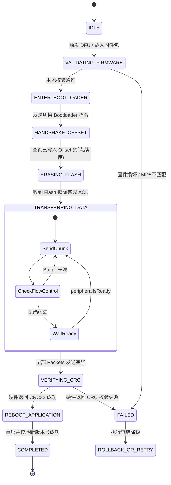
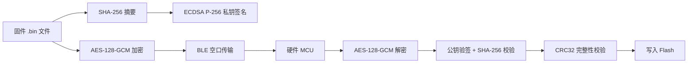
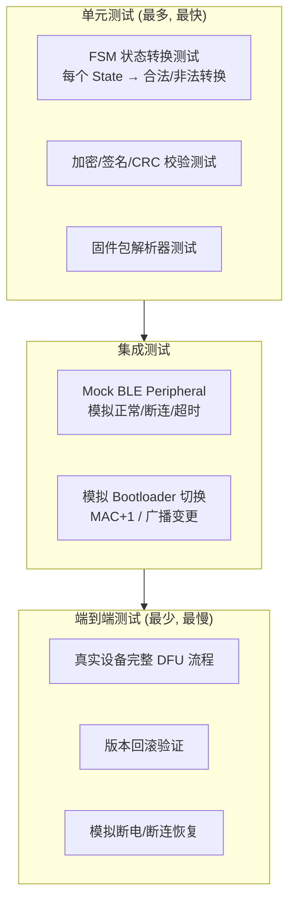

# 模块二：固件空中升级（OTA / DFU）架构深度剖析

---

## 🧭 模块知识拓扑与四维剖析

| 维度 | 核心内容 |
| :--- | :--- |
| **🔥 重点 (Key Focus)** | 有限状态机 (FSM) 解耦设计、Dual-Bank (双区模式) Flash 布局、校验与重启机制 |
| **🧠 难点 (Difficult Points)** | 断点续传 (Offset 查询与切片)、滑动窗口 (Sliding Window Protocol / PRN) 算法、Bootloader 模式 MAC 地址变动识别算法 |
| **⚠️ 坑点 (Pitfalls)** | 1. 进入 Bootloader 后设备 MAC 地址 +1 导致的搜索连接超时；<br>2. 固件 Flash Erase (擦除) 耗时过长触发 App 误判断连超时；<br>3. 缺乏状态超时 Guardian 导致的 FSM 挂起死锁。 |
| **💡 最佳实践 (Best Practices)** | 全局 Timer 状态护航、AES-128-GCM 加密 + SHA-256 / CRC32 双重验签、版本回滚降级防护 |

---

## 2.1 DFU 硬件底层与 Flash 分区机制

硬件 Flash 存储空间通常分为 **Bootloader**、**Application** 以及 **Swap/Storage** 区。


- **Dual-Bank (安全双区模式)**：新固件首先完全写入 Bank 1，全面校验（SHA-256 & CRC32）成功后，Bootloader 修改 Boot Flag 并在重启时将 Bank 1 搬移覆盖 Bank 0。如果升级中途断电/断连，设备原有的 Bank 0 仍可正常运行。
- **Single-Bank (单区模式)**：Flash 擦除 Bank 0 直接边收边写。断连后只能保留在 Bootloader 模式，依靠 Bootloader 的最小 BLE 栈等待重新升级。

---

## 2.2 完整 OTA 有限状态机 (FSM) 设计



---

## ⚠️ 2.3 资深实战：核心坑点与避坑指南 (Pitfalls & Solutions)

### 坑点 1：固件 Flash 擦除 (Flash Erase) 耗时触发 App 蓝牙超时
- **现象**：在 App 发送 `Start_DFU` 指令后，MCU 固件开始擦除内部 Flash。擦除过程可能长达 2~6 秒，期间 MCU 关闭中断不响应 BLE。App 超时未收到 ACK，以为蓝牙断连而抛出 Failure。
- **专家级解决方案**：
  - 在进入 `ERASING_FLASH` 状态时，必须**显式延长定时器 Timeout 限制（如设置为 15 秒）**，等待硬件发送 `Erase_Completed` 显式应答后才进入下一状态。

### 坑点 2：进入 Bootloader 模式后 MAC 地址 +1 或名称改变
- **现象**：给手环发 `Jump_To_Bootloader` 指令后，原连接断开。App 尝试用原 Peripheral `UUID` 重新连接超时。
- **本质原因**：Nordic / Dialog 芯片固件库默认在进入 Bootloader 模式时，为了避免 iOS 系统蓝牙 GATT 缓存，会将 **MAC 地址 +1**，并在广播名字后加上 `"DfuTgt"`。
- **专家级解决方案**：
  - 实现 **Target Re-discovery 匹配机制**：扫描广播包包含 `DFU_SERVICE_UUID` (`0xFE59`) 的设备，并匹配广播 Payload 里的序列号 (Serial Number)。

### 坑点 3：缺乏状态机超时 Guardian 导致升级界面永久卡死
- **现象**：升级停在 45% 或“擦除中”，蓝牙静默丢包，用户界面一直转圈。
- **专家级解决方案**：
  - 为 FSM 的每个 State 维护一个 `StateTimer Guardian`。如果在预设时间内（如 10s）没有进入下一个 State，触发主动重试；重试超过 3 次强制转入 `FAILED` 并尝试重新连回设备。

---

## 💡 2.4 资深最佳实践代码：带超时护航的状态机

```swift
final class DFUStateGuardian {
    private var stateTimer: Timer?
    private let timeoutInterval: TimeInterval
    private var retryCount = 0
    private let maxRetries = 3
    
    var onTimeoutAction: (() -> Void)?
    
    init(timeoutInterval: TimeInterval = 10.0) {
        self.timeoutInterval = timeoutInterval
    }
    
    func startGuardian() {
        resetTimer()
        stateTimer = Timer.scheduledTimer(withTimeInterval: timeoutInterval, repeats: false) { [weak self] _ in
            self?.handleTimeout()
        }
    }
    
    func resetTimer() {
        stateTimer?.invalidate()
        stateTimer = nil
    }
    
    private func handleTimeout() {
        if retryCount < maxRetries {
            retryCount += 1
            print("DFU State timeout, retrying (#\(retryCount))...")
            onTimeoutAction?()
            startGuardian()
        } else {
            print("DFU Max retries reached. Aborting.")
            // 触发主动断开并降级恢复
        }
    }
}
```

---

## 2.5 安全校验体系：AES-128-GCM 加密 + SHA-256 签名验证

> **JD 对齐**：「确保整个升级过程的安全性」



### 固件包校验 Swift 代码 (CryptoKit)

```swift
import CryptoKit
import Foundation

/// OTA 固件包安全校验器
struct FirmwareSecurityValidator {
    
    struct FirmwarePackage {
        let encryptedPayload: Data     // AES-128-GCM 加密的固件二进制
        let nonce: Data                // 12 字节 GCM Nonce
        let tag: Data                  // 16 字节 GCM Auth Tag
        let sha256Digest: Data         // 32 字节 SHA-256 摘要
        let signature: Data            // ECDSA P-256 签名
    }
    
    /// 1. 解密固件包
    static func decryptFirmware(package: FirmwarePackage, symmetricKey: SymmetricKey) throws -> Data {
        let sealedBox = try AES.GCM.SealedBox(
            nonce: AES.GCM.Nonce(data: package.nonce),
            ciphertext: package.encryptedPayload,
            tag: package.tag
        )
        return try AES.GCM.open(sealedBox, using: symmetricKey)
    }
    
    /// 2. 校验 SHA-256 摘要
    static func verifySHA256(firmwareData: Data, expectedDigest: Data) -> Bool {
        let computedDigest = SHA256.hash(data: firmwareData)
        return Data(computedDigest) == expectedDigest
    }
    
    /// 3. 验证 ECDSA P-256 签名 (防篡改)
    static func verifySignature(
        firmwareData: Data,
        signature: Data,
        publicKeyData: Data
    ) -> Bool {
        guard let publicKey = try? P256.Signing.PublicKey(x963Representation: publicKeyData) else {
            return false
        }
        guard let ecdsaSignature = try? P256.Signing.ECDSASignature(derRepresentation: signature) else {
            return false
        }
        return publicKey.isValidSignature(ecdsaSignature, for: firmwareData)
    }
    
    /// 4. CRC32 计算 (与硬件端对齐)
    static func crc32(_ data: Data) -> UInt32 {
        var crc: UInt32 = 0xFFFFFFFF
        for byte in data {
            crc ^= UInt32(byte)
            for _ in 0..<8 {
                crc = (crc & 1) != 0 ? (crc >> 1) ^ 0xEDB88320 : crc >> 1
            }
        }
        return crc ^ 0xFFFFFFFF
    }
    
    /// 完整校验流程
    static func validateFirmwarePackage(
        _ package: FirmwarePackage,
        symmetricKey: SymmetricKey,
        signingPublicKey: Data
    ) -> Result<Data, FirmwareValidationError> {
        // Step 1: 解密
        guard let decrypted = try? decryptFirmware(package: package, symmetricKey: symmetricKey) else {
            return .failure(.decryptionFailed)
        }
        
        // Step 2: SHA-256
        guard verifySHA256(firmwareData: decrypted, expectedDigest: package.sha256Digest) else {
            return .failure(.sha256Mismatch)
        }
        
        // Step 3: 签名验证
        guard verifySignature(firmwareData: decrypted, signature: package.signature, publicKeyData: signingPublicKey) else {
            return .failure(.signatureInvalid)
        }
        
        return .success(decrypted)
    }
    
    enum FirmwareValidationError: Error {
        case decryptionFailed
        case sha256Mismatch
        case signatureInvalid
    }
}
```

### 版本降级防护

```swift
/// 防止恶意降级攻击 (Anti-Rollback)
func validateVersionProgression(currentVersion: String, newVersion: String) -> Bool {
    let current = currentVersion.split(separator: ".").compactMap { Int($0) }
    let new = newVersion.split(separator: ".").compactMap { Int($0) }
    
    guard current.count == 3, new.count == 3 else { return false }
    
    // 新版本必须 >= 当前版本
    for i in 0..<3 {
        if new[i] > current[i] { return true }
        if new[i] < current[i] { return false }
    }
    return true // 相等版本允许（修复包）
}
```

---

## 2.6 DFU 用户体验设计

> **JD 对齐**：「提供优秀的用户体验」

### UX 状态映射

| FSM 内部状态 | 用户界面展示 | 进度百分比 | 用户可操作 |
| :--- | :--- | :--- | :--- |
| `VALIDATING_FIRMWARE` | "正在验证固件完整性..." | 0~5% | ❌ |
| `ENTER_BOOTLOADER` | "正在准备设备升级..." | 5~10% | ❌ |
| `ERASING_FLASH` | "正在准备存储空间..." | 10~15% | ❌ (⚠️ 此阶段可能持续 2~6s) |
| `TRANSFERRING_DATA` | "正在传输固件 (xx%)" | 15~90% | ⚠️ 可取消但需二次确认 |
| `VERIFYING_CRC` | "正在验证固件..." | 90~95% | ❌ |
| `REBOOT_APPLICATION` | "设备重启中..." | 95~100% | ❌ |
| `COMPLETED` | "✅ 升级成功！" | 100% | ✅ |
| `FAILED` | "升级失败，正在恢复..." | — | ✅ 可重试 |

### 关键 UX 原则

```swift
/// DFU 进度展示器 — 将 FSM 内部状态转化为用户友好的界面
final class DFUProgressPresenter: ObservableObject {
    @Published var progressPercent: Double = 0
    @Published var statusMessage: String = ""
    @Published var canCancel: Bool = false
    @Published var showRetryButton: Bool = false
    
    func updateState(_ state: DFUState, transferProgress: Double = 0) {
        switch state {
        case .validatingFirmware:
            statusMessage = "正在验证固件完整性..."
            progressPercent = 3
            canCancel = false
            
        case .enterBootloader:
            statusMessage = "正在准备设备升级..."
            progressPercent = 8
            
        case .erasingFlash:
            // ⚠️ 此阶段不要显示进度跳动，使用不确定进度条
            statusMessage = "正在准备存储空间，请勿移动设备..."
            progressPercent = 12
            
        case .transferringData:
            // 线性映射：15% ~ 90%
            progressPercent = 15 + transferProgress * 75
            statusMessage = "正在传输固件 (\(Int(progressPercent))%)"
            canCancel = true
            
        case .verifyingCRC:
            statusMessage = "正在验证固件完整性..."
            progressPercent = 92
            canCancel = false
            
        case .rebootApplication:
            statusMessage = "设备重启中，请稍候..."
            progressPercent = 97
            
        case .completed:
            statusMessage = "✅ 固件升级成功！"
            progressPercent = 100
            
        case .failed(let error):
            statusMessage = "升级遇到问题：\(error.userFriendlyMessage)"
            showRetryButton = true
            canCancel = true
        }
    }
}
```

---

## 2.7 DFU 测试策略

> **JD 对齐**：「开发并测试 iOS 端的固件空中升级流程」

### 测试金字塔



### FSM 状态机单元测试

```swift
import XCTest

final class DFUStateMachineTests: XCTestCase {
    var sut: DFUStateMachine!
    
    override func setUp() {
        sut = DFUStateMachine()
    }
    
    /// 测试正常状态流转路径
    func testHappyPathTransitions() {
        XCTAssertEqual(sut.currentState, .idle)
        
        sut.trigger(.startDFU)
        XCTAssertEqual(sut.currentState, .validatingFirmware)
        
        sut.trigger(.validationPassed)
        XCTAssertEqual(sut.currentState, .enterBootloader)
        
        sut.trigger(.bootloaderReady)
        XCTAssertEqual(sut.currentState, .handshakeOffset)
        
        sut.trigger(.offsetReceived)
        XCTAssertEqual(sut.currentState, .erasingFlash)
        
        sut.trigger(.eraseCompleted)
        XCTAssertEqual(sut.currentState, .transferringData)
        
        sut.trigger(.transferComplete)
        XCTAssertEqual(sut.currentState, .verifyingCRC)
        
        sut.trigger(.crcPassed)
        XCTAssertEqual(sut.currentState, .rebootApplication)
        
        sut.trigger(.versionVerified)
        XCTAssertEqual(sut.currentState, .completed)
    }
    
    /// 测试非法状态转换应被拒绝
    func testInvalidTransitionRejected() {
        XCTAssertEqual(sut.currentState, .idle)
        sut.trigger(.eraseCompleted) // 从 IDLE 不能直接跳到 ERASE
        XCTAssertEqual(sut.currentState, .idle) // 状态不变
    }
    
    /// 测试 CRC 校验失败回退
    func testCRCFailureTriggersRetry() {
        // ... 走到 verifyingCRC 状态
        sut.trigger(.crcFailed)
        XCTAssertEqual(sut.currentState, .failed)
    }
    
    /// 测试 Flash 擦除超时 Guardian
    func testEraseTimeoutTriggersGuardian() {
        // 模拟进入 erasingFlash 后 15 秒无响应
        let expectation = expectation(description: "Guardian timeout")
        sut.onStateTimeout = { state in
            XCTAssertEqual(state, .erasingFlash)
            expectation.fulfill()
        }
        // ... 设置 guardian timeout
        waitForExpectations(timeout: 20)
    }
}
```

### ⚠️ 坑点 4：用户在升级过程中手动杀 App

- **现象**：用户在固件传输到 45% 时上划杀 App，导致设备停留在 Bootloader 模式无法正常使用。
- **专家级解决方案（以可恢复性为准，勿迷信后台任务）**：
  1. **进入 DFU 前**：全屏「请勿关闭 App / 锁屏可但勿强制杀掉」，禁用侧滑返回；进度写入本地（offset、固件版本、设备 SN）。
  2. **不要依赖 `BGTaskScheduler` 续传 DFU**：`BGProcessingTask` **不保证**维持 BLE 长传会话，杀进程后更无法可靠接着传。它最多用于「稍后提醒用户打开 App 完成升级」类轻量任务。
  3. **Bootloader 自恢复才是主路径**：下次冷启动扫描 `DFU_SERVICE_UUID`，匹配 SN，从本地保存的 offset **断点续传**；Dual-Bank 下应用区仍可运行则优先提示「有未完成升级」。
  4. **与刺激互斥**：DFU 期间锁定刺激下发（见模块 10）。

```swift
/// App 启动时检查设备是否遗留在 Bootloader 模式 — 主恢复路径
func checkForStuckBootloaderDevice() {
    // 1) 读本地未完成 DFU 会话（offset / firmware hash / SN）
    // 2) 扫描 DFU Service（如 Nordic 0xFE59），按 SN 匹配
    // 3) 提示用户一键续传，而不是静默开传
    centralManager.scanForPeripherals(
        withServices: [CBUUID(string: "FE59")],
        options: nil
    )
}
```

