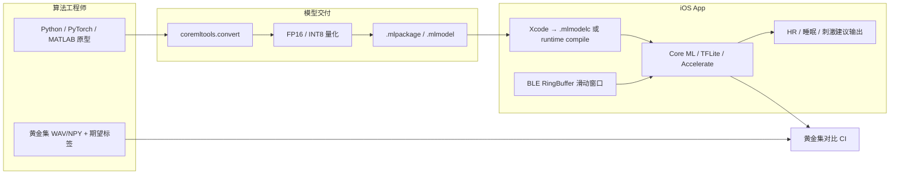
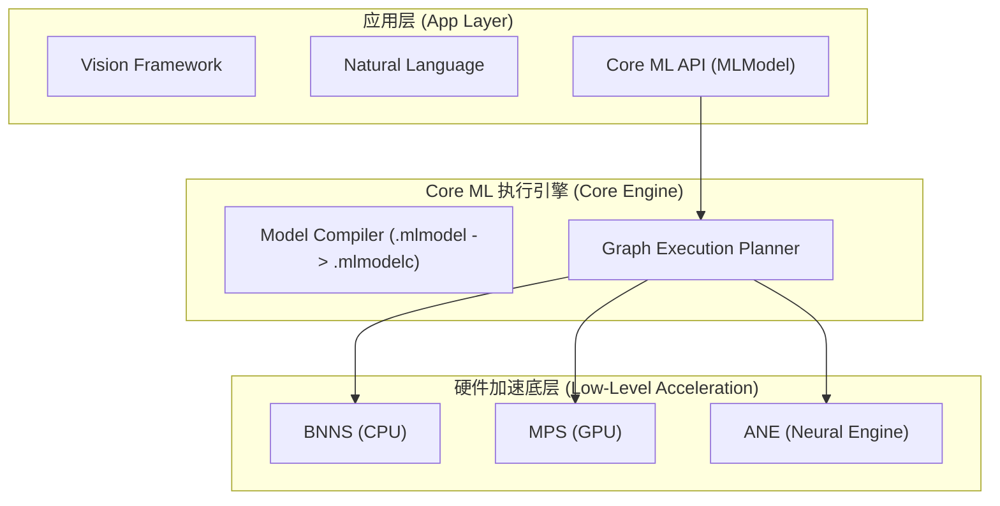
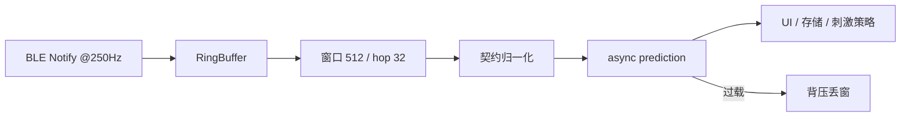
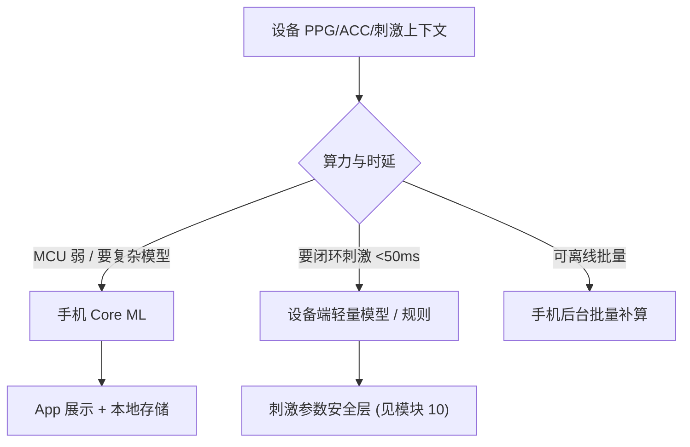

# 模块三：Core ML 端侧 AI 与生物信号算法落地（加强版）

> **JD 对齐**：职位强调「算法实现」；加分项含 Core ML / TFLite、Swift 调 C/C++、阅读 Python/MATLAB。  
> **备战定位**：本模块权重**不降**——即使你过去落地经验少，也要能讲清「从算法原型 → 端侧推理 → 与 BLE 管线对接」的完整工程路径。

---

## 🧭 模块知识拓扑与四维剖析

| 维度 | 核心内容 |
| :--- | :--- |
| **🔥 重点 (Key Focus)** | 端到端交付管线（Python→coremltools→.mlmodelc→Swift）、与算法团队的 **I/O 契约**、`MLComputeUnits` / ANE、INT8/FP16 量化 |
| **🧠 难点 (Difficult Points)** | 零拷贝 `MLMultiArray`、250Hz 滑动窗口背压、异步推理与 BLE 线程隔离、黄金集回归防静默漂移 |
| **⚠️ 坑点 (Pitfalls)** | 自定义算子 Fallback CPU 发热；重复 malloc 碎片；未预编译冷启动；归一化训练/推理不一致；动态下载模型未 `compileModel` |
| **💡 最佳实践 (Best Practices)** | 契约先行 + Instruments Core ML Profile + 零拷贝预分配 + Actor 串行推理 + 黄金集 CI |

---

## 3.0 端到端落地全景（面试必画图）



**一句话能力陈述（面试开场）**：  
「我会和算法约定输入采样率、窗口、归一化与输出置信度；用 coremltools 导出并量化；在 iOS 上预编译模型，用独立 Actor + 零拷贝缓冲做滑动窗口推理，并用黄金集保证 Swift/Python 数值对齐。」

---

## 3.1 Core ML 系统分层与硬件加速引擎选型



```swift
let config = MLModelConfiguration()
// .all / .cpuAndNeuralEngine：优先 ANE，适合持续推理
// .cpuAndGPU：自定义层不走 ANE 时
// .cpuOnly：后台低功耗、避免唤醒 GPU/ANE 发热
config.computeUnits = .cpuAndNeuralEngine
```

| 选型 | 适用 | 风险 |
| :--- | :--- | :--- |
| `.cpuAndNeuralEngine` | 心率/睡眠分期等 1D 信号模型 | 不支持算子会部分回落 CPU |
| `.cpuAndGPU` | 含复杂 reshape / 自定义层 | 功耗与发热更高 |
| `.cpuOnly` | 后台批量补算、省电模式 | 延迟更大 |

---

## 3.2 与算法团队的交付契约（无落地经验时的「正确做法」）

落地失败 80% 来自契约缺失，而不是 Core ML API。

### 契约清单（评审会签）

| 项 | 必须写死 | 示例 |
| :--- | :--- | :--- |
| 采样率 | Hz | PPG 250 Hz |
| 窗口 / 步长 | samples | window=512, hop=32 |
| 通道顺序 | CH0..N | PPG_IR, PPG_RED, ACC_X |
| dtype | float32 / int16 | 训练用 float32，空口可能是 int16 |
| 归一化 | z-score / min-max / 无 | **训练与推理必须同一套参数文件** |
| 缺失/伪迹 | 填 0？丢窗？ | 运动伪迹置信度 < 0.5 则丢弃 |
| 输出 | 标量/向量 + 置信度 | bpm + confidence；或 4 类睡眠 softmax |
| 失败语义 | NaN / 错误码 | confidence=0 表示无效 |
| 版本 | model_semver + protocol_ver | `sleep_v1.2.0` + `proto_v3` |

```swift
/// 算法 ↔ App 共享的模型元数据（可随 .mlmodel 旁路 JSON 下发）
struct ModelIOContract: Codable {
    let modelID: String
    let sampleRateHz: Double
    let windowSize: Int
    let hopSize: Int
    let inputMean: [Float]
    let inputStd: [Float]
    let outputNames: [String]
    let minConfidence: Float
}
```

### 归一化一致性（高频翻车点）

```swift
func normalize(_ window: [Float], mean: [Float], std: [Float]) -> [Float] {
    zip(window, zip(mean, std)).map { sample, ms in
        let (m, s) = ms
        return (sample - m) / max(s, 1e-6)
    }
}
```

---

## ⚠️ 3.3 资深实战：核心坑点与避坑指南

### 坑点 1：算子 Fallback 到 CPU → 发热 / 卡顿
- **现象**：推理时 CPU 打满、手机发烫、UI 掉帧。
- **原因**：自定义层 / 不支持的算子导致 ANE↔CPU 反复搬 Tensor。
- **解法**：
  1. `coremltools.convert(..., minimum_deployment_target=...)` 约束算子集。
  2. Instruments → **Core ML** 看每层 Compute Unit。
  3. 与算法协商改写不友好算子（或拆成 Accelerate 前处理 + Core ML 主干）。

### 坑点 2：高频 `MLMultiArray` 分配 → 碎片
- **解法**：预分配 `UnsafeMutablePointer` + `deallocator: nil`（见 3.4）。

### 坑点 3：`.mlmodel` 未预编译 → 冷启动 3~5s
- Bundle 确认走 `.mlmodelc`；动态下载必须 `MLModel.compileModel(at:)` 后持久化再加载。

### 坑点 4：在 BLE Queue 同步 `prediction` → 丢包
- **解法**：BLE 只写 RingBuffer；推理在独立 Actor / serial queue；来不及就按背压丢旧窗保实时。

---

## 💡 3.4 零拷贝推理 + 滑动窗口管线（可直接讲的生产骨架）

```swift
import CoreML
import Foundation

actor BioSignalInferencePipeline {
    private let model: MLModel
    private let contract: ModelIOContract
    private let inputPointer: UnsafeMutablePointer<Float>
    private var ring: [Float]
    private var writeIndex = 0
    private var filled = 0
    private var isInferring = false

    init(model: MLModel, contract: ModelIOContract) {
        self.model = model
        self.contract = contract
        self.inputPointer = .allocate(capacity: contract.windowSize)
        self.ring = [Float](repeating: 0, count: contract.windowSize * 4)
    }

    deinit { inputPointer.deallocate() }

    /// BLE 回调线程：只追加样本，不做重计算
    func appendSamples(_ samples: [Float]) async -> Float? {
        for s in samples {
            ring[writeIndex % ring.count] = s
            writeIndex += 1
            filled = min(filled + 1, ring.count)
        }
        guard filled >= contract.windowSize else { return nil }
        guard !isInferring else { return nil } // 背压：丢过载窗，保实时
        return await inferLatestWindow()
    }

    private func inferLatestWindow() async -> Float? {
        isInferring = true
        defer { isInferring = false }

        let start = (writeIndex - contract.windowSize + ring.count) % ring.count
        var window = [Float](repeating: 0, count: contract.windowSize)
        for i in 0..<contract.windowSize {
            window[i] = ring[(start + i) % ring.count]
        }
        // 若 mean/std 为标量广播，可简化；多通道按 contract 展开
        if contract.inputMean.count == 1 {
            let m = contract.inputMean[0], s = contract.inputStd[0]
            window = window.map { ($0 - m) / max(s, 1e-6) }
        }

        inputPointer.initialize(from: window, count: contract.windowSize)
        guard let array = try? MLMultiArray(
            dataPointer: UnsafeMutableRawPointer(inputPointer),
            shape: [1, NSNumber(value: contract.windowSize)],
            dataType: .float32,
            strides: [NSNumber(value: contract.windowSize), 1],
            deallocator: nil
        ) else { return nil }

        // 异步推理，避免堵 BLE
        let provider = try? MLDictionaryFeatureProvider(
            dictionary: ["inputSignal": MLFeatureValue(multiArray: array)]
        )
        guard let provider else { return nil }
        guard let out = try? await model.prediction(from: provider) else { return nil }
        let conf = out.featureValue(for: "confidence")?.doubleValue ?? 1.0
        guard conf >= Double(contract.minConfidence) else { return nil }
        return out.featureValue(for: "heartRateValue")?.doubleValue.map { Float($0) }
    }
}
```



---

## 3.5 coremltools 转换与量化 Cookbook（你需要能动手复述）

```python
# convert_hr_model.py — 与算法共用的最小可运行脚本
import coremltools as ct
import torch

# 假设已有 TorchScript 或 trace 好的 model
example = torch.rand(1, 512)
traced = torch.jit.trace(torch_model.eval(), example)

mlmodel = ct.convert(
    traced,
    inputs=[ct.TensorType(name="inputSignal", shape=(1, 512))],
    minimum_deployment_target=ct.target.iOS16,
)

# FP16：体积约减半，ANE 友好
mlmodel = ct.models.neural_network.quantization_utils.quantize_weights(mlmodel, nbits=16)
# 或 ct.optimize 路径做 INT8（需校准数据）

mlmodel.author = "AxiLab Algo"
mlmodel.short_description = "PPG window -> HR"
mlmodel.version = "1.2.0"
mlmodel.save("HeartRatePredictor.mlpackage")
```

**面试可讲的量化选择**：
- **FP16**：几乎无损，优先做。
- **INT8**：要校准集；精度掉了就回退 FP16，别硬上。
- 量化后必须用**同一黄金集**对比 Python 参考输出。

### 动态下载模型

```swift
func loadDynamicModel(from downloadedURL: URL) async throws -> MLModel {
    let compiledURL = try await MLModel.compileModel(at: downloadedURL)
    let permanentURL = FileManager.default
        .urls(for: .applicationSupportDirectory, in: .userDomainMask)[0]
        .appendingPathComponent("compiled_model.mlmodelc")
    try? FileManager.default.removeItem(at: permanentURL)
    try FileManager.default.moveItem(at: compiledURL, to: permanentURL)

    let config = MLModelConfiguration()
    config.computeUnits = .cpuAndNeuralEngine
    return try MLModel(contentsOf: permanentURL, configuration: config)
}
```

---

## 3.6 黄金集回归：证明「你真的落地过算法」

没有项目经历时，用这套流程证明工程成熟度：

```swift
struct GoldenCase: Codable {
    let input: [Float]
    let expectedHR: Float
    let tolerance: Float // e.g. 1.0 BPM
}

func runGoldenSuite(model: MLModel, cases: [GoldenCase]) -> Bool {
    for c in cases {
        // …填入 MLMultiArray，跑 prediction…
        // XCTAssertEqual(actual, c.expectedHR, accuracy: c.tolerance)
    }
    return true
}
```

| 检查项 | 通过标准 |
| :--- | :--- |
| 与 Python 参考 | 心率 MAE ≤ 1 BPM；分期 Kappa ≥ 约定阈值 |
| 性能 | iPhone 12 级 P99 延迟 < 30ms / 窗 |
| 热 | 连续 10 分钟推理温度可接受 / Energy Log 无异常 |
| 内存 | 稳态 Dirty Memory 不爬升 |

---

## 3.7 TFLite C++ / Accelerate：三条实现路径怎么选

| 路径 | 何时选 | 代价 |
| :--- | :--- | :--- |
| **Core ML** | 仅 iOS、要吃 ANE | 跨平台弱 |
| **TFLite C++** | iOS/Android 共用同一套权重与后处理 | 集成重，ANE 弱 |
| **Accelerate / 手写** | 经典信号算法（Pan-Tompkins、滤波） | 无「模型」，但可控、易验证 |

> JD 同时点了三条：面试时按场景选型，而不是只吹 Core ML。

### TFLite ObjC++ Wrapper（摘要）

```objc
// TFLiteWrapper.mm — 关键：.mm 才能混编 C++
#include "tensorflow/lite/interpreter.h"
#include "tensorflow/lite/model.h"
#include "tensorflow/lite/kernels/register.h"

- (BOOL)loadModel:(NSString *)modelPath {
    _model = tflite::FlatBufferModel::BuildFromFile(modelPath.UTF8String);
    tflite::ops::builtin::BuiltinOpResolver resolver;
    tflite::InterpreterBuilder(*_model, resolver)(&_interpreter);
    return _interpreter && _interpreter->AllocateTensors() == kTfLiteOk;
}
```

Swift 侧通过 Bridging Header `#import "TFLiteWrapper.h"` 调用；高频路径避免 `NSArray<NSNumber *>`，改为传入 `float *` + length 减少装箱。

---

## 3.8 Python → Swift 经典算法转译（Pan-Tompkins）

> 展示「读懂算法原型」能力；睡眠/HRV 规则引擎见模块 08。

**Python 原型要点**：带通 → 微分 → 平方 → 移动积分 → 自适应阈值 → 最小 RR 抑制。  
**Swift**：`[Double]` + `Accelerate`（`vDSP`）；用算法给的固定 ECG 片段对齐峰值索引。

```swift
struct PanTompkinsDetector {
    let sampleRate: Double
    func detectRPeaks(ecgSignal: [Double]) -> [Int] {
        let filtered = bandpassFilter(ecgSignal, lowCut: 5, highCut: 15)
        let diff = zip(filtered.dropFirst(), filtered).map { $0 - $1 }
        let squared = diff.map { $0 * $0 }
        let integrated = movingAverage(squared, windowSize: max(1, Int(0.15 * sampleRate)))
        let threshold = 0.6 * (integrated.max() ?? 0)
        let minRR = Int(0.2 * sampleRate)
        var peaks: [Int] = []
        for (i, v) in integrated.enumerated() where v > threshold {
            if peaks.isEmpty || i - peaks.last! > minRR { peaks.append(i) }
        }
        return peaks
    }
    // bandpass / movingAverage：生产用 vDSP_deq22 / vDSP_conv
}
```

| Python | Swift |
| :--- | :--- |
| `numpy` | `[Float]` / `vDSP` |
| `scipy.signal.butter` | 预计算 IIR 系数 + `vDSP_deq22` |
| `np.convolve` | `vDSP_conv` |
| `np.where` | `enumerated().filter` |

---

## 3.9 睡眠分期 / 神经相关：模型放哪？

结合 JD「健康数据计算」+「神经调节」语境：



**表达要点**：端侧 AI 不是「全都 Core ML」，而是时延/功耗/安全决定算力归属；刺激相关输出必须经过模块 10 的限幅与确认，**模型分数不能直接当下发指令**。

---

## 3.10 面试追问速答（针对「没深做过」的补强话术）

**Q：你没在生产用过 Core ML，怎么证明能扛算法实现？**  
A：按契约→转换→预编译→零拷贝滑动窗口→黄金集对齐这条链路讲；说明能独立把 Python 原型落到可测的 Swift/Core ML，并用 Instruments 验证 ANE 占比与延迟。

**Q：Core ML 和 TFLite 怎么选？**  
A：单 iOS + 要 ANE → Core ML；双端权重统一 → TFLite C++；经典 DSP → Accelerate。可混合：前处理 Accelerate，主干 Core ML。

**Q：实时 250Hz 会不会推理不过来？**  
A：不做逐 sample 推理；hop=32 时约 7.8 Hz 推理。Actor 背压丢窗；P99 超预算就减模型或降 hop。

**Q：模型升级如何做？**  
A：模型文件与 `ModelIOContract` 一起版本化；下载→compile→黄金集 smoke→原子切换；失败回滚上一版 `.mlmodelc`。

---

## 3.11 本周可执行练习（把「没落地」变成「有作品」）

1. 用公开 PPG/ECG 片段 + 一个小 MLP/1D-CNN，走通 `coremltools` → App 推理。  
2. 写 20 条黄金集，断言与 Python 误差。  
3. Instruments Core ML 截一张「层落在 ANE」的图，面试直接展示。  
4. 接上 Mock BLE（模块 06）跑 10 分钟，看内存是否爬升。

---

*本模块为加强版：重点补齐「无深度生产经验时仍能讲清、能演示」的算法落地闭环。*
