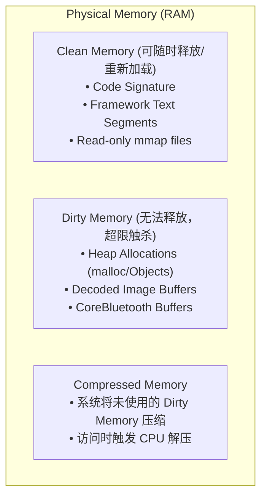
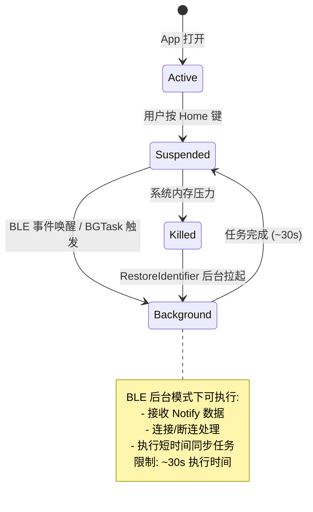
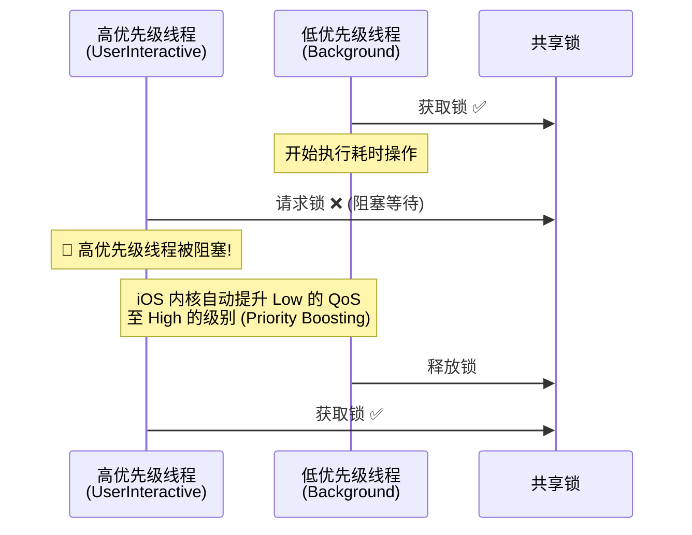

# 模块四：系统级性能优化、内存、多线程与稳定性体系

---

## 🧭 模块知识拓扑与四维剖析

| 维度 | 核心内容 |
| :--- | :--- |
| **🔥 重点 (Key Focus)** | Dirty/Clean/Compressed 虚拟内存剖析、LTTB (Largest Triangle Three Buckets) 降采样算法 |
| **🧠 难点 (Difficult Points)** | Swift Concurrency Actor 数据隔离与 `AsyncSequence` 背压 (Backpressure) 控制、Metal 120FPS 双重/三重缓冲区绘制 |
| **⚠️ 坑点 (Pitfalls)** | 1. 高频 BLE 回调缺少 `autoreleasepool` 导致内存积压飙升触发 Jetsam 杀 App；<br>2. GCD 无脑 async 导致的“线程爆满 (Thread Explosion)”与 QoS 优先级反转；<br>3. 普通文件日志在 Crash 瞬间 Page Cache 未刷盘导致现场日志丢失。 |
| **💡 最佳实践 (Best Practices)** | `mmap` (Memory Mapping) 日志 Buffer、`CADisplayLink` + `RingBuffer` 渲染解耦、Instruments 性能诊断探查 |

---

## 4.1 虚拟内存机制 (Dirty/Clean/Compressed Memory) 与 ARC 优化

iOS 没有传统意义上的 Swap 交换分区（磁盘虚拟内存）。了解内存本质是搞定性能优化的前提。



---

## ⚠️ 4.2 资深实战：核心坑点与避坑指南 (Pitfalls & Solutions)

### 坑点 1：高频 BLE 数据接收未加 `autoreleasepool` 导致内存暴涨杀进程 (Jetsam)
- **现象**：App 持续接收 250Hz 的 BLE 原始波形数据，运行几分钟后，内存占用从 30MB 飙升至 150MB+，最终被 iOS 系统因 OOM (Out of Memory) 静默杀掉。
- **本质原因**：Swift/ObjC 在处理 `Data` 切片或字符串转换时，系统默认生成的 Autorelease 对象只会在 **当前主线程 RunLoop 循环结束** 时才统一释放。高频回调下，RunLoop 尚未结束，海量 Autorelease 对象堆积在内存中。
- **专家级解决方案**：在高频 BLE 回调函数体内显式包含 `autoreleasepool { ... }` 块。

### 坑点 2：GCD 异步无脑 async 导致的“线程爆满 (Thread Explosion)”
- **现象**：每次收到 BLE 数据都调用 `DispatchQueue.global().async { process(data) }`。当数据量巨大且写入 SQLite 阻塞时，GCD 线程池迅速被占满，创建出 50+ 个内核线程，引发严重的线程上下文切换开销，导致 App 极其卡顿。
- **专家级解决方案**：
  - 使用**单一 Serial Queue** 进行排队。
  - 使用 Swift Concurrency 的 `Actor` 或者控制信号量 `DispatchSemaphore` 避免无限制创建线程。

---

## 💡 4.3 资深最佳实践代码：LTTB 降采样算法实现

```swift
struct Point {
    let x: Double
    let y: Double
}

/// LTTB (Largest Triangle Three Buckets) 降采样算法
/// 最佳实践：在绘制高频 ECG/PPG 波形前，将 10 万点降至与屏幕像素密度匹配的数量（如 1000 点），完美保留心电 R 峰
func lttbDownsample(data: [Point], threshold: Int) -> [Point] {
    let dataLength = data.count
    guard threshold >= dataLength || threshold <= 2 else { return data }

    var sampled: [Point] = []
    sampled.reserveCapacity(threshold)

    // 总是保留第一个点
    sampled.append(data[0])

    let bucketSize = Double(dataLength - 2) / Double(threshold - 2)
    var a = 0

    for i in 0..<(threshold - 2) {
        var avgX: Double = 0
        var avgY: Double = 0
        let avgRangeStart = Int(floor(Double(i + 1) * bucketSize)) + 1
        let avgRangeEnd = min(Int(floor(Double(i + 2) * bucketSize)) + 1, dataLength)
        let avgRangeLength = Double(avgRangeEnd - avgRangeStart)

        for j in avgRangeStart..<avgRangeEnd {
            avgX += data[j].x
            avgY += data[j].y
        }
        avgX /= avgRangeLength
        avgY /= avgRangeLength

        let rangeOffs = Int(floor(Double(i + 0) * bucketSize)) + 1
        let rangeTo = Int(floor(Double(i + 1) * bucketSize)) + 1

        let pointA = data[a]
        var maxArea: Double = -1
        var maxAreaPointIndex = rangeOffs

        for j in rangeOffs..<rangeTo {
            let area = abs((pointA.x - avgX) * (data[j].y - pointA.y) - (pointA.x - data[j].x) * (avgY - pointA.y)) * 0.5
            if area > maxArea {
                maxArea = area
                maxAreaPointIndex = j
            }
        }

        sampled.append(data[maxAreaPointIndex])
        a = maxAreaPointIndex
    }

    // 总是保留最后一个点
    sampled.append(data[dataLength - 1])
    return sampled
}
```

---

## 4.4 稳定性体系：mmap 崩溃日志 Buffer 与 dSYM 符号化探查

### mmap (Memory Mapping) 高性能写日志本质
通过 `mmap` 系统调用，将磁盘文件的物理页直接映射到进程的虚拟地址空间：

```
App Writes -> Virtual Memory Address (mmap) -> Operating System Page Cache -> Disk (Async Flush)
```
即使 App 发生 **SIGSEGV / OOM Crash** 导致进程被杀，内核的 Page Cache 依然会在系统空闲时写入磁盘，实现 **Crash 现场日志零丢失**。

### dSYM 符号化实操

Crash 堆栈中的 `0x104b2a3f4` 仅仅是运行时的内存虚拟地址。
$$\text{Symbol Address} = \text{Runtime Address} - \text{Slide Address (ASLR Offset)}$$

```bash
# 1. 获取 dSYM 的 UUID (确认与 Crash 报告中的 UUID 匹配)
dwarfdump --uuid App.app.dSYM

# 2. 使用 atos 还原符号
atos -o App.app.dSYM/Contents/Resources/DWARF/App \
     -l 0x104000000 \
     0x104b2a3f4
# 输出: -[BLEManager connectPeripheral:] (in App) (BLEManager.swift:142)
```

> 💡 更完整的 mmap 实现代码与 Crash 收集体系，请参见 [模块九：崩溃分析、日志体系与监控](file:///Users/apple/Developments/艾犀人工智能/iOS_Interview_Prep/09_Crash_Logging_Monitoring.md)

---

## 4.5 后台任务与 BLE 后台处理

> **JD 对齐**：「后台任务处理（特别是与 BLE 相关的）」

### iOS 后台执行模型



### BGTaskScheduler — 后台健康数据同步

```swift
import BackgroundTasks

/// 后台任务管理器 — 定期同步健康数据至服务器
/// Info.plist 必须注册: BGTaskSchedulerPermittedIdentifiers
final class BackgroundSyncManager {
    
    static let syncTaskIdentifier = "com.app.health.sync"
    static let processingTaskIdentifier = "com.app.health.processing"
    
    /// 在 App 启动时注册后台任务
    static func registerTasks() {
        // 1. 短时后台任务 (App Refresh, ~30s)
        BGTaskScheduler.shared.register(
            forTaskWithIdentifier: syncTaskIdentifier,
            using: nil
        ) { task in
            handleSyncTask(task as! BGAppRefreshTask)
        }
        
        // 2. 长时后台处理任务 (Processing, 可达数分钟)
        BGTaskScheduler.shared.register(
            forTaskWithIdentifier: processingTaskIdentifier,
            using: nil
        ) { task in
            handleProcessingTask(task as! BGProcessingTask)
        }
    }
    
    /// 调度下一次后台同步
    static func scheduleNextSync() {
        let request = BGAppRefreshTaskRequest(identifier: syncTaskIdentifier)
        request.earliestBeginDate = Date(timeIntervalSinceNow: 15 * 60) // 最早 15 分钟后
        
        do {
            try BGTaskScheduler.shared.submit(request)
        } catch {
            print("❌ BGTask submit failed: \(error)")
        }
    }
    
    /// 调度后台数据处理 (如睡眠分析、HRV 计算)
    static func scheduleProcessing() {
        let request = BGProcessingTaskRequest(identifier: processingTaskIdentifier)
        request.requiresNetworkConnectivity = false
        request.requiresExternalPower = false
        request.earliestBeginDate = Date(timeIntervalSinceNow: 60 * 60) // 1 小时后
        
        try? BGTaskScheduler.shared.submit(request)
    }
    
    private static func handleSyncTask(_ task: BGAppRefreshTask) {
        // 设置过期回调
        task.expirationHandler = {
            // 清理资源
        }
        
        // 执行同步
        Task {
            await uploadPendingHealthData()
            task.setTaskCompleted(success: true)
            scheduleNextSync() // 调度下一次
        }
    }
    
    private static func handleProcessingTask(_ task: BGProcessingTask) {
        task.expirationHandler = { }
        
        Task {
            // 执行耗时的睡眠分期计算
            await performSleepAnalysis()
            task.setTaskCompleted(success: true)
        }
    }
    
    private static func uploadPendingHealthData() async { /* ... */ }
    private static func performSleepAnalysis() async { /* ... */ }
}
```

---

## 4.6 多线程深入：QoS 优先级反转 + 锁选型

### QoS 优先级反转详解



### 锁选型对照表

| 锁类型 | 性能 | 支持 QoS 提升 | 递归支持 | 推荐场景 |
| :--- | :--- | :--- | :--- | :--- |
| `os_unfair_lock` | ⚡ 最快 | ✅ 是 | ❌ 否 | 极短临界区 (BLE Buffer) |
| `NSLock` | 🔹 快 | ✅ 是 | ❌ 否 | 一般互斥 |
| `NSRecursiveLock` | 🔹 中 | ✅ 是 | ✅ 是 | 递归调用需要 |
| `DispatchSemaphore` | ⚠️ 中 | ❌ 否 | ❌ 否 | ⚠️ 避免跨 QoS 使用 |
| `Swift Actor` | 🔹 中 | ✅ 是 | N/A | Swift Concurrency 首选 |

```swift
/// 最佳实践：对高频 BLE 数据的 Ring Buffer 使用 os_unfair_lock
final class ThreadSafeBLEBuffer {
    private var buffer: [Data] = []
    private let lock = os_unfair_lock_t.allocate(capacity: 1)
    
    init() {
        lock.initialize(to: os_unfair_lock())
    }
    
    deinit { lock.deallocate() }
    
    func append(_ data: Data) {
        os_unfair_lock_lock(lock)
        buffer.append(data)
        os_unfair_lock_unlock(lock)
    }
    
    func drainAll() -> [Data] {
        os_unfair_lock_lock(lock)
        let result = buffer
        buffer.removeAll(keepingCapacity: true)
        os_unfair_lock_unlock(lock)
        return result
    }
}
```

