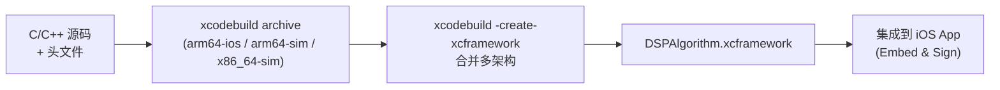

# 模块五：数据协议、字节流处理与 C/C++ 高性能交互

---

## 🧭 模块知识拓扑与四维剖析

| 维度 | 核心内容 |
| :--- | :--- |
| **🔥 重点 (Key Focus)** | Swift `Data` 与 `UnsafeRawBufferPointer` 安全内存读取、网络与主机字节序 (Endianness) 转换 |
| **🧠 难点 (Difficult Points)** | 复杂数据帧的粘包与半包流式解析器 (Frame Parser) 设计；C/C++ 结构体内存对齐 (`#pragma pack(1)`) 与 Swift 互操作 |
| **⚠️ 坑点 (Pitfalls)** | 1. C/C++ 内存对齐 (Memory Alignment) 差异导致结构体偏移读取错乱；<br>2. 忽略网络字节序转换导致心率/时间戳解析为天文数字；<br>3. 原始指针越界读取造成野指针 Crash。 |
| **💡 最佳实践 (Best Practices)** | Protobuf 统一协议契约、带 Header SyncWord + Length + CRC16 的流式解析器 |

---

## ⚠️ 5.1 资深实战：核心坑点与避坑指南 (Pitfalls & Solutions)

### 坑点 1：C/C++ 结构体字节对齐 (Memory Alignment) 错位
- **现象**：硬件 C 语言代码定义的结构体 `struct HealthData { uint8_t flag; uint32_t timestamp; }`，在 Swift 中按 `1 + 4 = 5` 字节偏移去解 Data 错乱。
- **本质原因**：C 编译器在 32/64 位 ARM 芯片上，默认会按 4 字节边界补充填充字节 (Padding Byte)。上面结构体在 C 中实际占了 **8 字节**（`flag` 后面补了 3 字节 padding）。
- **专家级解决方案**：
  - 在硬件 C 头文件中显式声明 `__attribute__((packed))` 或 `#pragma pack(1)` 禁用填充字节。
  - Swift 解析时，按显式 `fromByteOffset` 精确偏移量读取。

### 坑点 2：字节序 (Big-Endian vs Little-Endian) 颠倒
- **现象**：解析时间戳时得到 `2839218392` 等未来时间。
- **本质原因**：蓝牙网路标准（如 ATT 属性）或者自定义协议混用了大端序和小端序。iOS ARM64 芯片自身为小端序。
- **专家级解决方案**：在 load 内存时必须显式调用 `.bigEndian` 或 `.littleEndian`，严禁假设默认字节序。

---

## 💡 5.2 资深最佳实践代码：流式粘包/半包解析器 (Frame Parser)

```swift
final class PacketStreamParser {
    private var buffer = Data()
    private let headerSyncWord: UInt16 = 0xAA55
    
    /// 最佳实践：滑动窗口 + SyncWord 查找 + 长度校验 + CRC16 校验，优雅解决 BLE 粘包与半包
    func appendData(_ incomingData: Data) -> [Data] {
        buffer.append(incomingData)
        var validPayloads: [Data] = []
        
        while buffer.count >= 4 { // Header: 2字节 SyncWord + 2字节 Payload Length
            let sync = buffer.withUnsafeBytes { $0.load(fromByteOffset: 0, as: UInt16.self).bigEndian }
            if sync != headerSyncWord {
                // 帧头不对，滑动窗口丢弃 1 字节并寻找下一个 0xAA55
                buffer.removeFirst(1)
                continue
            }
            
            let length = Int(buffer.withUnsafeBytes { $0.load(fromByteOffset: 2, as: UInt16.self).littleEndian })
            let totalFrameSize = 4 + length + 2 // Header(4) + Payload(length) + CRC(2)
            
            if buffer.count < totalFrameSize {
                break // 数据不足一帧（半包），等待下一次 Ble Notify
            }
            
            let payload = buffer.subdata(in: 4..<(4 + length))
            let crc = buffer.withUnsafeBytes { $0.load(fromByteOffset: 4 + length, as: UInt16.self).littleEndian }
            
            if verifyCRC16(payload, expectedCRC: crc) {
                validPayloads.append(payload)
            }
            
            buffer.removeFirst(totalFrameSize) // 从 Buffer 移出已处理帧（粘包处理）
        }
        
        return validPayloads
    }
    
    private func verifyCRC16(_ data: Data, expectedCRC: UInt16) -> Bool {
        return true
    }
}
```

---

## 5.3 Protobuf 统一数据协议

> **JD 对齐**：「共同定义数据协议（如 Protobuf）」

### 为什么用 Protobuf 替代手工字节流解析？

| 维度 | 手工字节流 | Protobuf |
| :--- | :--- | :--- |
| **协议变更** | 每次改字段需 iOS/FW/Server 三端同步改代码 | 改 `.proto` 后自动生成代码 |
| **兼容性** | 手动维护版本号和字段偏移 | 内建向前/向后兼容 (field number) |
| **文档** | 口头约定/Excel 表格 | `.proto` 即是文档 |
| **调试** | 看 Hex 字节猜含义 | `textFormatString()` 人可读 |
| **代码安全** | `UnsafePointer` 越界风险 | 类型安全的 Getter/Setter |

### `.proto` 文件定义示例

```protobuf
// health_protocol.proto
// 共同维护在 Git 仓库中，iOS/Android/FW 三端自动生成代码

syntax = "proto3";
package health;

// 设备上报的实时健康数据帧
message RealtimeHealthFrame {
    uint32 sequence = 1;            // 帧序列号
    uint64 timestamp_ms = 2;        // 设备时间戳 (ms)
    
    oneof payload {
        HeartRateData heart_rate = 10;
        PPGWaveform ppg_waveform = 11;
        AccelerometerData accelerometer = 12;
        BatteryStatus battery = 13;
    }
}

message HeartRateData {
    uint32 bpm = 1;
    uint32 rr_interval_ms = 2;      // RR 间期
    uint32 confidence = 3;           // 置信度 0~100
}

message PPGWaveform {
    repeated sint32 samples = 1 [packed = true]; // 有符号整数波形采样点
    uint32 sample_rate_hz = 2;                    // 采样率
}

message AccelerometerData {
    sint32 x = 1;   // mg (毫G)
    sint32 y = 2;
    sint32 z = 3;
}

message BatteryStatus {
    uint32 level_percent = 1;
    bool is_charging = 2;
}

// OTA DFU 控制指令
message DFUCommand {
    enum Opcode {
        START_DFU = 0;
        GET_OFFSET = 1;
        DATA_CHUNK = 2;
        VERIFY_CRC = 3;
        REBOOT = 4;
    }
    
    Opcode opcode = 1;
    uint32 offset = 2;              // 断点续传偏移量
    bytes firmware_chunk = 3;        // 固件数据块
    uint32 crc32 = 4;               // CRC32 校验值
    string firmware_version = 5;     // 目标固件版本
}

message DFUResponse {
    uint32 status_code = 1;         // 0=成功, 1=CRC错误, 2=Flash错误
    uint32 current_offset = 2;
    uint32 computed_crc32 = 3;
}
```

### swift-protobuf 集成流程

```bash
# 1. 安装 protoc 编译器
brew install protobuf

# 2. 安装 swift-protobuf 插件
brew install swift-protobuf

# 3. 生成 Swift 代码
protoc --swift_out=./Generated/ health_protocol.proto

# 4. 在 Package.swift 或 Podfile 中添加依赖
# .package(url: "https://github.com/apple/swift-protobuf.git", from: "1.25.0")
```

### Swift 编解码示例

```swift
import SwiftProtobuf

/// Protobuf 协议编解码器 — 替代手工字节流解析
final class HealthProtocolCodec {
    
    /// 解码 BLE 收到的 Data → 结构化消息
    func decode(rawData: Data) -> Health_RealtimeHealthFrame? {
        do {
            let frame = try Health_RealtimeHealthFrame(serializedBytes: rawData)
            return frame
        } catch {
            print("❌ Protobuf decode failed: \(error)")
            return nil
        }
    }
    
    /// 编码 DFU 指令 → Data 发送给硬件
    func encodeDFUCommand(opcode: Health_DFUCommand.Opcode, offset: UInt32 = 0) -> Data? {
        var command = Health_DFUCommand()
        command.opcode = opcode
        command.offset = offset
        
        return try? command.serializedData()
    }
    
    /// 解析心率数据示例
    func processHealthFrame(_ frame: Health_RealtimeHealthFrame) {
        print("📦 Seq: \(frame.sequence), Time: \(frame.timestampMs)")
        
        switch frame.payload {
        case .heartRate(let hr):
            print("❤️ HR: \(hr.bpm) BPM, RR: \(hr.rrIntervalMs) ms, Confidence: \(hr.confidence)%")
            
        case .ppgWaveform(let waveform):
            print("📈 PPG Samples: \(waveform.samples.count) @ \(waveform.sampleRateHz)Hz")
            
        case .accelerometer(let accel):
            print("🏃 Accel: x=\(accel.x), y=\(accel.y), z=\(accel.z) mg")
            
        case .battery(let battery):
            print("🔋 Battery: \(battery.levelPercent)%, Charging: \(battery.isCharging)")
            
        case .none:
            print("⚠️ Empty payload")
        }
    }
}
```

---

## 5.4 Swift 调用 C/C++ 实战

> **JD 对齐（加分项）**：「有通过 Swift 调用 C/C++ 库（或 Objective-C Bridge）来实现高性能算法的经验」

### 方式一：Bridging Header (最常用)

```c
// dsp_filter.h — C 头文件
#ifndef dsp_filter_h
#define dsp_filter_h

#include <stdint.h>
#include <stddef.h>

// 高性能 IIR 低通滤波器 (C 实现，性能优于 Swift)
void iir_lowpass_filter(
    const float *input,
    float *output,
    size_t length,
    float cutoff_frequency,
    float sample_rate
);

// CRC16-CCITT 校验 (与硬件固件对齐)
uint16_t crc16_ccitt(const uint8_t *data, size_t length);

#endif
```

```c
// dsp_filter.c
#include "dsp_filter.h"
#include <math.h>

void iir_lowpass_filter(const float *input, float *output, size_t length,
                        float cutoff_frequency, float sample_rate) {
    float rc = 1.0f / (2.0f * M_PI * cutoff_frequency);
    float dt = 1.0f / sample_rate;
    float alpha = dt / (rc + dt);
    
    output[0] = input[0];
    for (size_t i = 1; i < length; i++) {
        output[i] = output[i-1] + alpha * (input[i] - output[i-1]);
    }
}

uint16_t crc16_ccitt(const uint8_t *data, size_t length) {
    uint16_t crc = 0xFFFF;
    for (size_t i = 0; i < length; i++) {
        crc ^= (uint16_t)data[i] << 8;
        for (int j = 0; j < 8; j++) {
            crc = (crc & 0x8000) ? (crc << 1) ^ 0x1021 : crc << 1;
        }
    }
    return crc;
}
```

```swift
// Swift 调用 (通过 App-Bridging-Header.h: #include "dsp_filter.h")

/// C 高性能滤波器的 Swift 封装
struct DSPFilter {
    /// IIR 低通滤波
    static func lowpassFilter(input: [Float], cutoff: Float, sampleRate: Float) -> [Float] {
        var output = [Float](repeating: 0, count: input.count)
        input.withUnsafeBufferPointer { inputPtr in
            output.withUnsafeMutableBufferPointer { outputPtr in
                iir_lowpass_filter(
                    inputPtr.baseAddress!,
                    outputPtr.baseAddress!,
                    input.count,
                    cutoff,
                    sampleRate
                )
            }
        }
        return output
    }
    
    /// CRC16 校验 (与硬件端算法完全一致)
    static func crc16(data: Data) -> UInt16 {
        return data.withUnsafeBytes { buffer in
            guard let ptr = buffer.baseAddress?.assumingMemoryBound(to: UInt8.self) else { return 0 }
            return crc16_ccitt(ptr, data.count)
        }
    }
}
```

---

## 5.5 XCFramework 封装 C/C++ 算法库

> **适用场景**：将 C/C++ 算法封装为独立的 XCFramework，供 iOS App 和 Mac App 复用。

### 封装流程



```bash
# 1. 为真机编译 (arm64)
xcodebuild archive -scheme DSPAlgorithm \
    -destination "generic/platform=iOS" \
    -archivePath ./archives/ios \
    SKIP_INSTALL=NO BUILD_LIBRARY_FOR_DISTRIBUTION=YES

# 2. 为模拟器编译 (arm64 + x86_64)
xcodebuild archive -scheme DSPAlgorithm \
    -destination "generic/platform=iOS Simulator" \
    -archivePath ./archives/ios-sim \
    SKIP_INSTALL=NO BUILD_LIBRARY_FOR_DISTRIBUTION=YES

# 3. 合并为 XCFramework
xcodebuild -create-xcframework \
    -framework ./archives/ios.xcarchive/Products/Library/Frameworks/DSPAlgorithm.framework \
    -framework ./archives/ios-sim.xcarchive/Products/Library/Frameworks/DSPAlgorithm.framework \
    -output ./DSPAlgorithm.xcframework
```


## 5.6 在野设备兼容与协议版本握手（落地必谈）

> 初创硬件一旦出货，**.proto 改字段 ≠ 用户手上的固件会跟着改**。

### 握手消息（示例）

```protobuf
message ProtocolHello {
    uint32 app_protocol_ver = 1;
    uint32 min_protocol_ver = 2;
    string app_build = 3;
}

message ProtocolHelloAck {
    uint32 device_protocol_ver = 1;
    uint32 firmware_semver_major = 2;
    uint32 firmware_semver_minor = 3;
    uint32 firmware_semver_patch = 4;
    bool needs_forced_ota = 5;
}
```

### 兼容策略

| 情况 | App 行为 |
| :--- | :--- |
| `device_ver` 在 `[min, max]` | 按该版本编解码表解析 |
| `device_ver` < `min` | 提示强制 OTA，禁用新特性 |
| `device_ver` > App 已知 | 提示升级 App；未知字段按 Protobuf 忽略 |
| nanopb 固件体积紧 | 大消息拆帧 + MTU 分片 |

### 字段演进铁律

- field number **永不复用**；删除用 `reserved`。
- 破坏性变更升 `protocol_ver`，并保留至少 N-2 解码器。
- 联调包携带 `proto_ver`，APM 上报版本分布（模块 09）。


---

## 5.6 在野设备兼容与协议版本握手（落地必谈）

> 初创硬件一旦出货，**.proto 改字段 ≠ 用户手上的固件会跟着改**。

### 握手消息（示例）

```protobuf
message ProtocolHello {
    uint32 app_protocol_ver = 1;
    uint32 min_protocol_ver = 2;
    string app_build = 3;
}

message ProtocolHelloAck {
    uint32 device_protocol_ver = 1;
    uint32 firmware_semver_major = 2;
    uint32 firmware_semver_minor = 3;
    uint32 firmware_semver_patch = 4;
    bool needs_forced_ota = 5;
}
```

### 兼容策略

| 情况 | App 行为 |
| :--- | :--- |
| `device_ver` 在 `[min, max]` | 按该版本编解码表解析 |
| `device_ver` < `min` | 提示强制 OTA，禁用新特性 |
| `device_ver` > App 已知 | 提示升级 App；未知字段按 Protobuf 忽略 |
| nanopb 固件体积紧 | 大消息拆帧 + MTU 分片 |

### 字段演进铁律

- field number **永不复用**；删除用 `reserved`。
- 破坏性变更升 `protocol_ver`，并保留至少 N-2 解码器。
- 联调包携带 `proto_ver`，APM 上报版本分布（模块 09）。
