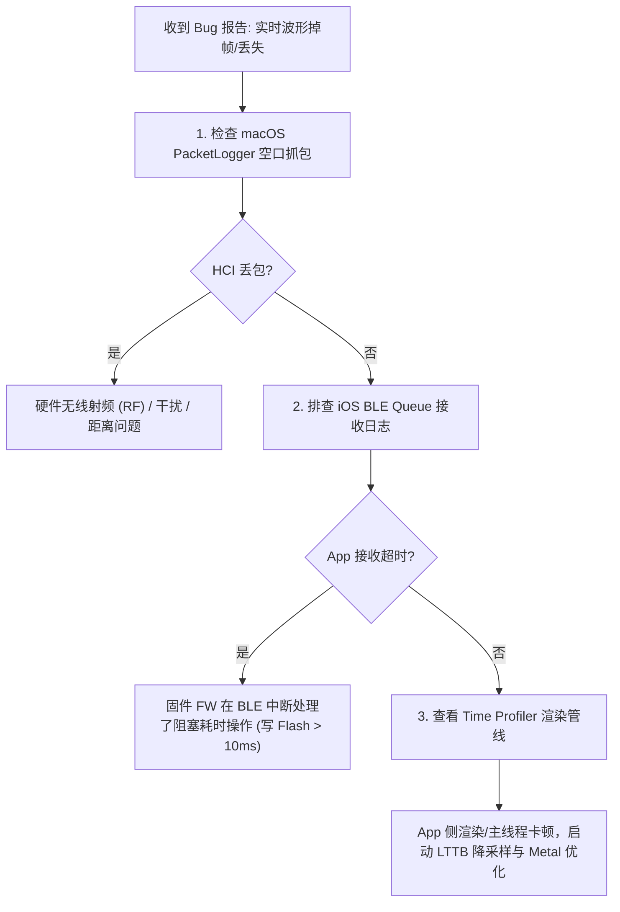
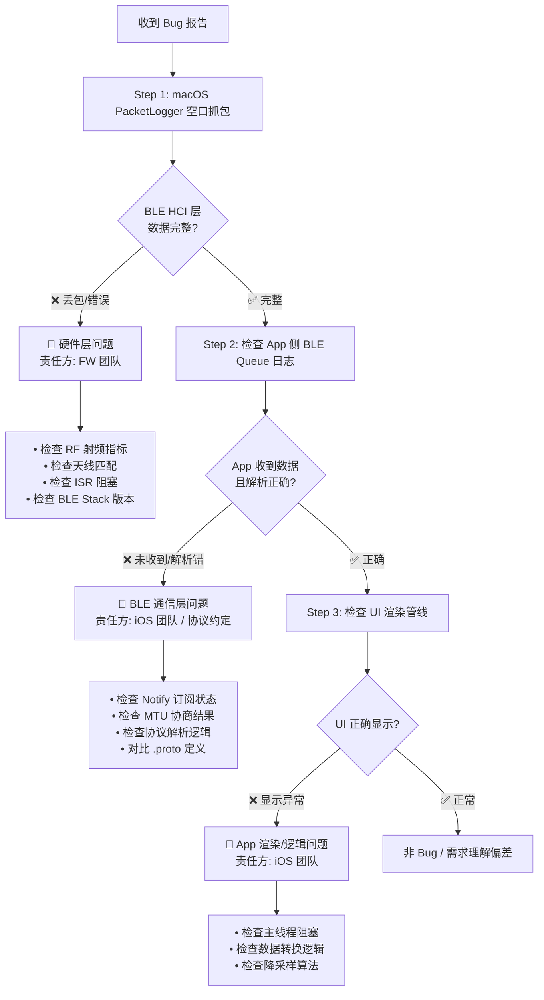
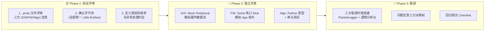

# 模块六：全链路 Debugging、软硬件联调与 Mock 驱动开发

---

## 🧭 模块知识拓扑与四维剖析

| 维度 | 核心内容 |
| :--- | :--- |
| **🔥 重点 (Key Focus)** | macOS PacketLogger 空口 HCI 抓包分析、BLE 断连 Reason Code (0x08 / 0x13 / 0x3E) 诊断 |
| **🧠 难点 (Difficult Points)** | 编写基于 `CBPeripheralManager` 的 Mock 仿真外设，模拟高频 250Hz PPG/ECG 信号流与 OTA 交互 |
| **⚠️ 坑点 (Pitfalls)** | 1. 固件在 BLE 中断服务程序 (ISR) 阻塞写 Flash 导致 iOS 触发 0x08 超时断连；<br>2. 忽视人体阻挡/环境衰减导致的 RSSI 极低大面积丢包；<br>3. 口头约定协议缺乏契约导致联调互相甩锅。 |
| **💡 最佳实践 (Best Practices)** | Protobuf 统一协议定义、BLE Peripheral Simulator 单机自动化 Mock 测试 |

---

## ⚠️ 6.1 资深实战：核心坑点与排查矩阵 (Pitfalls & Diagnostic Matrix)



### HCI 断连 Reason Code 权威对照

| Reason Code (Hex) | 含义描述 | 根本原因与责任归属 |
| :--- | :--- | :--- |
| **0x08** | Connection Timeout | 链路层连接超时。**通常是硬件死机、Watchdog 复位或在 BLE 中断里执行了阻塞式 Flash 写入**。 |
| **0x13** | Remote User Terminated | 对端主动断开。硬件电池没电关机，或硬件主动调用了 disconnect。 |
| **0x3E** | Connection Failed to be Established | 连接建立失败。广播包格式异常或 iOS 蓝牙 stack 内部状态错乱。 |

---

## 💡 6.2 资深最佳实践代码：CoreBluetooth Peripheral Simulator Mock 驱动

```swift
#if DEBUG
import CoreBluetooth

/// 最佳实践：在 Mac 或测试机上模拟硬件 Peripheral，解耦硬件出板进度
final class BLEPeripheralMockManager: NSObject, CBPeripheralManagerDelegate {
    private var peripheralManager: CBPeripheralManager?
    private var notifyCharacteristic: CBMutableCharacteristic?

    override init() {
        super.init()
        peripheralManager = CBPeripheralManager(delegate: self, queue: nil)
    }

    func peripheralManagerDidUpdateState(_ peripheral: CBPeripheralManager) {
        if peripheral.state == .poweredOn {
            let service = CBMutableService(type: CBUUID(string: "FFF0"), primary: true)
            notifyCharacteristic = CBMutableCharacteristic(
                type: CBUUID(string: "FFF1"),
                properties: [.notify, .read, .writeWithoutResponse],
                value: nil,
                permissions: [.readable, .writeable]
            )
            service.characteristics = [notifyCharacteristic!]
            peripheralManager?.add(service)
            peripheralManager?.startAdvertising([CBAdvertisementDataServiceUUIDsKey: [service.uuid]])
        }
    }

    /// 模拟波形流：不要用 Timer(0.004) 假装精确 250Hz。
    /// 正确做法见本节末尾 6.6 `startWaveformReplay`（按 chunk 批量 updateValue）。
    func startSimulatedPPGDataStream() {
        guard let characteristic = notifyCharacteristic else { return }
        startWaveformReplay(samples: (0..<2500).map { _ in UInt8.random(in: 60...100) }) { [weak self] chunk in
            self?.peripheralManager?.updateValue(chunk, for: characteristic, onSubscribedCentrals: nil)
        }
    }
}
#endif
```

---

## 6.3 三方定责：清晰区分 App / BLE / 固件问题

> **JD 对齐**：「强大的问题定位（Debugging）能力，能清晰区分是 App、BLE 还是固件的问题」

### 三层定责决策树



### 定责话术模板

| 场景 | 定责结论 | 沟通话术 |
| :--- | :--- | :--- |
| PacketLogger 显示 HCI 丢包 | **FW 责任** | "通过空口抓包确认，在 Connection Event #1234 处 HCI 层丢失了 3 个 LL Data PDU，App 侧 BLE 栈正常。建议 FW 团队检查 ISR 中断处理是否有阻塞操作。" |
| HCI 完整但 App Notify 未触发 | **iOS 责任** | "空口数据完整，但 App 未正确订阅 CCCD (0x2902)。定位到 `discoverCharacteristics` 回调中遗漏了 `setNotifyValue(true)`。" |
| 协议字段值超出预期 | **协议约定问题** | "心率字段解析为 65535，排查发现 FW 端使用 big-endian 发送 uint16，而 .proto 约定为 little-endian。建议以 .proto 定义为准，FW 侧修改字节序。" |
| 波形显示异常但数据正确 | **iOS 责任** | "BLE 数据接收和解析均正确，问题定位在渲染层——LTTB 降采样的 threshold 参数过小导致 R 峰被抹平。已调整至 1000 点。" |

### Instruments 诊断工具速查

| 工具 | 用途 | 使用场景 |
| :--- | :--- | :--- |
| **PacketLogger** (macOS) | BLE HCI 空口抓包 | 定位 BLE 层丢包/断连原因 |
| **Time Profiler** | CPU 热点分析 | 定位主线程阻塞/卡顿 |
| **Allocations** | 内存分配追踪 | 定位内存泄漏/碎片 |
| **Leaks** | 循环引用检测 | 定位 BLE delegate 循环引用 |
| **Network** | 网络请求监控 | 定位 API 延迟/失败 |
| **Core ML Instrument** | 模型推理分析 | 检查算子在 ANE/CPU/GPU 分布 |
| **Energy Log** | 电量消耗分析 | 定位 BLE 高频通信导致的功耗问题 |

---

## 6.4 跨团队联调 SOP Checklist

> **JD 对齐**：「与嵌入式（FW）工程师和算法（Algorithm）工程师紧密合作」

### 联调全流程



### 协议评审 Checklist

- [ ] `.proto` 文件已提交至共享 Git 仓库
- [ ] 所有字段的字节序已明确 (建议统一 Little-Endian)
- [ ] 每个消息体包含 `sequence` (序列号) 用于丢帧检测
- [ ] 每个消息体包含 `timestamp_ms` (时间戳) 用于时序同步
- [ ] 错误码枚举已定义并三方对齐
- [ ] MTU 大小与最大帧长度已确认 (≤ MTU - 3)
- [ ] 固件 OTA 状态机的状态码与 App 一一对应
- [ ] BLE Service UUID 和 Characteristic UUID 已分配并记录
- [ ] Notify / Write / Read 的使用场景已明确

### 联调环境搭建

```swift
/// 联调日志输出器 — 输出统一格式方便三方对比
final class DebugProtocolLogger {
    static func logBLEReceived(uuid: String, data: Data, timestamp: Date = Date()) {
        let hex = data.map { String(format: "%02X", $0) }.joined(separator: " ")
        let ts = String(format: "%.3f", timestamp.timeIntervalSince1970)
        print("📥 [\(ts)] BLE_RX [\(uuid)] \(data.count)B: \(hex)")
    }
    
    static func logBLESent(uuid: String, data: Data, timestamp: Date = Date()) {
        let hex = data.map { String(format: "%02X", $0) }.joined(separator: " ")
        let ts = String(format: "%.3f", timestamp.timeIntervalSince1970)
        print("📤 [\(ts)] BLE_TX [\(uuid)] \(data.count)B: \(hex)")
    }
}
```

---

## 6.5 扩展 Mock：OTA DFU 仿真

```swift
#if DEBUG
/// OTA DFU Mock — 模拟 Bootloader 切换和进度回包
extension BLEPeripheralMockManager {
    
    private static let dfuServiceUUID = CBUUID(string: "FE59")
    private static let dfuControlUUID = CBUUID(string: "8EC90001-F315-4F60-9FB8-838830DAEA50")
    private static let dfuDataUUID    = CBUUID(string: "8EC90002-F315-4F60-9FB8-838830DAEA50")
    
    /// 添加 DFU Service 仿真
    func setupDFUMockService() {
        let dfuService = CBMutableService(type: Self.dfuServiceUUID, primary: true)
        
        let controlChar = CBMutableCharacteristic(
            type: Self.dfuControlUUID,
            properties: [.write, .notify],
            value: nil,
            permissions: [.writeable]
        )
        
        let dataChar = CBMutableCharacteristic(
            type: Self.dfuDataUUID,
            properties: [.writeWithoutResponse],
            value: nil,
            permissions: [.writeable]
        )
        
        dfuService.characteristics = [controlChar, dataChar]
        peripheralManager?.add(dfuService)
    }
    
    /// 模拟固件对 DFU 指令的响应
    func handleDFUWriteRequest(_ data: Data, characteristic: CBMutableCharacteristic) {
        guard let opcode = data.first else { return }
        
        switch opcode {
        case 0x01: // START_DFU
            // 模拟 Flash 擦除延迟 (3 秒)
            DispatchQueue.global().asyncAfter(deadline: .now() + 3.0) {
                let response: [UInt8] = [0x60, 0x01, 0x01] // Response: Success
                self.peripheralManager?.updateValue(
                    Data(response),
                    for: characteristic,
                    onSubscribedCentrals: nil
                )
            }
            
        case 0x02: // GET_OFFSET
            // 返回已写入偏移量 (断点续传)
            let offset: UInt32 = 0x00010000 // 64KB
            var response: [UInt8] = [0x60, 0x02, 0x01]
            withUnsafeBytes(of: offset.littleEndian) { response.append(contentsOf: $0) }
            peripheralManager?.updateValue(Data(response), for: characteristic, onSubscribedCentrals: nil)
            
        case 0x04: // VERIFY_CRC
            // 模拟 CRC 校验通过
            let response: [UInt8] = [0x60, 0x04, 0x01]
            peripheralManager?.updateValue(Data(response), for: characteristic, onSubscribedCentrals: nil)
            
        default:
            break
        }
    }
}
#endif
```


## 6.6 远程联调与「无板」协作（JD：远程）

远程主导 OTA/BLE 时，最大风险是**看不到空口与 Flash 时序**。面试要主动谈协作基建。

### 最低可行远程联调包

| 资产 | 用途 |
| :--- | :--- |
| 工程机租借/快递 | 真机 DFU / 刺激安全回归 |
| PacketLogger 抓包文件 | 定责 App vs FW |
| 统一日志格式（6.4） | 三方对齐时间线 |
| 固件符号 + App dSYM | 崩溃对齐 |
| 复现包：proto 版本 + hex + 步骤 | 异步排查 |

### Mock 边界

- Mock **能**覆盖：协议态机、粘包、超时 Guardian、UX。
- Mock **不能**覆盖：RF、Flash 抖动、芯片栈异常。
- CI 跑 Mock；发版前跑台架回归表（模块 11）。

### ⚠️ 修正：250Hz Mock 不要用 Timer(0.004)

```swift
func startWaveformReplay(samples: [UInt8], sampleRate: Double = 250) {
    let chunkHz = 25.0
    let timer = DispatchSource.makeTimerSource(queue: .global(qos: .userInitiated))
    timer.schedule(deadline: .now(), repeating: 1.0 / chunkHz)
    var idx = 0
    timer.setEventHandler {
        let n = Int(sampleRate / chunkHz)
        let slice = Array(samples[idx..<min(idx + n, samples.count)])
        idx = (idx + n) 

---

## 6.6 远程联调与「无板」协作（JD：远程）

远程主导 OTA/BLE 时，最大风险是**看不到空口与 Flash 时序**。面试要主动谈协作基建。

### 最低可行远程联调包

| 资产 | 用途 |
| :--- | :--- |
| 工程机租借/快递 | 真机 DFU / 刺激安全回归 |
| PacketLogger 抓包文件 | 定责 App vs FW |
| 统一日志格式（6.4） | 三方对齐时间线 |
| 固件符号 + App dSYM | 崩溃对齐 |
| 复现包：proto 版本 + hex + 步骤 | 异步排查 |

### Mock 边界

- Mock **能**覆盖：协议态机、粘包、超时 Guardian、UX。
- Mock **不能**覆盖：RF、Flash 抖动、芯片栈异常。
- CI 跑 Mock；发版前跑台架回归表（模块 11）。

### ⚠️ 修正：250Hz Mock 不要用 Timer(0.004)

```swift
func startWaveformReplay(
    samples: [UInt8],
    sampleRate: Double = 250,
    onChunk: @escaping (Data) -> Void
) {
    let chunkHz = 25.0
    let timer = DispatchSource.makeTimerSource(queue: .global(qos: .userInitiated))
    timer.schedule(deadline: .now(), repeating: 1.0 / chunkHz)
    var idx = 0
    timer.setEventHandler {
        let n = Int(sampleRate / chunkHz)
        let slice = Array(samples[idx..<min(idx + n, samples.count)])
        idx = (idx + n) % max(samples.count, 1)
        onChunk(Data(slice))
    }
    timer.resume()
}
```
