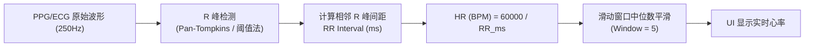
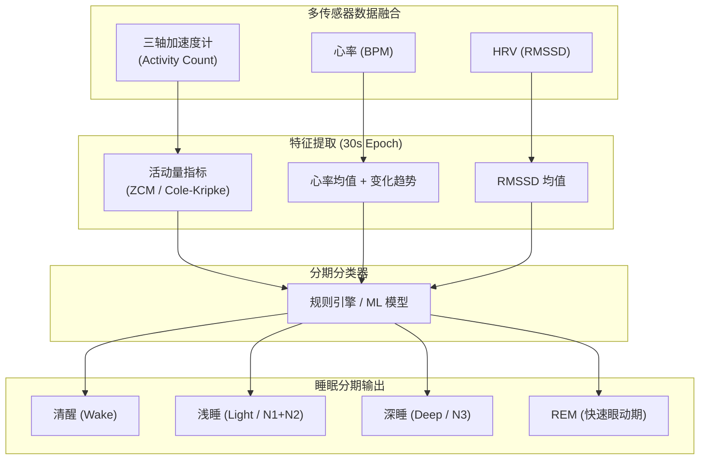
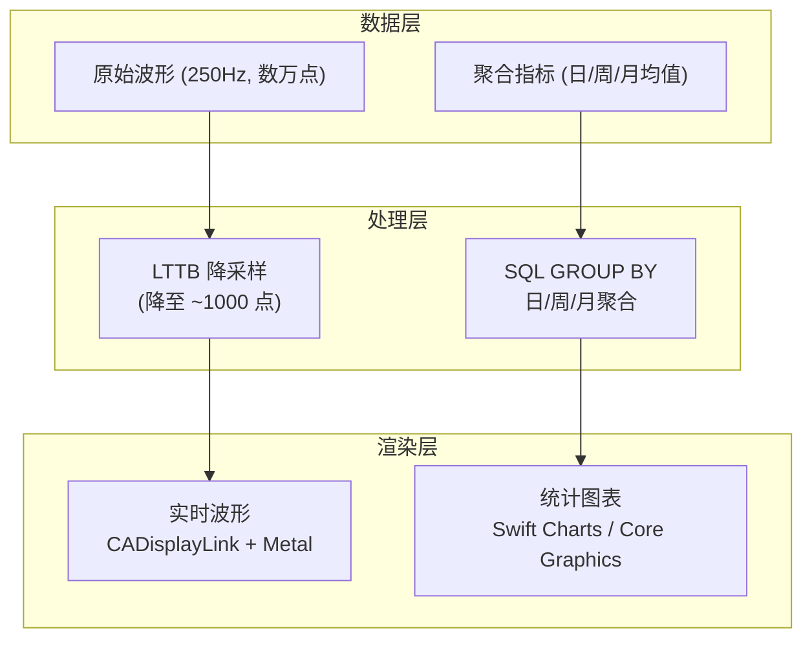

# 模块八：健康数据计算、本地存储与高性能图表可视化

> **JD 原文**：「负责计算健康数据（如心率、睡眠结构、HRV），并将其进行本地存储与高性能的图表可视化」

---

## 🧭 模块知识拓扑与四维剖析

| 维度 | 核心内容 |
| :--- | :--- |
| **🔥 重点 (Key Focus)** | 心率 (HR) 实时计算与平滑、HRV 时域指标 (SDNN/RMSSD/pNN50) 算法、睡眠分期模型、Core Data / SQLite 波形存储 |
| **🧠 难点 (Difficult Points)** | 250Hz PPG/ECG 高频数据的实时滤波与峰值检测、睡眠分期多传感器融合（加速度 + 心率 + HRV）、大规模时序数据的日/周/月聚合查询性能 |
| **⚠️ 坑点 (Pitfalls)** | 1. RR 间期异常值（运动伪迹 / 信号丢失）导致 HRV 指标畸形；<br>2. 波形原始数据批量写入 Core Data 阻塞主线程导致 UI 卡顿；<br>3. HealthKit 写入权限被用户拒绝后静默失败，App 以为同步成功。 |
| **💡 最佳实践 (Best Practices)** | RR 间期异常值过滤（±20% 中位数规则）、后台 NSManagedObjectContext 批量写入、HealthKit 权限状态显式检查 |

---

## 8.1 心率 (HR) 实时计算算法

### RR 间期 → BPM 转换原理



### 心率计算核心代码

```swift
/// 实时心率计算引擎
final class HeartRateCalculator {
    /// 最近的 R 峰时间戳队列 (毫秒)
    private var rPeakTimestamps: [Double] = []
    private let maxPeakHistory = 20
    
    /// 滑动窗口 BPM 平滑 (防止单次异常跳变)
    private var bpmHistory: [Double] = []
    private let smoothWindowSize = 5
    
    /// 从检测到的 R 峰时间戳计算瞬时心率
    func onRPeakDetected(timestampMs: Double) -> Double? {
        rPeakTimestamps.append(timestampMs)
        if rPeakTimestamps.count > maxPeakHistory {
            rPeakTimestamps.removeFirst()
        }
        
        guard rPeakTimestamps.count >= 2 else { return nil }
        
        let lastRR = rPeakTimestamps.last! - rPeakTimestamps[rPeakTimestamps.count - 2]
        
        // 过滤生理不可能的 RR 间期 (< 300ms 即 >200BPM, > 2000ms 即 <30BPM)
        guard lastRR > 300 && lastRR < 2000 else { return nil }
        
        let instantBPM = 60000.0 / lastRR
        
        // 滑动窗口中位数平滑
        bpmHistory.append(instantBPM)
        if bpmHistory.count > smoothWindowSize {
            bpmHistory.removeFirst()
        }
        
        return medianSmoothed(bpmHistory)
    }
    
    /// 提取最近 N 个有效 RR 间期 (用于 HRV 计算)
    func getRecentRRIntervals(count: Int) -> [Double] {
        guard rPeakTimestamps.count >= 2 else { return [] }
        var intervals: [Double] = []
        for i in 1..<rPeakTimestamps.count {
            let rr = rPeakTimestamps[i] - rPeakTimestamps[i - 1]
            if rr > 300 && rr < 2000 { // 有效 RR 过滤
                intervals.append(rr)
            }
        }
        return Array(intervals.suffix(count))
    }
    
    private func medianSmoothed(_ values: [Double]) -> Double {
        let sorted = values.sorted()
        let mid = sorted.count / 2
        return sorted.count % 2 == 0
            ? (sorted[mid - 1] + sorted[mid]) / 2.0
            : sorted[mid]
    }
}
```

---

## 8.2 心率变异性 (HRV) 时域指标分析

> **JD 对齐**：「计算健康数据（如 HRV）」

HRV 反映自主神经系统活性，是评估压力/恢复/睡眠质量的核心生理指标。

### 三大时域指标公式

| 指标 | 公式 | 临床意义 |
| :--- | :--- | :--- |
| **SDNN** | $\sqrt{\frac{1}{N-1} \sum_{i=1}^{N}(RR_i - \overline{RR})^2}$ | 总体 HRV 水平（交感 + 副交感） |
| **RMSSD** | $\sqrt{\frac{1}{N-1} \sum_{i=1}^{N-1}(RR_{i+1} - RR_i)^2}$ | 短期 HRV（副交感活性指标） |
| **pNN50** | $\frac{\text{count}(\|RR_{i+1} - RR_i\| > 50\text{ms})}{N-1} \times 100\%$ | 相邻 RR 差值>50ms 的比例 |

### HRV 计算 Swift 实现

```swift
/// HRV 时域指标计算器
struct HRVTimeDomainAnalyzer {
    
    struct HRVResult {
        let sdnn: Double     // ms
        let rmssd: Double    // ms
        let pnn50: Double    // 百分比 (0~100)
        let meanRR: Double   // ms
        let meanHR: Double   // BPM
    }
    
    /// 输入: 一组有效 RR 间期 (毫秒), 通常 5 分钟窗口 (~300 个 RR 间期)
    static func analyze(rrIntervals: [Double]) -> HRVResult? {
        let n = rrIntervals.count
        guard n >= 10 else { return nil } // 至少 10 个 RR 间期才有统计意义
        
        // 异常值过滤：剔除偏离中位数 ±20% 的 RR 间期
        let sorted = rrIntervals.sorted()
        let median = sorted[n / 2]
        let filtered = rrIntervals.filter { abs($0 - median) / median < 0.20 }
        let fn = filtered.count
        guard fn >= 10 else { return nil }
        
        // 均值
        let meanRR = filtered.reduce(0, +) / Double(fn)
        
        // SDNN: 标准差
        let variance = filtered.reduce(0.0) { $0 + ($1 - meanRR) * ($1 - meanRR) } / Double(fn - 1)
        let sdnn = sqrt(variance)
        
        // RMSSD: 相邻 RR 差值的均方根
        var sumSquaredDiffs = 0.0
        var nn50Count = 0
        for i in 0..<(fn - 1) {
            let diff = filtered[i + 1] - filtered[i]
            sumSquaredDiffs += diff * diff
            if abs(diff) > 50.0 { nn50Count += 1 }
        }
        let rmssd = sqrt(sumSquaredDiffs / Double(fn - 1))
        
        // pNN50
        let pnn50 = Double(nn50Count) / Double(fn - 1) * 100.0
        
        // 平均心率
        let meanHR = 60000.0 / meanRR
        
        return HRVResult(sdnn: sdnn, rmssd: rmssd, pnn50: pnn50, meanRR: meanRR, meanHR: meanHR)
    }
}
```

---

## 8.3 睡眠结构分析

> **JD 对齐**：「计算健康数据（如睡眠结构）」

### 睡眠分期模型



### 睡眠分期特征规则参考

| 分期 | 活动量 | 心率趋势 | RMSSD |
| :--- | :--- | :--- | :--- |
| **清醒** | 高 (>阈值) | 波动大 | 低~中 |
| **浅睡 (N1/N2)** | 低 | 平稳偏低 | 中 |
| **深睡 (N3)** | 极低 | 最低且稳定 | 高 (副交感主导) |
| **REM** | 极低 (肌张力抑制) | 不规则波动 | 低 (交感活跃) |

```swift
/// 基于规则引擎的简易睡眠分期 (30 秒一个 Epoch)
enum SleepStage: String, Codable {
    case wake, light, deep, rem
}

struct SleepEpochFeatures {
    let activityCount: Double    // 30s 内加速度计活动量
    let meanHR: Double           // 30s 平均心率
    let rmssd: Double            // 30s RMSSD
    let hrVariability: Double    // 30s 内心率极差
}

func classifySleepStage(_ features: SleepEpochFeatures) -> SleepStage {
    // 活动量高 → 清醒
    if features.activityCount > 50 { return .wake }
    
    // 心率最低 + RMSSD 最高 → 深睡
    if features.meanHR < 55 && features.rmssd > 60 && features.hrVariability < 5 {
        return .deep
    }
    
    // 心率不规则 + RMSSD 低 → REM
    if features.hrVariability > 10 && features.rmssd < 30 {
        return .rem
    }
    
    // 默认 → 浅睡
    return .light
}
```

---

## 8.4 HealthKit 集成

> **JD 对齐（加分项）**：「有健康医疗类 App（特别是睡眠或心率监测）开发经验」

### ⚠️ 坑点：HealthKit 权限拒绝后的静默失败

- **现象**：调用 `healthStore.save(sample)` 后无错误抛出，但 Health App 中看不到数据。
- **本质原因**：iOS 隐私策略设计 — 当用户拒绝写入权限后，`save` 方法会静默成功（不报错），以防止 App 通过错误码推断用户健康数据的存在性。
- **专家级解决方案**：在写入前使用 `authorizationStatus(for:)` 显式检查权限状态。

```swift
import HealthKit

final class HealthKitManager {
    private let healthStore = HKHealthStore()
    
    /// 请求心率 + 睡眠分析的读写权限
    func requestAuthorization(completion: @escaping (Bool) -> Void) {
        guard HKHealthStore.isHealthDataAvailable() else {
            completion(false)
            return
        }
        
        let writeTypes: Set<HKSampleType> = [
            HKQuantityType.quantityType(forIdentifier: .heartRate)!,
            HKQuantityType.quantityType(forIdentifier: .heartRateVariabilitySDNN)!,
            HKCategoryType.categoryType(forIdentifier: .sleepAnalysis)!
        ]
        
        let readTypes: Set<HKObjectType> = Set(writeTypes)
        
        healthStore.requestAuthorization(toShare: writeTypes, read: readTypes) { success, error in
            completion(success && error == nil)
        }
    }
    
    /// 写入心率样本
    func saveHeartRate(bpm: Double, date: Date) {
        let heartRateType = HKQuantityType.quantityType(forIdentifier: .heartRate)!
        
        // ⚠️ 最佳实践：显式检查权限状态
        guard healthStore.authorizationStatus(for: heartRateType) == .sharingAuthorized else {
            print("⚠️ HealthKit 心率写入权限未授权")
            return
        }
        
        let quantity = HKQuantity(unit: HKUnit(from: "count/min"), doubleValue: bpm)
        let sample = HKQuantitySample(
            type: heartRateType,
            quantity: quantity,
            start: date,
            end: date,
            metadata: [HKMetadataKeyHeartRateSensorLocation: NSNumber(value: HKHeartRateSensorLocation.wrist.rawValue)]
        )
        
        healthStore.save(sample) { success, error in
            if !success { print("❌ HealthKit save failed: \(error?.localizedDescription ?? "")") }
        }
    }
    
    /// 写入睡眠分析样本
    func saveSleepAnalysis(stage: SleepStage, startDate: Date, endDate: Date) {
        let sleepType = HKCategoryType.categoryType(forIdentifier: .sleepAnalysis)!
        
        let categoryValue: HKCategoryValueSleepAnalysis
        switch stage {
        case .wake: categoryValue = .awake
        case .light: categoryValue = .asleepCore
        case .deep: categoryValue = .asleepDeep
        case .rem:  categoryValue = .asleepREM
        }
        
        let sample = HKCategorySample(
            type: sleepType,
            value: categoryValue.rawValue,
            start: startDate,
            end: endDate
        )
        
        healthStore.save(sample) { success, error in
            if !success { print("❌ Sleep save failed: \(error?.localizedDescription ?? "")") }
        }
    }
}
```

---

## 8.5 本地存储方案：Core Data vs SQLite/GRDB

> **JD 对齐**：「进行本地存储」

### 存储方案选型对比

| 维度 | Core Data | SQLite / GRDB |
| :--- | :--- | :--- |
| **Apple 生态集成** | ✅ 原生支持、iCloud 同步 | 需手动实现 |
| **批量写入性能** | ⚠️ 需 `NSBatchInsertRequest` 优化 | ✅ 事务批量 INSERT 极快 |
| **查询灵活性** | NSPredicate（受限） | ✅ 原生 SQL 灵活 |
| **波形原始数据** | ❌ 不适合大 Blob | ✅ 可存二进制 Blob 或文件路径 |
| **聚合计算** | ❌ 需手动 fetch 后计算 | ✅ SQL `AVG/MAX/GROUP BY` |
| **推荐用途** | 结构化健康指标 (HR/HRV/Sleep) | 原始波形数据 (ECG/PPG 采样点) |

### ⚠️ 坑点：Core Data 主线程批量写入导致 UI 卡顿

- **现象**：每收到一帧 BLE 波形数据就创建一个 `NSManagedObject` 并 `save`，10 分钟后主线程卡死。
- **专家级解决方案**：使用后台 `NSManagedObjectContext` + `NSBatchInsertRequest` 批量入库。

```swift
/// 后台批量写入健康数据 — 避免阻塞主线程
final class HealthDataPersistence {
    private let persistentContainer: NSPersistentContainer
    
    init() {
        persistentContainer = NSPersistentContainer(name: "HealthModel")
        persistentContainer.loadPersistentStores { _, error in
            if let error = error { fatalError("Core Data load failed: \(error)") }
        }
    }
    
    /// 批量写入心率记录 (NSBatchInsertRequest, iOS 13+)
    func batchInsertHeartRates(_ records: [(timestamp: Date, bpm: Double)]) {
        persistentContainer.performBackgroundTask { context in
            let batchInsert = NSBatchInsertRequest(
                entityName: "HeartRateRecord",
                managedObjectHandler: { (obj: NSManagedObject) -> Bool in
                    // 由系统循环调用，每次填充一条记录
                    // 返回 true 表示全部插入完毕
                    return false
                }
            )
            
            // 使用字典模式更高效
            var index = 0
            let dictBatch = NSBatchInsertRequest(
                entityName: "HeartRateRecord",
                dictionaryHandler: { dict in
                    guard index < records.count else { return true }
                    dict["timestamp"] = records[index].timestamp
                    dict["bpm"] = records[index].bpm
                    index += 1
                    return false
                }
            )
            dictBatch.resultType = .count
            
            do {
                let result = try context.execute(dictBatch) as? NSBatchInsertResult
                print("✅ Batch inserted \(result?.result as? Int ?? 0) HR records")
            } catch {
                print("❌ Batch insert failed: \(error)")
            }
        }
    }
}
```

### 波形原始数据存储策略

```swift
/// 波形数据使用 SQLite (GRDB) 存储，每 10 秒批量 flush
final class WaveformStorage {
    private var pendingBuffer: [Float] = []
    private let flushInterval: TimeInterval = 10.0 // 10 秒批量刷盘
    private let bufferCapacity = 2500 // 250Hz × 10s
    
    func appendSample(_ sample: Float) {
        pendingBuffer.append(sample)
        if pendingBuffer.count >= bufferCapacity {
            flushToDisk()
        }
    }
    
    private func flushToDisk() {
        let dataToFlush = pendingBuffer
        pendingBuffer.removeAll(keepingCapacity: true)
        
        DispatchQueue.global(qos: .utility).async {
            // 将 [Float] 转为 Data (zero-copy)
            let binaryData = dataToFlush.withUnsafeBytes { Data($0) }
            // 写入 SQLite BLOB 或本地文件
            self.writeToSQLite(waveformBlob: binaryData, timestamp: Date())
        }
    }
    
    private func writeToSQLite(waveformBlob: Data, timestamp: Date) {
        // GRDB / SQLite 事务批量写入
    }
}
```

---

## 8.6 高性能图表可视化

> **JD 对齐**：「高性能的图表可视化」

### 图表渲染管线



### CADisplayLink + RingBuffer 渲染解耦

```swift
/// 高性能实时波形渲染器 — BLE 数据接收与 UI 绘制彻底解耦
final class RealtimeWaveformRenderer {
    /// 环形缓冲区：BLE 线程写入，渲染线程读取
    private var ringBuffer = RingBuffer<Float>(capacity: 2048)
    private var displayLink: CADisplayLink?
    private weak var waveformView: WaveformMetalView?
    
    func startRendering(targetView: WaveformMetalView) {
        self.waveformView = targetView
        displayLink = CADisplayLink(target: self, selector: #selector(renderFrame))
        displayLink?.preferredFrameRateRange = CAFrameRateRange(minimum: 30, maximum: 120, preferred: 60)
        displayLink?.add(to: .main, forMode: .common)
    }
    
    /// BLE 线程调用 — 写入新采样点
    func appendBLESamples(_ samples: [Float]) {
        for sample in samples {
            ringBuffer.write(sample)
        }
    }
    
    /// CADisplayLink 回调 — 匹配屏幕刷新率按需绘制
    @objc private func renderFrame() {
        // 从 RingBuffer 读取增量数据
        let newPoints = ringBuffer.readAll()
        guard !newPoints.isEmpty else { return }
        
        // 提交给 Metal/Core Graphics 渲染
        waveformView?.appendPoints(newPoints)
        waveformView?.setNeedsDisplay()
    }
    
    func stopRendering() {
        displayLink?.invalidate()
        displayLink = nil
    }
}

/// 线程安全的环形缓冲区
final class RingBuffer<T> {
    private var buffer: [T?]
    private var writeIndex = 0
    private var readIndex = 0
    private let capacity: Int
    private let lock = os_unfair_lock_t.allocate(capacity: 1)
    
    init(capacity: Int) {
        self.capacity = capacity
        self.buffer = [T?](repeating: nil, count: capacity)
        lock.initialize(to: os_unfair_lock())
    }
    
    deinit { lock.deallocate() }
    
    func write(_ element: T) {
        os_unfair_lock_lock(lock)
        buffer[writeIndex % capacity] = element
        writeIndex += 1
        os_unfair_lock_unlock(lock)
    }
    
    func readAll() -> [T] {
        os_unfair_lock_lock(lock)
        var result: [T] = []
        while readIndex < writeIndex {
            if let element = buffer[readIndex % capacity] {
                result.append(element)
            }
            readIndex += 1
        }
        os_unfair_lock_unlock(lock)
        return result
    }
}
```

### 日/周/月聚合图表查询

```swift
/// 聚合查询 — 用于绘制日/周/月心率趋势图
/// SQL: SELECT date(timestamp), AVG(bpm), MIN(bpm), MAX(bpm)
///      FROM heart_rate_records
///      WHERE timestamp BETWEEN ? AND ?
///      GROUP BY date(timestamp)
struct DailyHRAggregate {
    let date: Date
    let avgBPM: Double
    let minBPM: Double
    let maxBPM: Double
}

// 使用 iOS 16+ Swift Charts 渲染
// import Charts
// Chart(dailyAggregates) { item in
//     LineMark(x: .value("日期", item.date), y: .value("平均心率", item.avgBPM))
//     AreaMark(x: .value("日期", item.date), yStart: .value("最低", item.minBPM), yEnd: .value("最高", item.maxBPM))
//         .opacity(0.2)
// }
```


---

## 8.7 存储分层与原始波形成本（落地必算）

> 250Hz × 2 字节 × 2 通道 ≈ **3.6 MB/小时**；通宵 8h ≈ **30 MB/晚**。

### 推荐分层

| 层 | 内容 | TTL | 用途 |
| :--- | :--- | :--- | :--- |
| L0 热原始 | 最近 N 分钟滚动 | 分钟~小时 | 实时图 |
| L1 指标 | HR / HRV / 睡眠 epoch | 月~年 | 趋势 / HealthKit |
| L2 冷原始 | 压缩归档（可选） | 按合规 | 算法复盘 |
| L3 导出 | 用户显式导出 | 用户删 | 隐私最小化 |

```swift
struct WaveformRetentionPolicy {
    let hotRawMinutes: Int
    let keepNightRawDays: Int
    let metricsDays: Int
    func purge(now: Date = Date()) { /* 删过期 L0；保留 L1 */ }
}
```

**面试金句**：先算采样成本，再谈高性能可视化；UI 吃 LTTB 点，存储按 TTL 分层。
