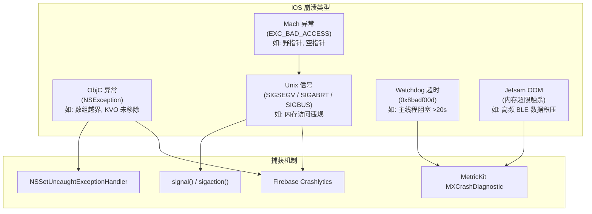
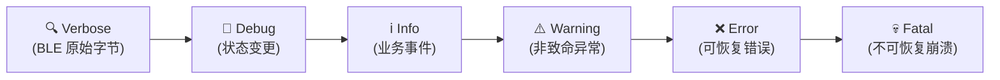
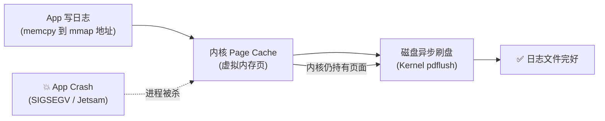
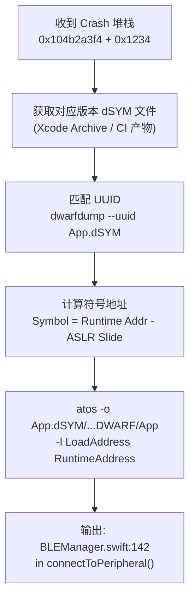

# 模块九：崩溃分析、分级日志体系与线上监控

> **JD 原文**：「完善崩溃分析、日志体系、监控」

---

## 🧭 模块知识拓扑与四维剖析

| 维度 | 核心内容 |
| :--- | :--- |
| **🔥 重点 (Key Focus)** | Signal Handler (SIGSEGV/SIGABRT) 崩溃捕获机制、`os_log` 分级日志系统、MetricKit 性能指标自动采集 |
| **🧠 难点 (Difficult Points)** | mmap 崩溃安全日志 Buffer 完整实现、Crash 堆栈 dSYM 符号化全流程、自定义 APM 指标设计（BLE 连接成功率/OTA 成功率/Crash-Free Rate） |
| **⚠️ 坑点 (Pitfalls)** | 1. Signal Handler 中调用非 Async-Signal-Safe 函数导致二次 Crash 死锁；<br>2. 普通文件日志在 Crash 瞬间 Page Cache 未刷盘导致现场日志丢失；<br>3. MetricKit 回调仅在 App 下次启动时触发，非实时上报。 |
| **💡 最佳实践 (Best Practices)** | Signal Handler 仅写 mmap Buffer、`os_log` 替代 `print`、MetricKit + Firebase Crashlytics 双通道 |

---

## 9.1 崩溃收集体系

### iOS Crash 分类与捕获机制



### Crash Handler 完整实现

> **关键**：Unix Signal Handler 内禁止 Swift 字符串插值、`Thread.callStackSymbols`、`NSLog`、任何 `malloc`。下面把「教学用错误写法」和「可落地写法」分开。

#### ❌ 错误示范（面试要能指出问题）

```swift
signal(SIGSEGV) { signalNumber in
    // 以下全部非 async-signal-safe，可能二次崩溃/死锁
    let info = "signal \(signalNumber) \(Thread.callStackSymbols)"
    print(info)
}
```

#### ✅ 可落地思路（ObjC 异常 vs Signal 分流）

```swift
import Foundation

final class CrashCollector {
    private static var mmapLogger: MMapCrashLogger?

    static func install() {
        mmapLogger = MMapCrashLogger(filePath: crashLogPath())

        // 1) ObjC 异常：不在 signal 上下文，可用较高层 API（仍应尽快落盘）
        NSSetUncaughtExceptionHandler { exception in
            let info = """
            [ObjC Exception]
            Name: \(exception.name.rawValue)
            Reason: \(exception.reason ?? "nil")
            CallStack:
            \(exception.callStackSymbols.joined(separator: "\n"))
            """
            CrashCollector.mmapLogger?.writeString(info) // 内部应尽量减少分配
        }

        // 2) Unix 信号：只允许 write/mmap 指针写入；实现建议放在 C 文件
        // installAsyncSignalSafeHandlers() → 将 signum、简单寄存器摘要 memcpy 进预 mmap 区
        // 详见同目录 MMapCrashLogger + signal_handler.c（面试口述即可）
        installAsyncSignalSafeHandlers()
    }

    static func checkAndUploadPreviousCrash() {
        guard let data = mmapLogger?.readPreviousLog(), !data.isEmpty else { return }
        uploadCrashLog(data)
        mmapLogger?.clearLog()
    }

    private static func crashLogPath() -> String {
        let cacheDir = NSSearchPathForDirectoriesInDomains(.cachesDirectory, .userDomainMask, true).first!
        return "\(cacheDir)/crash_mmap.log"
    }

    private static func uploadCrashLog(_ data: String) {
        // 网络上报至后端 APM
    }
}

/// 占位：真实项目用 C/ObjC 实现，仅 write(2) / memcpy 到预分配 mmap
func installAsyncSignalSafeHandlers() {
    // sigaction(SIGSEGV/SIGABRT/...) → 写固定布局二进制 crash header + 回退 SIG_DFL + raise
}
```

### ⚠️ 坑点 1：Signal Handler 中调用非 Async-Signal-Safe 函数

- **现象**：在 Signal Handler 中调用 `NSLog` / `print` / `malloc` / `objc_msgSend`，导致死锁或二次 Crash。
- **本质原因**：Signal Handler 在任意时刻打断程序执行（包括正持有锁的时刻）。如果 Handler 中再次尝试获取同一锁，产生死锁。`malloc` / `free` / `NSLog` 内部都使用锁。
- **专家级解决方案**：
  - Signal Handler 中**仅允许**调用 POSIX 定义的 Async-Signal-Safe 函数（如 `write(2)` / `_exit(2)`）。
  - 使用 `mmap` 预分配缓冲区，在 Handler 中仅做 `memcpy`，无任何 `malloc`。

---

## 9.2 MetricKit 性能监控

> iOS 13+ 提供的系统级性能诊断框架，无需额外 SDK。

```swift
import MetricKit

/// MetricKit 性能与崩溃诊断订阅器
final class PerformanceMetricsSubscriber: NSObject, MXMetricManagerSubscriber {
    
    static let shared = PerformanceMetricsSubscriber()
    
    func startMonitoring() {
        MXMetricManager.shared.add(self)
    }
    
    // iOS 13+: 每日一次性能指标回调
    func didReceive(_ payloads: [MXMetricPayload]) {
        for payload in payloads {
            // App 启动耗时
            if let launchMetrics = payload.applicationLaunchMetrics {
                let avgLaunch = launchMetrics.histogrammedTimeToFirstDraw
                    .bucketEnumerator.allObjects
                print("📊 App Launch: \(avgLaunch)")
            }
            
            // 内存峰值
            if let memoryMetrics = payload.memoryMetrics {
                print("📊 Peak Memory: \(memoryMetrics.peakMemoryUsage)")
            }
            
            // CPU 使用
            if let cpuMetrics = payload.cpuMetrics {
                print("📊 CPU Time: \(cpuMetrics.cumulativeCPUTime)")
            }
        }
    }
    
    // iOS 14+: 崩溃诊断回调 (含堆栈)
    func didReceive(_ payloads: [MXDiagnosticPayload]) {
        for payload in payloads {
            // Crash 诊断
            if let crashDiagnostics = payload.crashDiagnostics {
                for crash in crashDiagnostics {
                    let stack = crash.callStackTree
                    let signal = crash.signal
                    let termination = crash.terminationReason
                    print("💀 Crash: signal=\(signal ?? "nil"), reason=\(termination ?? "nil")")
                    print("   Stack: \(stack)")
                    // 上报至后端
                    uploadDiagnostic(crash)
                }
            }
            
            // Hang 诊断 (主线程阻塞)
            if let hangDiagnostics = payload.hangDiagnostics {
                for hang in hangDiagnostics {
                    let duration = hang.hangDuration
                    print("🧊 Hang detected: \(duration)")
                }
            }
        }
    }
    
    private func uploadDiagnostic(_ crash: MXCrashDiagnostic) {
        // 序列化并上报
    }
}
```

### ⚠️ 坑点 2：MetricKit 回调时机

- **现象**：App 发生 Crash 后，期望立即收到 `didReceive(_ payloads: [MXDiagnosticPayload])`，但始终未触发。
- **本质原因**：MetricKit 的诊断数据是**异步采集**的，通常在 Crash 发生后的**下一次 App 启动 24~48 小时内**通过回调交付。不适合做实时告警。
- **专家级解决方案**：MetricKit 作为**补充通道**，配合 Firebase Crashlytics / Sentry 等实时 SDK 双通道覆盖。

---

## 9.3 分级日志系统设计

### 日志级别定义



### 基于 `os_log` 的统一日志实现

```swift
import os.log

/// 统一日志管理器 — 基于 Apple 推荐的 os_log (替代 print/NSLog)
enum LogCategory: String {
    case ble = "BLE"
    case ota = "OTA"
    case health = "Health"
    case ui = "UI"
    case network = "Network"
}

struct AppLogger {
    private let logger: Logger
    
    init(category: LogCategory) {
        self.logger = Logger(subsystem: Bundle.main.bundleIdentifier ?? "com.app", category: category.rawValue)
    }
    
    /// Verbose: BLE 原始字节流（仅 Debug 模式可见）
    func verbose(_ message: String) {
        logger.debug("🔍 \(message, privacy: .private)")
    }
    
    /// Debug: 内部状态变更
    func debug(_ message: String) {
        logger.debug("🐛 \(message, privacy: .private)")
    }
    
    /// Info: 业务关键事件
    func info(_ message: String) {
        logger.info("ℹ️ \(message, privacy: .public)")
    }
    
    /// Warning: 非致命异常
    func warning(_ message: String) {
        logger.warning("⚠️ \(message, privacy: .public)")
    }
    
    /// Error: 可恢复错误
    func error(_ message: String) {
        logger.error("❌ \(message, privacy: .public)")
    }
    
    /// Fatal: 不可恢复错误（同时写入 mmap）
    func fatal(_ message: String) {
        logger.critical("💀 \(message, privacy: .public)")
    }
}

// 使用示例
// let bleLog = AppLogger(category: .ble)
// bleLog.info("Connected to device: \(peripheral.name ?? "unknown")")
// bleLog.error("GATT discovery failed: \(error.localizedDescription)")
// bleLog.verbose("Raw bytes: \(data.hexString)")
```

### `os_log` vs `print` vs `NSLog` 对比

| 维度 | `print` | `NSLog` | `os_log` / `Logger` |
| :--- | :--- | :--- | :--- |
| **性能** | ❌ 同步写入 stdout | ❌ 同步 + 序列化 | ✅ 异步、极低开销 |
| **级别控制** | ❌ 无 | ❌ 无 | ✅ debug/info/error/fault |
| **隐私合规** | ❌ 无 | ❌ 明文 | ✅ `.private` 自动脱敏 |
| **系统集成** | ❌ Xcode only | ⚠️ 可用 `log` 命令 | ✅ Console.app 完整集成 |
| **Release 表现** | 完全输出 | 完全输出 | debug 级别自动剥离 |

---

## 9.4 mmap 崩溃安全日志 — 完整实现

> **核心价值**：普通 `write()` 文件日志在 Crash 瞬间，数据可能仍停留在用户空间 Buffer 中未刷盘。`mmap` 将磁盘文件页直接映射到虚拟地址空间，写入即对内核 Page Cache 可见，即使进程被杀，内核仍会异步刷盘。



### mmap 日志 Buffer Swift/C 实现

```swift
import Foundation

/// mmap 崩溃安全日志写入器
/// 即使 App 被 Crash / Jetsam 杀死，日志数据也能保证落盘
final class MMapCrashLogger {
    private var mmapPointer: UnsafeMutableRawPointer?
    private var fileDescriptor: Int32 = -1
    private let fileSize: Int = 1024 * 1024 // 1MB 固定大小
    private var writeOffset: Int = 0
    private let filePath: String
    
    init(filePath: String) {
        self.filePath = filePath
        setupMMap()
    }
    
    deinit {
        if let ptr = mmapPointer {
            munmap(ptr, fileSize)
        }
        if fileDescriptor >= 0 {
            close(fileDescriptor)
        }
    }
    
    private func setupMMap() {
        // 1. 创建或打开日志文件
        fileDescriptor = open(filePath, O_RDWR | O_CREAT, S_IRUSR | S_IWUSR)
        guard fileDescriptor >= 0 else {
            print("❌ mmap: open() failed")
            return
        }
        
        // 2. 设置文件大小为固定值 (ftruncate)
        ftruncate(fileDescriptor, off_t(fileSize))
        
        // 3. 将文件映射到虚拟内存
        mmapPointer = mmap(
            nil,
            fileSize,
            PROT_READ | PROT_WRITE,
            MAP_SHARED,  // MAP_SHARED 确保写入对内核 Page Cache 可见
            fileDescriptor,
            0
        )
        
        guard mmapPointer != MAP_FAILED else {
            print("❌ mmap() failed")
            mmapPointer = nil
            return
        }
        
        // 4. 读取当前写入偏移量 (前 4 字节存储 offset)
        writeOffset = mmapPointer!.load(fromByteOffset: 0, as: Int32.self).hashValue
        if writeOffset < 4 || writeOffset >= fileSize { writeOffset = 4 }
    }
    
    /// 写入日志 — 可在 Signal Handler 中安全调用 (仅 memcpy，无 malloc)
    func write(_ message: String) {
        guard let ptr = mmapPointer else { return }
        
        let timestamp = Date().timeIntervalSince1970
        let logLine = "[\(timestamp)] \(message)\n"
        let bytes = Array(logLine.utf8)
        let length = bytes.count
        
        // 环形写入：超出则从头覆盖
        if writeOffset + length >= fileSize {
            writeOffset = 4
        }
        
        // memcpy — Async-Signal-Safe，可在 Signal Handler 中使用
        bytes.withUnsafeBufferPointer { buffer in
            memcpy(ptr.advanced(by: writeOffset), buffer.baseAddress!, length)
        }
        writeOffset += length
        
        // 更新偏移量到文件头
        var offset32 = Int32(writeOffset)
        memcpy(ptr, &offset32, 4)
    }
    
    /// 读取上次崩溃留下的日志
    func readPreviousLog() -> String? {
        guard let ptr = mmapPointer else { return nil }
        let offset = Int(ptr.load(fromByteOffset: 0, as: Int32.self))
        guard offset > 4 && offset < fileSize else { return nil }
        
        let data = Data(bytes: ptr.advanced(by: 4), count: offset - 4)
        return String(data: data, encoding: .utf8)
    }
    
    /// 清空日志 (上报成功后调用)
    func clearLog() {
        guard let ptr = mmapPointer else { return }
        memset(ptr, 0, fileSize)
        var zero: Int32 = 4
        memcpy(ptr, &zero, 4)
        writeOffset = 4
    }
}
```

---

## 9.5 线上监控与自定义 APM 指标

> **JD 对齐**：「完善监控」

### 自定义业务指标定义

| 指标名称 | 计算公式 | 告警阈值 | 业务含义 |
| :--- | :--- | :--- | :--- |
| **BLE 连接成功率** | `连接成功次数 / 连接尝试总次数 × 100%` | < 95% | 蓝牙芯片/固件兼容性问题 |
| **OTA 升级成功率** | `升级完成次数 / 升级启动总次数 × 100%` | < 99% | DFU 流程稳定性 |
| **Crash-Free Rate** | `未崩溃用户数 / 总活跃用户数 × 100%` | < 99.5% | 整体稳定性红线 |
| **实时波形丢帧率** | `丢失帧数 / 预期帧数 × 100%` | > 5% | BLE 吞吐/解析性能 |
| **心率计算延迟** | `从 BLE 收帧到 UI 刷新的 P99 耗时` | > 500ms | 数据管线性能 |
| **OTA 分阶段漏斗** | 见下表各阶段转化率 | 单阶段骤降 | 定位卡在擦除/传输/校验 |
| **协议版本分布** | 活跃设备 `proto_ver` 直方图 | 旧版本占比过高 | 强制升级/兼容窗口 |
| **刺激指令拒绝率** | Gate reject / 总建议次数 | 异常升高 | 算法越界或限幅过紧 |

### OTA 分阶段漏斗（比「总成功率」更能定责）

| 阶段 | 埋点 | 骤降时优先查 |
| :--- | :--- | :--- |
| start | 用户点升级 | UX / 电量门禁 |
| validated | 本地固件校验通过 | 包损坏 / 签名 |
| bootloader | 进入 DFU 模式并重连成功 | MAC+1 / 重发现 |
| erased | Flash 擦除 ACK | 超时 Guardian |
| transferred | 字节 100% | 流控 / RF |
| verified | CRC/签名通过 | 算法不一致 |
| completed | 应用区版本号确认 | 重启 / 回滚 |

```swift
enum OTAFunnelStage: String {
    case start, validated, bootloader, erased, transferred, verified, completed, failed
}

extension APMTracker {
    func trackOTA(stage: OTAFunnelStage, deviceSN: String, protoVer: Int, rssi: Int?) {
        trackResult(event: "ota_\(stage.rawValue)", success: stage != .failed)
        // 附带维度：SN 哈希、protoVer、rssi、App/FW 版本 — 供远端下钻
    }
}
```

```swift
/// 自定义 APM 埋点 — 用于上报 BLE/OTA/Health 核心业务指标
final class APMTracker {
    static let shared = APMTracker()
    
    private var metrics: [String: [Double]] = [:]
    private let queue = DispatchQueue(label: "com.app.apm", qos: .utility)
    
    /// 记录一次事件耗时
    func trackDuration(event: String, duration: TimeInterval) {
        queue.async {
            self.metrics[event, default: []].append(duration)
        }
    }
    
    /// 记录成功/失败计数
    func trackResult(event: String, success: Bool) {
        let key = success ? "\(event)_success" : "\(event)_failure"
        queue.async {
            self.metrics[key, default: []].append(1)
        }
    }
    
    /// 定期上报汇总 (每 5 分钟)
    func startPeriodicReport(interval: TimeInterval = 300) {
        Timer.scheduledTimer(withTimeInterval: interval, repeats: true) { [weak self] _ in
            self?.flushMetrics()
        }
    }
    
    private func flushMetrics() {
        queue.async {
            let snapshot = self.metrics
            self.metrics.removeAll()
            
            // 计算汇总指标
            var report: [String: Any] = [:]
            
            // BLE 连接成功率
            let bleSuccess = Double(snapshot["ble_connect_success"]?.count ?? 0)
            let bleFail = Double(snapshot["ble_connect_failure"]?.count ?? 0)
            if bleSuccess + bleFail > 0 {
                report["ble_connect_success_rate"] = bleSuccess / (bleSuccess + bleFail) * 100
            }
            
            // OTA 升级成功率
            let otaSuccess = Double(snapshot["ota_upgrade_success"]?.count ?? 0)
            let otaFail = Double(snapshot["ota_upgrade_failure"]?.count ?? 0)
            if otaSuccess + otaFail > 0 {
                report["ota_upgrade_success_rate"] = otaSuccess / (otaSuccess + otaFail) * 100
            }
            
            // P99 延迟
            if let durations = snapshot["hr_calculation_latency"], !durations.isEmpty {
                let sorted = durations.sorted()
                let p99Index = Int(Double(sorted.count) * 0.99)
                report["hr_calc_p99_ms"] = sorted[min(p99Index, sorted.count - 1)] * 1000
            }
            
            // 上传至后端
            self.uploadReport(report)
        }
    }
    
    private func uploadReport(_ report: [String: Any]) {
        // 发送至后端 APM 系统 / Firebase Analytics
        print("📊 APM Report: \(report)")
    }
}
```

### dSYM 符号化完整流程



```bash
# 实际操作命令
# 1. 获取 dSYM 的 UUID
dwarfdump --uuid App.app.dSYM

# 2. 用 atos 符号化崩溃地址
atos -o App.app.dSYM/Contents/Resources/DWARF/App \
     -l 0x104000000 \
     0x104b2a3f4

# 输出: -[BLEManagerCoordinator centralManager:didDisconnectPeripheral:error:] (in App) (BLEManagerCoordinator.swift:142)
```
