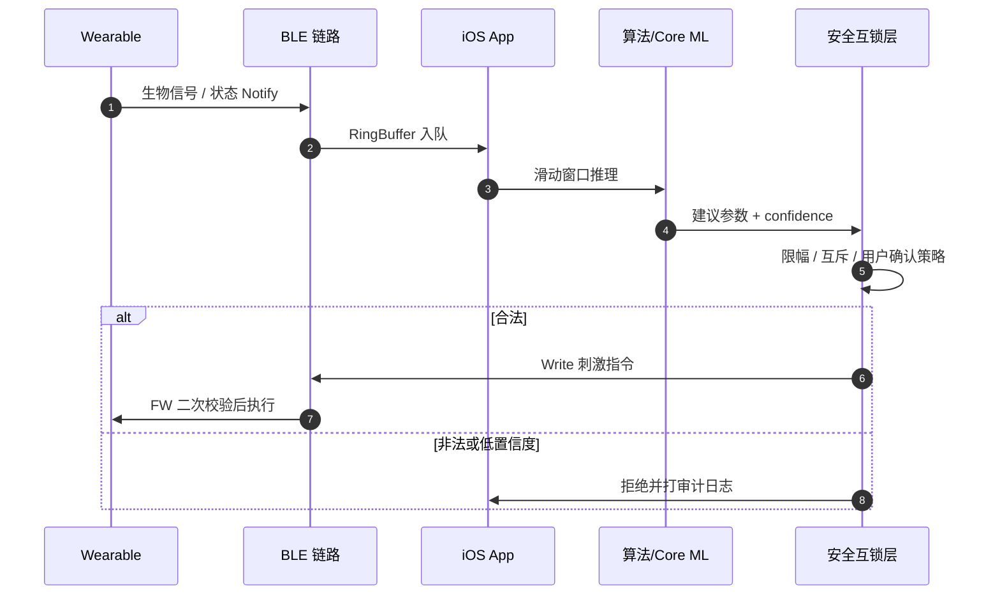

# 模块十：神经调节场景 — 刺激控制安全与闭环时延

> **JD 原文信号**：公司专注「智能可穿戴设备与**神经调节**技术」；职位要算法实现 + BLE 大数据流。  
> **备战意义**：通用健康 App 话术不够；必须能讲「感知 → 算法 → **安全层** → 刺激下发」的失败安全设计。

---

## 🧭 四维剖析

| 维度 | 核心内容 |
| :--- | :--- |
| **🔥 重点** | 刺激参数校验、确认 UX、失败安全态（Fail-Safe）、审计日志 |
| **🧠 难点** | 闭环时延预算（感测→推理→下发）、断连时刺激策略、与 OTA 互斥 |
| **⚠️ 坑点** | 模型输出直接当下发指令；无上限电流/脉宽；弱网/断连仍维持危险参数 |
| **💡 最佳实践** | App 侧硬约束 + FW 侧二次限幅；刺激与 DFU 互斥锁；全量命令审计 |

---

## 10.1 闭环链路与时延预算



| 环节 | 典型预算（示例，面试可改成「需与产品对齐」） |
| :--- | :--- |
| BLE Notify → App | < 20 ms |
| 窗口推理 | < 30 ms |
| 安全校验 | < 5 ms |
| Write → FW ACK | 1~2 个 Connection Interval |
| **闭环合计** | 产品定义；超时则保持上一安全态或停止刺激 |

---

## 10.2 App 侧硬约束（模型不能越权）

```swift
struct StimulationLimits {
    let maxAmplitudeuA: Int
    let maxPulseWidthUs: Int
    let maxFrequencyHz: Int
    let minCooldownMs: Int
}

struct StimulationCommand: Equatable {
    var amplitudeuA: Int
    var pulseWidthUs: Int
    var frequencyHz: Int
    var durationMs: Int
}

enum StimulationGateError: Error {
    case overAmplitude, overPulseWidth, overFrequency
    case cooldown, lowConfidence, dfuInProgress, notConfirmed
}

final class StimulationSafetyGate {
    private let limits: StimulationLimits
    private var lastFireAt: Date?
    private(set) var dfuLocked = false
    var userConfirmedSession = false

    func validate(
        proposed: StimulationCommand,
        confidence: Float,
        minConfidence: Float = 0.6
    ) -> Result<StimulationCommand, StimulationGateError> {
        guard !dfuLocked else { return .failure(.dfuInProgress) }
        guard userConfirmedSession else { return .failure(.notConfirmed) }
        guard confidence >= minConfidence else { return .failure(.lowConfidence) }
        guard proposed.amplitudeuA <= limits.maxAmplitudeuA else { return .failure(.overAmplitude) }
        guard proposed.pulseWidthUs <= limits.maxPulseWidthUs else { return .failure(.overPulseWidth) }
        guard proposed.frequencyHz <= limits.maxFrequencyHz else { return .failure(.overFrequency) }
        if let last = lastFireAt,
           Date().timeIntervalSince(last) * 1000 < Double(limits.minCooldownMs) {
            return .failure(.cooldown)
        }
        return .success(proposed)
    }

    func recordFired() { lastFireAt = Date() }
}
```

**面试金句**：Core ML / 规则引擎只产出「建议」；**唯一下发路径**必须经过 SafetyGate；固件必须再做一次限幅（Defense in Depth）。

---

## 10.3 UX 与失败安全态

| 事件 | App 行为 | 设备期望 |
| :--- | :--- | :--- |
| 用户未确认治疗会话 | 禁止自动刺激 | 忽略非法 Write |
| BLE 断连 | 停止发新指令，UI 告警 | **停止或回退到安全默认** |
| 推理置信度低 | 不更新刺激参数 | 保持安全态 |
| 进入 DFU | `dfuLocked=true` | 拒绝刺激 opcode |
| App 崩溃 | — | Watchdog / 超时自动停刺激 |

```swift
/// 断连时的 Fail-Safe
func centralManager(_ central: CBCentralManager,
                    didDisconnectPeripheral peripheral: CBPeripheral,
                    error: Error?) {
    stimulationGate.userConfirmedSession = false
    ui.showBanner("连接中断，刺激已停止，请靠近设备后重新确认")
}
```

---

## 10.4 审计日志（合规与排障）

每条刺激相关 Write 记录：时间、参数、来源（手动/算法）、confidence、Gate 结果、固件 ACK。  
Crash/APM 体系（模块 09）应单独有 `stim_command_accepted / rejected` 计数，便于与医疗/产品复盘。

---

## 10.5 面试追问

**Q：算法建议了超限电流怎么办？**  
A：Gate 拒绝 + 审计；UI 不展示「已执行」；同时报缺陷给算法（契约/训练标签问题）。

**Q：为什么不能只在 App 限幅？**  
A：恶意/错误 App、越狱、写特征值重放都可能绕过；FW 必须是最后一道闸。
