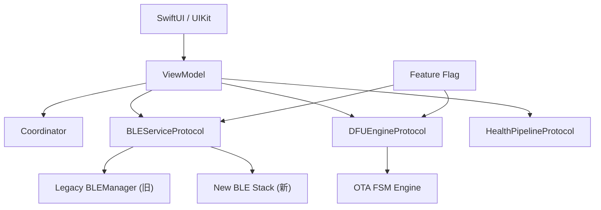

# 模块十一：既有代码上的架构演进（Brownfield）

> **JD 原文**：「能在既有代码基础上进行架构优化、演进与重构。」  
> 初创 + 远程 + 硬件联调并行时，**禁止大爆炸重写**。

---

## 🧭 四维剖析

| 维度 | 核心内容 |
| :--- | :--- |
| **🔥 重点** | Protocol 抽象、旁路新引擎 + Feature Flag、硬件回归矩阵 |
| **🧠 难点** | ObjC/Swift 混编边界、Massive VC 拆分不中断发版 |
| **⚠️ 坑点** | 边改架构边改 OTA 无回归表；一次切光 BLE 单例 |
| **💡 最佳实践** | Strangler Fig：新路径生长、旧路径枯萎；每 Sprint 可回滚 |

---

## 11.1 推荐目标形态



```swift
protocol BLEServiceProtocol: AnyObject {
    func connect(deviceID: UUID)
    func disconnect()
    var dataStream: AsyncStream<Data> { get }
}

final class BLEServiceRouter: BLEServiceProtocol {
    private let flag: FeatureFlags
    private let legacy: BLEServiceProtocol
    private let modern: BLEServiceProtocol

    func connect(deviceID: UUID) {
        (flag.useModernBLE ? modern : legacy).connect(deviceID: deviceID)
    }
    // …
}
```

---

## 11.2 与 OTA/硬件并行的迁移节奏

| Sprint | 动作 | 验收 |
| :--- | :--- | :--- |
| N | 抽出 `BLEServiceProtocol`，旧实现包一层 | 行为不变 + 单测 |
| N+1 | 新 OTA FSM **旁路**上线，Flag 默认关 | Mock + 台架 DFU 通过 |
| N+2 | 小流量打开 Flag | OTA 成功率 ≥ 旧路径 |
| N+3 | 健康计算迁出 VC | 图表 FPS / 内存不回退 |
| N+4 | 删旧路径 | 回归矩阵全绿 |

---

## 11.3 硬件回归矩阵（每次动 BLE/OTA 必跑）

- [ ] 冷启动扫描连接  
- [ ] 弱信号 / 口袋衰减断连重连  
- [ ] 后台 `bluetooth-central` 收数  
- [ ] Flash 擦除超时（模拟 5s 无 ACK）  
- [ ] Bootloader MAC+1 / UUID 变更重发现  
- [ ] 用户杀 App 后启动续传提示  
- [ ] 升级中来电 / 切后台  
- [ ] 低电量拒绝 DFU  
- [ ] 刺激会话与 DFU 互斥（模块 10）  

---

## 11.4 面试 STAR 要点

- **不说**「我重写了整个 App」。  
- **说**「用 Protocol + Flag 旁路 OTA，旧路径保底；用硬件回归表把成功率从 x% 收到 y%，再下线旧代码。」
