# 资深 iOS 开发专家：智能硬件 / BLE / OTA / Core ML / 系统级性能优化深度指南

---

## 目录
- [一、 模块一：BLE 通信与 CoreBluetooth 底层原理与极限调优](#一-模块一ble-通信与-corebluetooth-底层原理与极限调优)
  - [1.1 iOS 蓝牙系统架构与 CoreBluetooth 线程模型](#11-ios-蓝牙系统架构与-corebluetooth-线程模型)
  - [1.2 GATT / ATT / L2CAP 协议栈本质剖析](#12-gatt--att--l2cap-协议栈本质剖析)
  - [1.3 极限吞吐量模型与流控机制](#13-极限吞吐量模型与流控机制)
  - [1.4 后台挂起、状态恢复与退避重连架构](#14-后台挂起状态恢复与退避重连架构)
- [二、 模块二：固件空中升级（OTA / DFU）架构深度剖析](#二-模块二固件空中升级ota--dfu架构深度剖析)
  - [2.1 DFU 硬件底层与 Flash 分区机制](#21-dfu-硬件底层与-flash-分区机制)
  - [2.2 完整 OTA 有限状态机 (FSM) 设计](#22-完整-ota-有限状态机-fsm-设计)
  - [2.3 关键硬核技术：断点续传、滑动窗口与变砖降级容错](#23-关键硬核技术断点续传滑动窗口与变砖降级容错)
  - [2.4 安全校验体系 (AES-GCM / SHA-256 / CRC32)](#24-安全校验体系-aes-gcm--sha-256--crc32)
- [三、 模块三：Core ML 端侧 AI 与生物信号算法落地](#三-模块三core-ml-端侧-ai-与生物信号算法落地)
  - [3.1 Core ML 系统分层与硬件加速引擎选型](#31-core-ml-系统分层与硬件加速引擎选型)
  - [3.2 模型量化、体积压缩与延迟优化](#32-模型量化体积压缩与延迟优化)
  - [3.3 生物信号 (PPG/ECG) 零拷贝 (Zero-Copy) 推理架构](#33-生物信号-ppgecg-零拷贝-zero-copy-推理架构)
  - [3.4 实时滑动窗口推理与 TFLite C++ 集成对比](#34-实时滑动窗口推理与-tflite-c-集成对比)
- [四、 模块四：系统级性能优化、内存、多线程与稳定性体系](#四-模块四系统级性能优化内存多线程与稳定性体系)
  - [4.1 虚拟内存机制 (Dirty/Clean/Compressed Memory) 与 ARC 优化](#41-虚拟内存机制-dirtycleancompressed-memory-与-arc-优化)
  - [4.2 多线程本质：GCD 线程爆满、QoS 优先级反转与 Swift Concurrency](#42-多线程本质gcd-线程爆满qos-优先级反转与-swift-concurrency)
  - [4.3 高帧率 (60/120 FPS) 图表渲染管线与 LTTB 降采样算法](#43-高帧率-60120-fps-图表渲染管线与-lttb-降采样算法)
  - [4.4 稳定性体系：mmap 崩溃日志 Buffer 与 dSYM 符号化探查](#44-稳定性体系mmap-崩溃日志-buffer-与-dsym-符号化探查)
- [五、 模块五：数据协议、字节流处理与 C/C++ 高性能交互](#五-模块五数据协议字节流处理与-cc-高性能交互)
  - [5.1 Swift Unsafe 指针与字节序 (Endianness) 转换](#51-swift-unsafe-指针与字节序-endianness-转换)
  - [5.2 流式粘包/半包解析器 (Frame Parser) 设计](#52-流式粘包半包解析器-frame-parser-设计)
- [六、 模块六：全链路 Debugging、软硬件联调与跨团队协同](#六-模块六全链路-debugging软硬件联调与跨团队协同)
  - [6.1 全链路故障排查矩阵](#61-全链路故障排查矩阵)
  - [6.2 软硬件协同契约与 Mock 驱动开发](#62-软硬件协同契约与-mock-驱动开发)

---

## 一、 模块一：BLE 通信与 CoreBluetooth 底层原理与极限调优

### 1.1 iOS 蓝牙系统架构与 CoreBluetooth 线程模型

深入本质来看，`CoreBluetooth.framework` 并不是直接与蓝牙芯片通信，而是作为 Client 端通过 **Mach Port / XPC 通信** 与 iOS 蓝牙守护进程 `bluetoothd` 进行跨进程交互。

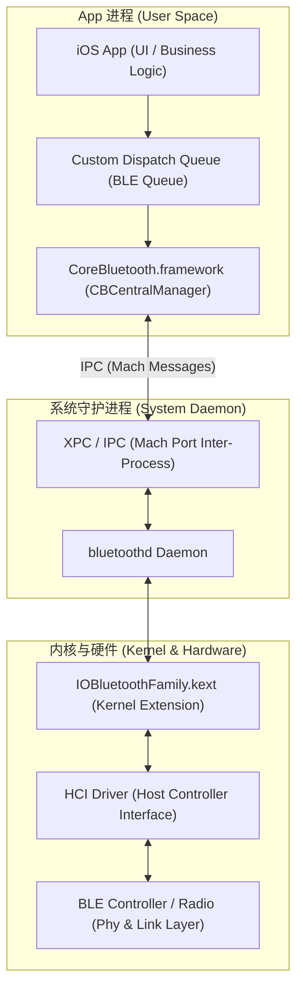

#### 关键知识点与面试探查点：
1. **`queue` 参数作用**：初始化 `CBCentralManager(delegate:queue:options:)` 时，若 `queue` 传 `nil`，所有的代理回调都在 **主线程 (Main Queue)** 触发；如果蓝牙数据密集（如 250Hz PPG 信号），主线程会产生卡顿。**资深实践**：必须传入专门的 `DispatchQueue(label: "com.app.ble.queue", qos: .userInitiated)`。
2. **线程隔离与死锁风险**：代理回调在蓝牙 Queue 运行，调用 UI 刷新必须显式 `DispatchQueue.main.async`。

---

### 1.2 GATT / ATT / L2CAP 协议栈本质剖析

BLE 协议栈分为 **Host** 和 **Controller** 两部分，两者的接口即为 HCI。

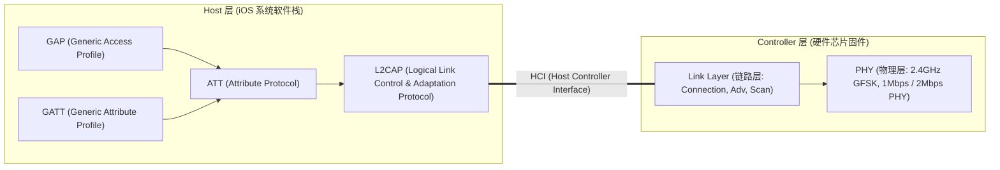

#### 概念深入剖析：
- **ATT PDU (Protocol Data Unit)**：ATT 协议的数据包。每次读写都会包含 `Opcode` (1 Byte) + `Attribute Handle` (2 Bytes) + `Value` (0~509 Bytes)。因此有效 Payload 总是为 **ATT MTU - 3 字节**。
- **L2CAP CoC (Connection-Oriented Channels)**：在 iOS 11+ 中，`CBPeripheral` 支持打开 L2CAP Channel (`openL2CAPChannel(_:)`)。
  - **本质区别**：GATT 是基于属性数据库的（带 Handle 开销和 ATT 限制）；而 L2CAP CoC 提供纯粹的 **Socket 式双向数据流**，避开了 GATT 层的多重封装，传输效率更高，常用于高音质音频或极速 OTA。

---

### 1.3 极限吞吐量模型与流控机制

#### BLE 理论极限吞吐量公式
$$\text{Throughput (bits/s)} = \frac{\text{Payload Per Packet (bytes)} \times 8}{\text{Connection Interval (seconds)}} \times \text{Packets Per Connection Event}$$

假设条件：
- **PHY**：2Mbps (BLE 5.0+)
- **ATT MTU**：247 字节 $\rightarrow$ Payload = $247 - 3 = 244$ 字节
- **Connection Interval**：15 ms (iOS 允许的最小值)
- **Packets per Event**：iOS 在理想情况下一个 Connection Event 可发送 4~6 个包

$$\text{Max Throughput} = \frac{244 \times 8 \text{ bits}}{0.015 \text{ s}} \times 6 \approx 780.8 \text{ Kbps } (\approx 97.6 \text{ KB/s})$$

#### `Write Without Response` 流控机制（序列图）

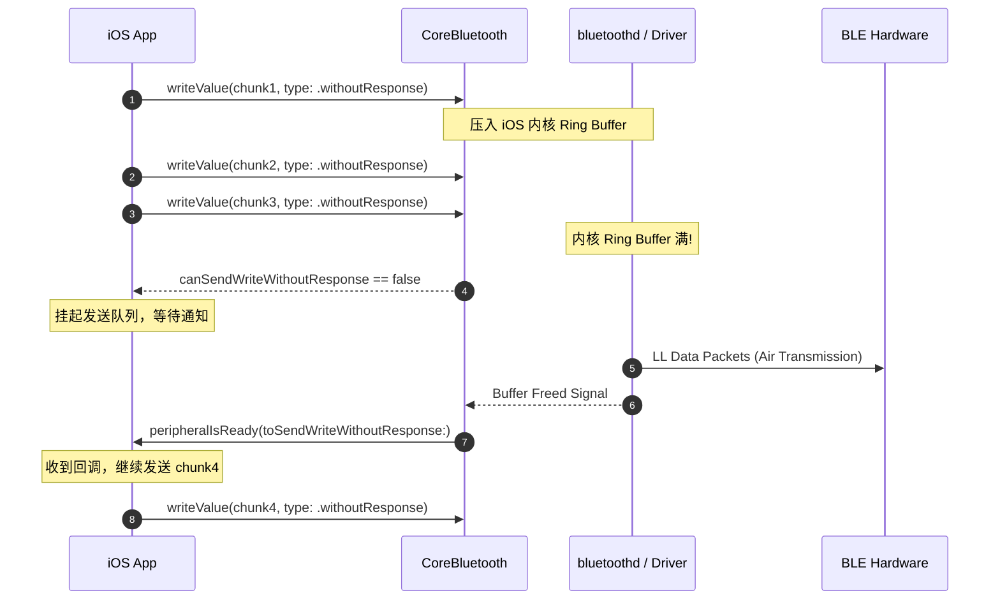

---

### 1.4 后台挂起、状态恢复与退避重连架构

#### 后台蓝牙恢复 (State Restoration) 流程

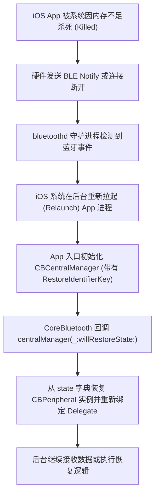

---

## 二、 模块二：固件空中升级（OTA / DFU）架构深度剖析

固件空中升级是智能硬件产品的命脉。升级中断变“砖”将产生高昂的售后成本。

### 2.1 DFU 硬件底层与 Flash 分区机制

硬件 Flash 存储空间通常分为 **Bootloader**、**Application** 以及 **Swap/Storage** 区。


- **Dual-Bank (安全双区模式)**：新固件首先完全写入 Bank 1，全面校验（SHA-256 & CRC32）成功后，Bootloader 修改 Boot Flag 并在重启时将 Bank 1 搬移覆盖 Bank 0。如果升级中途断电/断连，设备原有的 Bank 0 仍可正常运行。
- **Single-Bank (单区模式)**：Flash 擦除 Bank 0 直接边收边写。断连后只能保留在 Bootloader 模式，依靠 Bootloader 的最小 BLE 栈等待重新升级。

---

### 2.2 完整 OTA 有限状态机 (FSM) 设计

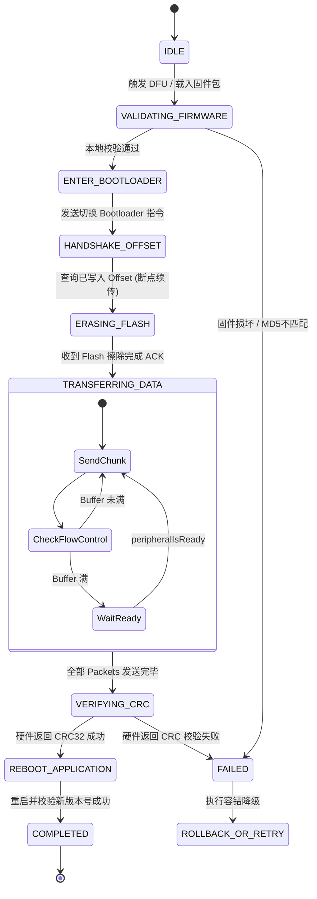

---

### 2.3 关键硬核技术：断点续传、滑动窗口与变砖降级容错

#### 1. 断点续传 (Resumable DFU) 实现
- 握手阶段，App 发送 `Opcode: 0x02 (Get_Offset)`。
- 硬件返回当前已经成功写入 Flash 的字节数 `Offset = 0x00040000` (256KB)。
- App 从固件 `Data.subdata(in: 0x00040000..<totalLength)` 处继续切片发送，节省 80% 重复传输时间。

#### 2. 滑动窗口协议 (Sliding Window Protocol)
单包 ACK（Write With Response）耗时极长（RTT > 30ms）。滑动窗口允许 App 连续发送 $N$ 个包（如 $N=16$），硬件在收到每 16 个包后返回一个 `PRN (Packet Receipt Notification)` 包。如果超时未收到 PRN，App 回退滑动窗口重发。

#### 3. 变砖恢复与降级容错机制 (Bootloader Redirection)
- 当设备从 Application 模式切换到 Bootloader 模式时，很多蓝牙芯片（如 Nordic nRF52832）为了防止 iOS 系统蓝牙缓存，会**自动将 MAC 地址 +1**，或改变广播包中的 Service UUID。
- **资深排查方案**：App 必须启动 **匹配算法 (Target Re-discovery)**，扫描包含 `DFU_SERVICE_UUID` 的广播包，并对比广播 Payload 中包含的 Device Serial Number (SN)，从而精准重新连接处于 Bootloader 模式的同一个硬件。

---

### 2.4 安全校验体系 (AES-GCM / SHA-256 / CRC32)

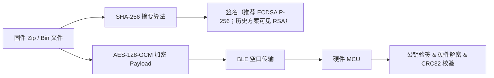

> 分册 `02_OTA_DFU_Architecture.md` 以 **ECDSA P-256 + AES-GCM + CRC32** 为统一口径；面试时不要混用 RSA/ECDSA 两套而不说明。

---

## 更新指引

更细的坑点、远程联调、神经调节安全、Brownfield、Core ML 加强版，请以 `iOS_Interview_Prep/` 分册为准（见 `00_README.md`）。本文件保留协议栈与架构总览。

---

## 三、 模块三：Core ML 端侧 AI 与生物信号算法落地

加分项与高级架构方向：在 iOS 端侧对 PPG/ECG 生物信号进行实时滤波、心率计算、房颤检测或睡眠分期推理。

### 3.1 Core ML 系统分层与硬件加速引擎选型

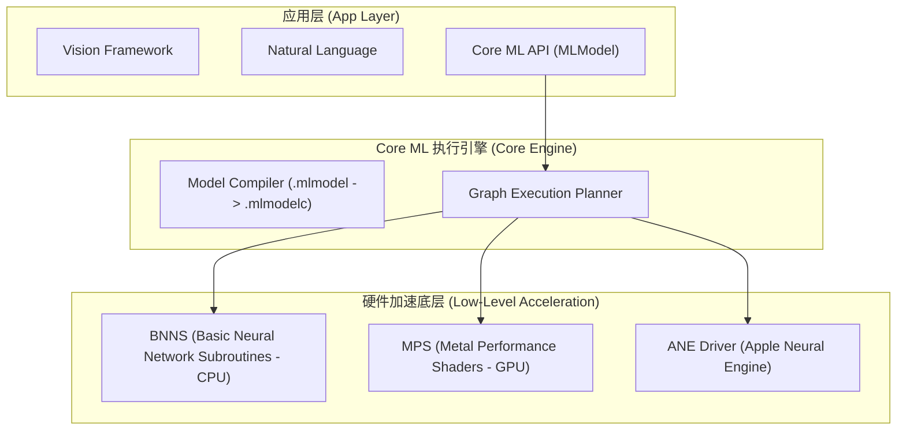

#### 硬件执行单元选型 (`MLComputeUnits`)

```swift
let config = MLModelConfiguration()
// 1. .all: 优先使用 ANE (NPU)，退回 GPU/CPU。推荐用于高吞吐推理。
// 2. .cpuAndGPU: 适合部分不支持 ANE 的自定义 Layer 模型。
// 3. .cpuOnly: 低功耗后台推理，避免唤醒 GPU 导致发热。
config.computeUnits = .all 
```

---

### 3.2 模型量化、体积压缩与延迟优化

在智能硬件 App 中，打包的模型体积直接影响 App 下载转化率。

1. **Post-Training Quantization (训练后量化)**：
   - 使用 `coremltools` 将模型权重从 **FP32** 压缩至 **FP16** 或 **INT8**。
   - 体积缩小 **75%**（例如：40MB $\rightarrow$ 10MB），且 ANE 推理速度提升 2~3 倍。
2. **算子兼容性 (Operator Compatibility)**：
   - ANE 对特定的算子（如 Conv1D/Conv2D、Relu、LSTM）支持极好；若模型中包含未支持的自定义 Python 算子，Core ML 会被迫将该层 Fallback 到 CPU 计算，产生巨大的 **CPU-ANE 内存拷贝开销**。

---

### 3.3 生物信号 (PPG/ECG) 零拷贝 (Zero-Copy) 推理架构

高频波形信号（如 250Hz 心电数据）持续流入时，若频繁创建 `MLMultiArray` 或数组拷贝，会导致高频的垃圾回收（GC）和内存碎片。

```swift
final class BioSignalMLInferenceEngine {
    private var model: HeartRatePredictor?
    // 预先分配固定内存的 UnsafeMutablePointer，避免重复 malloc
    private var inputBufferPointer: UnsafeMutablePointer<Float>
    private let sampleWindowSize = 512

    init() {
        inputBufferPointer = UnsafeMutablePointer<Float>.allocate(capacity: sampleWindowSize)
        setupModel()
    }

    deinit {
        inputBufferPointer.deallocate()
    }

    private func setupModel() {
        let config = MLModelConfiguration()
        config.computeUnits = .cpuAndNeuralEngine
        self.model = try? HeartRatePredictor(configuration: config)
    }

    /// 零拷贝（Zero-Copy）传入指针进行 Core ML 推理
    func inferPPGWindow(rawSamples: [Float]) -> Float? {
        guard rawSamples.count == sampleWindowSize, let model = model else { return nil }

        // 1. 直接拷贝到预分配的连续内存区域
        inputBufferPointer.initialize(from: rawSamples, count: sampleWindowSize)

        // 2. 使用 withUnsafeMutableBufferPointer 创建无拷贝的 MLMultiArray
        guard let customArray = try? MLMultiArray(
            dataPointer: UnsafeMutableRawPointer(inputBufferPointer),
            shape: [1, NSNumber(value: sampleWindowSize)],
            dataType: .float32,
            strides: [NSNumber(value: sampleWindowSize), 1],
            deallocator: nil // 内存由外层统一管理，CoreML 不负责 release
        ) else { return nil }

        // 3. 执行推理
        let output = try? model.prediction(inputSignal: customArray)
        return output?.heartRateValue
    }
}
```

---

### 3.4 实时滑动窗口推理与 TFLite C++ 集成对比

#### 滑动窗口队列模型 (Sliding Window FIFO)


#### Core ML vs TensorFlow Lite (C++ API) 对比

| 维度 | Core ML | TensorFlow Lite (C++ Interop) |
| :--- | :--- | :--- |
| **硬件加速** | **强支持 ANE (Apple Neural Engine)** & GPU | 仅支持 CPU / Metal Delegate |
| **推理延迟** | **极低** (针对 Apple 芯片硬件级优化) | 中等 |
| **跨平台复用** | 仅限于 iOS / macOS | 跨 iOS / Android 共享同一套 C++ 算法代码 |
| **集成复杂度** | 极低 (`.mlmodel` 自动生成 Swift 代码) | 较高 (需编写 C++ Wrapper 与 CMake/XCFramework) |

---

## 四、 模块四：系统级性能优化、内存、多线程与稳定性体系

### 4.1 虚拟内存机制 (Dirty/Clean/Compressed Memory) 与 ARC 优化

iOS 没有传统意义上的 Swap 交换分区（磁盘虚拟内存）。了解内存本质是搞定性能优化的前提。

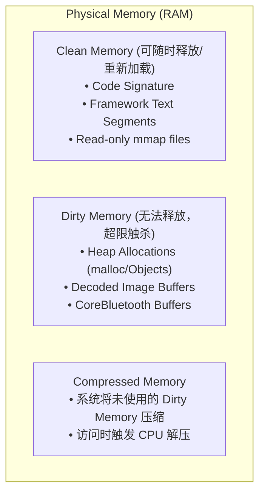

#### BLE 数据接收中的 `autoreleasepool` 内存暴涨陷阱
在循环接收高频 BLE 数据或从数据库读取十万条波形数据时，系统默认的 Autoreleasepool 只会在主线程 RunLoop 周期结束时才释放。

```swift
// ❌ 错误示范：在高频 BLE 收到回调中频繁创建 Data/String，产生临时 Autorelease 对象
func parseBulkBlePackets(packets: [Data]) {
    for packet in packets {
        // 若没有 autoreleasepool，内存短时间内急剧飙升
        autoreleasepool {
            let parsedString = String(data: packet, encoding: .utf8)
            process(parsedString)
        }
    }
}
```

---

### 4.2 多线程本质：GCD 线程爆满、QoS 优先级反转与 Swift Concurrency

#### 1. GCD 线程爆满 (Thread Explosion)
当使用 `DispatchQueue.global().async` 处理高频 BLE 数据解析时，如果解析阻塞（如写 SQLite），GCD 会不断创建新的操作系统线程（上限约 64 个）。线程频繁上下文切换会导致内存飙升与卡死。
- **资深解决方案**：使用**单一 Serial Queue** 或者 Swift Concurrency 的 `Actor` 进行任务排队。

#### 2. QoS 优先级反转 (Priority Inversion)
当 `Background` 梯队的后台线程持有锁，而 `UserInitiated` / `Main` 梯队的线程等待该锁时，发生优先级反转。iOS 操作系统会自动升阶持有锁的线程 QoS，但尽量避免混合锁操作。

#### 3. Swift Concurrency 中的 AsyncSequence 背压 (Backpressure) 控制

```swift
actor BLEDataReceiver {
    private var isProcessing = false

    // 实现背压控制：若前一次推理未完成，丢弃或挂起新帧，防止任务堆积
    func processBleIncomingData(_ data: Data) async {
        guard !isProcessing else {
            print("Dropped packet due to backpressure")
            return
        }
        isProcessing = true
        defer { isProcessing = false }

        await performHeavyCalculation(data)
    }

    private func performHeavyCalculation(_ data: Data) async {
        // 后台重型算法计算...
    }
}
```

---

### 4.3 高帧率 (60/120 FPS) 图表渲染管线与 LTTB 降采样算法

#### 图表渲染管线原理

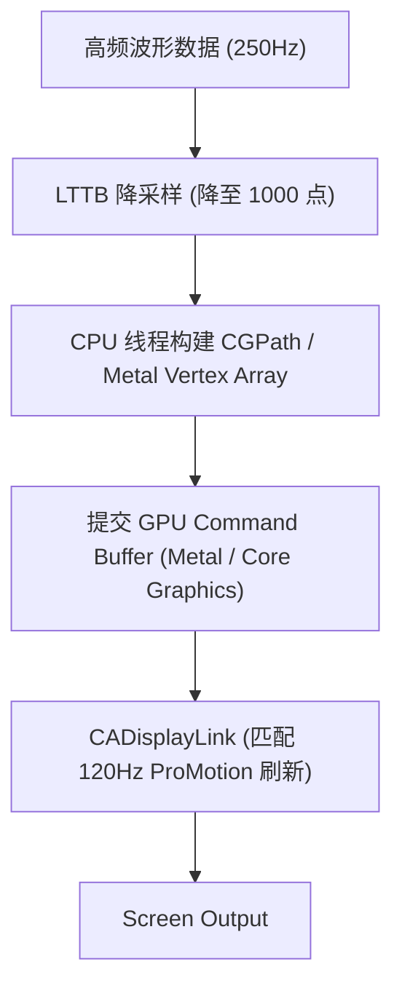

#### LTTB (Largest Triangle Three Buckets) 降采样核心原理
LTTB 算法在降采样时计算由三点构成的**最大三角形面积**，能够完美保留波形中的 Peak（如 ECG 心电图中的 R 峰与 S 峰），防止普通均值抽样把心电 R 峰给“抹平”。

---

### 4.4 稳定性体系：mmap 崩溃日志 Buffer 与 dSYM 符号化探查

#### 1. mmap (Memory Mapping) 高性能写日志本质
通过 `mmap` 系统调用，将磁盘文件的物理页直接映射到进程的虚拟地址空间：

```
App Writes -> Virtual Memory Address (mmap) -> Operating System Page Cache -> Disk (Async Flush)
```
即使 App 发生 **SIGSEGV / OOM Crash** 导致进程被杀，内核的 Page Cache 依然会在系统空闲时写入磁盘，实现 **Crash 现场日志零丢失**。

#### 2. dSYM 符号化原理
Crash 堆栈中的 `0x104b2a3f4` 仅仅是运行时的内存虚拟地址。
$$\text{Symbol Address} = \text{Runtime Address} - \text{Slide Address (ASLR Offset)}$$
通过 `atos` 工具结合 `dSYM` 文件中的 DWARF 调试符号表，还原为源码的文件名与行号：
`atos -o App.app.dSYM/Contents/Resources/DWARF/App -l <LoadAddress> <TargetAddress>`

---

## 五、 模块五：数据协议、字节流处理与 C/C++ 高性能交互

### 5.1 Swift Unsafe 指针与字节序 (Endianness) 转换

```swift
struct HealthPacket {
    let header: UInt16      // 0xAA55
    let packetType: UInt8
    let sequence: UInt8
    let timestamp: UInt32   // 小端序
    let hrValue: UInt8
}

func parseRawBleData(_ data: Data) -> HealthPacket? {
    // 确保字节长度符合要求
    guard data.count >= MemoryLayout<HealthPacket>.size else { return nil }

    return data.withUnsafeBytes { bufferPointer -> HealthPacket? in
        guard let baseAddress = bufferPointer.baseAddress else { return nil }
        
        let header = baseAddress.load(fromByteOffset: 0, as: UInt16.self).bigEndian
        let type = baseAddress.load(fromByteOffset: 2, as: UInt8.self)
        let seq = baseAddress.load(fromByteOffset: 3, as: UInt8.self)
        let ts = baseAddress.load(fromByteOffset: 4, as: UInt32.self).littleEndian
        let hr = baseAddress.load(fromByteOffset: 8, as: UInt8.self)

        return HealthPacket(header: header, packetType: type, sequence: seq, timestamp: ts, hrValue: hr)
    }
}
```

---

### 5.2 流式粘包/半包解析器 (Frame Parser) 设计

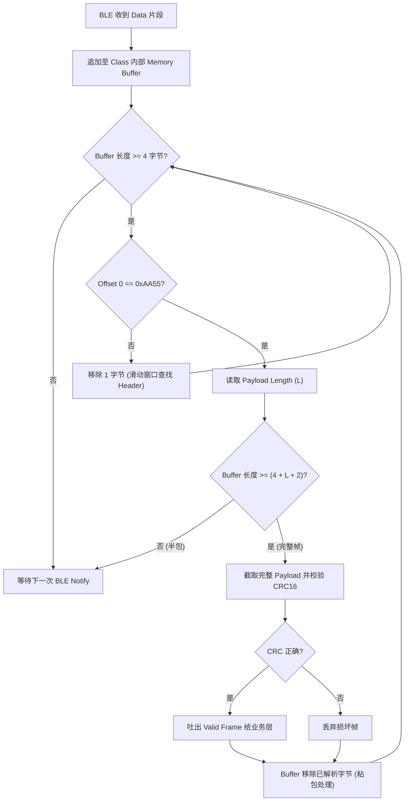

---

## 六、 模块六：全链路 Debugging、软硬件联调与跨团队协同

### 6.1 全链路故障排查矩阵

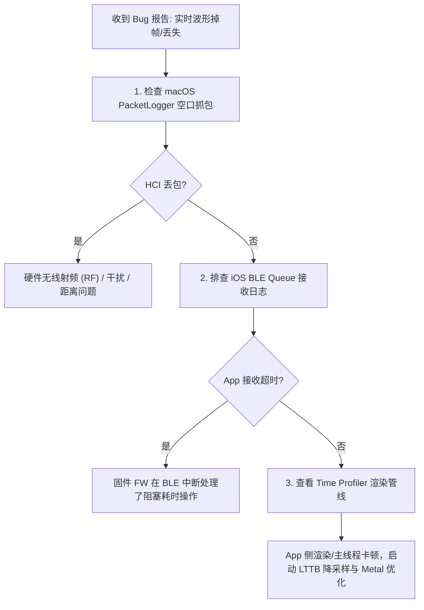

---

### 6.2 软硬件协同契约与 Mock 驱动开发

为实现软件与硬件团队高效并行开发，推荐使用 **CoreBluetooth Peripheral Simulator (Mock 方案)**：

```swift
#if DEBUG
import CoreBluetooth

/// 在 Mac 或测试机上模拟硬件 Peripheral，解耦硬件出板进度
final class BLEPeripheralMockManager: NSObject, CBPeripheralManagerDelegate {
    private var peripheralManager: CBPeripheralManager?
    private var notifyCharacteristic: CBMutableCharacteristic?

    override init() {
        super.init()
        peripheralManager = CBPeripheralManager(delegate: self, queue: nil)
    }

    func peripheralManagerDidUpdateState(_ peripheral: CBPeripheralManager) {
        if peripheral.state == .poweredOn {
            let service = CBMutableService(type: CBUUID(string: "FFF0"), primary: true)
            notifyCharacteristic = CBMutableCharacteristic(
                type: CBUUID(string: "FFF1"),
                properties: [.notify, .read, .writeWithoutResponse],
                value: nil,
                permissions: [.readable, .writeable]
            )
            service.characteristics = [notifyCharacteristic!]
            peripheralManager?.add(service)
            peripheralManager?.startAdvertising([CBAdvertisementDataServiceUUIDsKey: [service.uuid]])
        }
    }

    /// 模拟以 250Hz 发送心电波形数据
    func startSimulatedPPGDataStream() {
        Timer.scheduledTimer(withTimeInterval: 0.004, repeats: true) { [weak self] _ in
            let mockBytes: [UInt8] = [0xAA, 0x55, 0x01, 0x02, UInt8.random(in: 60...100)]
            self?.peripheralManager?.updateValue(Data(mockBytes), for: self?.notifyCharacteristic as! CBMutableCharacteristic, onSubscribedCentrals: nil)
        }
    }
}
#endif
```

---
*本指南由资深 iOS 开发专家整理，涵盖算法、协议、底层原理与渲染性能调优，助你在面试中应对自如！*
